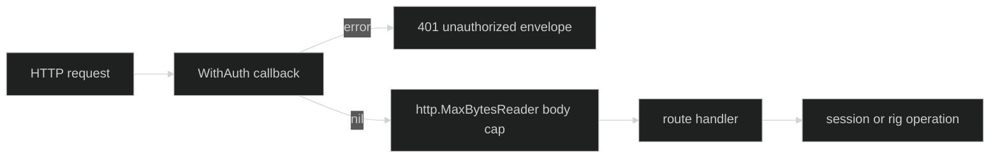

# Authentication

Authentication is a caller-owned callback installed with `serve.WithAuth`.
Serve does not select a credential scheme. It invokes the callback for every
request before the handler can read a body or call a session.

## Callback boundary {#callback-boundary}

The option has this exact type:

```go
func WithAuth(authn func(*http.Request) error) serve.Option
```

Return `nil` to allow the request. Return any non-`nil` error to reject it.
Serve writes status `401` and this client-safe JSON envelope:

```json
{"error":{"code":"unauthorized","message":"authentication required","retryable":false}}
```

The callback error is retained only as the logged cause. Its text is never
sent to the client. A `nil` callback is ignored, so an option list containing
`serve.WithAuth(nil)` remains unauthenticated rather than installing a
panic-prone callback.

```go
func authenticate(r *http.Request) error {
	if r.Header.Get("Authorization") != "Bearer example-token" {
		return errors.New("credential rejected")
	}
	return nil
}

handler, err := serve.Handler(rig, serve.WithAuth(authenticate))
if err != nil {
	return err
}
```

The example's credential is only a placeholder. The callback is the trust
boundary where an application should verify its own token, session, or proxy
assertion.

## Middleware order {#middleware-order}

`Handler` composes the request path in this order:



Authentication is outermost. An unauthenticated request therefore cannot make
the body-cap wrapper read bytes, and it cannot reach a route that calls
`NewSession`, `Submit`, `RespondGate`, or `RestoreSession`. The body cap is
lazy: an authenticated route receives `http.MaxBytesReader`, and an over-limit
read fails while the route decodes the body.

The cap defaults to `1 << 20` bytes. Set a positive value with
`serve.WithMaxBodyBytes(n)` when a deployment needs a tighter or larger bound;
nonpositive values are ignored and the default remains active.

## Bind proof {#bind-proof}

`serve.Server` does not re-run or infer the callback. It accepts the auth proof
only from the handler returned by `serve.Handler`. That Handler carries an
internal `authAware` marker reporting whether a non-nil callback was installed.
Passing a plain wrapper around the Handler loses that marker and is treated as
unauthenticated for a public bind. This fail-closed behavior may refuse a
wrapper that is actually protected, but it cannot silently bless one that has
no proof.

```go
handler, err := serve.Handler(rig, serve.WithAuth(authenticate))
if err != nil {
	return err
}
srv, err := serve.Server("127.0.0.1:8080", handler)
if err != nil {
	return err
}
// Server only constructs srv. The caller owns ListenAndServe or Serve.
```

Use the explicit public-bind option only when an authenticating proxy or mesh
sidecar is the actual trust boundary. See
[`public-bind-protection`](./public-bind-protection.md) for the address policy.

## Source and runnable proof {#source-and-runnable-proof}

The callback option is defined in
[`options.go`](https://github.com/looprig/harness/blob/main/pkg/serve/options.go).
Middleware order and the redacted `401` response are implemented in
[`middleware.go`](https://github.com/looprig/harness/blob/main/pkg/serve/middleware.go).
The auth-aware bind check is in
[`server.go`](https://github.com/looprig/harness/blob/main/pkg/serve/server.go),
with request-boundary cases in
[`middleware_test.go`](https://github.com/looprig/harness/blob/main/pkg/serve/middleware_test.go)
and [`server_test.go`](https://github.com/looprig/harness/blob/main/pkg/serve/server_test.go).
Run:

```sh
go test ./pkg/serve
```
