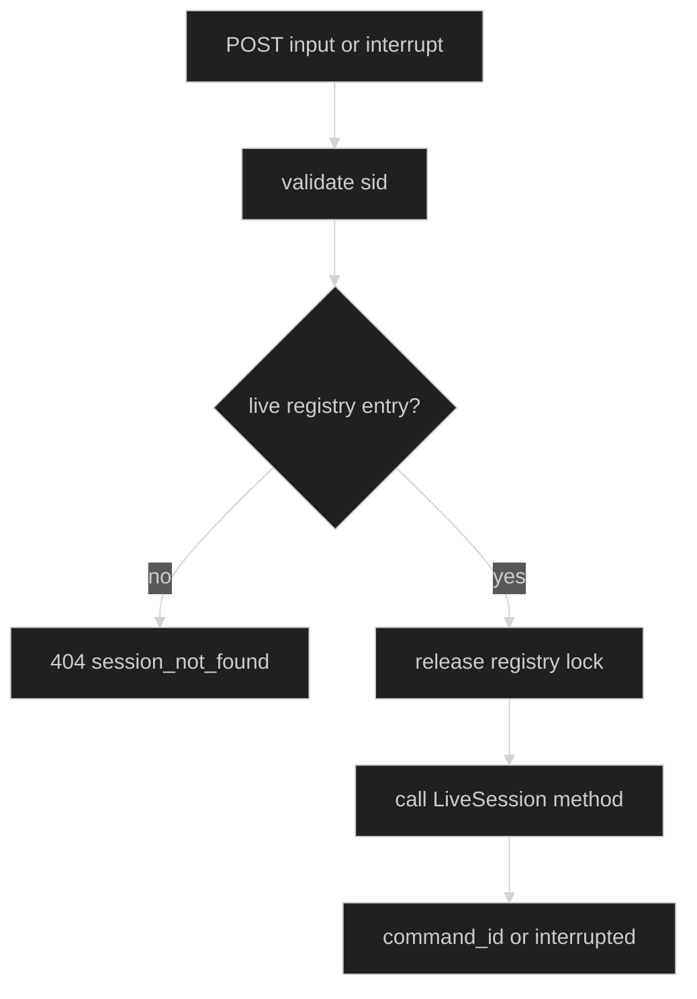

# Submit commands

The HTTP control routes are fire-and-forget session operations. They return a
command ID or an interrupt fact after the live session accepts the call. They do
not wait for a completed Turn.

## Input {#input}

`POST /v1/sessions/{sid}/input` resolves `{sid}` in the server's live registry,
then decodes a required non-empty `{"blocks":[...]}` body. The block decoder
delegates tagged block semantics to `content.UnmarshalBlocks`.

| Condition | Status | Body |
| --- | --- | --- |
| valid live session and non-empty blocks | 200 | `{"command_id":"..."}` |
| malformed UUID | 400 | `invalid_parameter` |
| empty or absent blocks, malformed JSON, unknown block, or body over cap | 400 | `invalid_body` |
| session not live in this process | 404 | `session_not_found` |
| `LiveSession.Submit` fails | 500 | `internal` |

The returned UUID is the correlation key for the events generated by the
submission. It identifies acceptance by `Submit`, not completion of the Turn.

```go
func submitInput(ctx context.Context, client *http.Client, endpoint string) (uuid.UUID, error) {
	// The block object uses Harness's tagged content wire shape.
	payload := []byte(`{"blocks":[{"type":"text","Text":"check status"}]}`)
	req, err := http.NewRequestWithContext(ctx, http.MethodPost, endpoint, bytes.NewReader(payload))
	if err != nil {
		return uuid.UUID{}, err
	}
	res, err := client.Do(req)
	if err != nil {
		return uuid.UUID{}, err
	}
	defer res.Body.Close()
	if res.StatusCode != http.StatusOK {
		return uuid.UUID{}, fmt.Errorf("submit: HTTP %s", res.Status)
	}
	var body struct {
		CommandID uuid.UUID `json:"command_id"`
	}
	if err := json.NewDecoder(res.Body).Decode(&body); err != nil {
		return uuid.UUID{}, err
	}
	return body.CommandID, nil
}
```

The handler looks up the session before reading the body. A missing session
therefore does not spend work decoding an input that cannot be delivered.

## Interrupt {#interrupt}

`POST /v1/sessions/{sid}/interrupt` has no request body. It resolves the same
live registry entry and calls `LiveSession.Interrupt`.

| Condition | Status | Response |
| --- | --- | --- |
| live session, one or more in-flight turns cancelled | 200 | `{"interrupted":true}` |
| live session, no in-flight turn | 200 | `{"interrupted":false}` |
| malformed UUID | 400 | `invalid_parameter` |
| session not live | 404 | `session_not_found` |
| `Interrupt` fails | 500 | `internal` |

`interrupted` is a fact about work that was running when the call reached the
session. It is not a promise that every event already in the stream has been
consumed.

```go
func interrupt(ctx context.Context, client *http.Client, endpoint string) error {
	req, err := http.NewRequestWithContext(ctx, http.MethodPost, endpoint, http.NoBody)
	if err != nil {
		return err
	}
	res, err := client.Do(req)
	if err != nil {
		return err
	}
	defer res.Body.Close()
	var body struct{ Interrupted bool `json:"interrupted"` }
	if err := json.NewDecoder(res.Body).Decode(&body); err != nil {
		return err
	}
	if res.StatusCode != http.StatusOK {
		return fmt.Errorf("interrupt: HTTP %s", res.Status)
	}
	return nil
}
```

## Live registry boundary {#live-registry-boundary}

The read plane can inspect a durable session on any pod. The input, interrupt,
gate, and event routes intentionally cannot: they require an in-process
`LiveSession`. Restore the session first when durable history exists but the
current process has no live entry.

The registry uses an `RWMutex` only for map membership. It releases the lock
before calling `Submit`, `Interrupt`, or any other live-session method, so a
slow actor cannot block unrelated lookups.



## Source and runnable proof {#source-and-runnable-proof}

- [`LiveSession` methods](https://github.com/looprig/harness/blob/main/pkg/serve/serve.go)
- [`input` and `interrupt` handlers](https://github.com/looprig/harness/blob/main/pkg/serve/handlers_control.go)
- [`registry locking and lookup`](https://github.com/looprig/harness/blob/main/pkg/serve/registry.go)
- [`control route tests`](https://github.com/looprig/harness/blob/main/pkg/serve/handlers_control_test.go)
- [`registry concurrency tests`](https://github.com/looprig/harness/blob/main/pkg/serve/registry_test.go)

```sh
go test ./pkg/serve -run 'TestServerHandle(Input|Interrupt)|TestRegistry'
```
