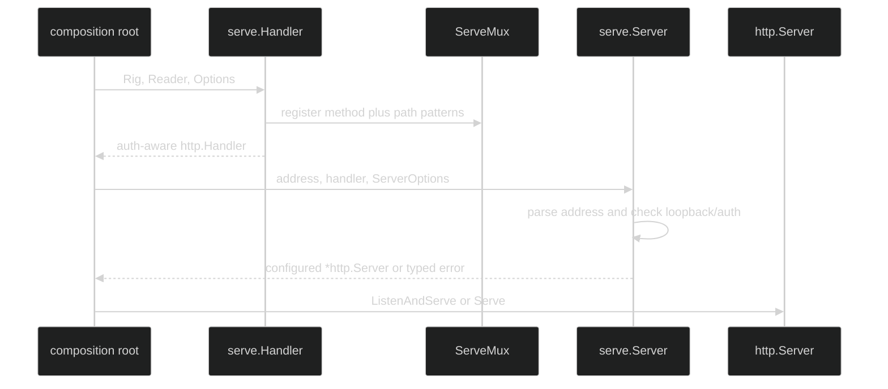

# Create a server

Build the handler first, then ask `serve.Server` to validate the listen address
and return a configured `*http.Server`. `Server` does not call `Listen` or
`Serve`; the application owns when serving starts and how it handles the
returned server's lifecycle.

## Handler construction {#handler-construction}

The complete and read-only constructors are:

```go
func Handler[S LiveSession, O any](rig Rig[S, O], reads Reader, opts ...Option) http.Handler
func ReadHandler(reads Reader, opts ...Option) http.Handler

type Option func(*config)
func WithAuth(authn func(*http.Request) error) Option
func WithMaxBodyBytes(n int64) Option
```

`Handler` wires the ten routes. `ReadHandler` wires only capabilities, list,
status, and journal. `WithAuth` ignores a nil callback. `WithMaxBodyBytes`
ignores zero and negative values, retaining the 1 MiB default. A nil option in
the variadic list is ignored.

The `Rig` generic keeps the concrete session type at the composition root:

```go
func handler(rig serve.Rig[*liveSession, sessionOption], reader serve.Reader) http.Handler {
	// `authenticate` returns nil only after the request identity is trusted.
	return serve.Handler(rig, reader,
		serve.WithAuth(authenticate),
		serve.WithMaxBodyBytes(2<<20),
	)
}
```

The handler wraps the mux as `auth -> body cap -> route`. Authentication runs
before the request body is read. Body limiting is lazy, so a route sees a read
error when it attempts to decode more than the configured cap.



## Server construction {#server-construction}

The bind constructor and its only option are:

```go
type ServerOption func(*serverConfig)

func WithInsecurePublicBind() ServerOption
func Server(addr string, h http.Handler, opts ...ServerOption) (*http.Server, error)
```

`Server` parses `addr` with `net.SplitHostPort`. A malformed address returns
`InvalidAddrError` and no server. A non-loopback host with no authenticator
returns `PublicBindWithoutAuthError` unless the caller explicitly supplies
`WithInsecurePublicBind()`.

The explicit opt-in is for a deployment where an authenticating proxy or mesh
sidecar is the trust boundary. It does not install authentication itself.

```go
func start(h http.Handler) error {
	server, err := serve.Server("127.0.0.1:8080", h)
	if err != nil {
		return fmt.Errorf("configure HTTP server: %w", err)
	}
	// Server has not listened yet. The caller owns this blocking lifecycle.
	return server.ListenAndServe()
}
```

## Hardened defaults {#hardened-defaults}

The returned `http.Server` has these values:

| Field | Value | Reason |
| --- | --- | --- |
| `ReadTimeout` | 5 s | Bounds the complete request read. |
| `ReadHeaderTimeout` | 5 s | Slowloris header guard. |
| `IdleTimeout` | 60 s | Bounds idle keep-alive gaps. |
| `MaxHeaderBytes` | 1 MiB | Bounds request headers. |
| `WriteTimeout` | `0` | Keeps the long-lived events stream open. |
| `TLSConfig.MinVersion` | TLS 1.2 | Defensive minimum if TLS is used by the deployment. |

Request bodies are independently capped by `WithMaxBodyBytes`. The events
handler clears a connection write deadline through `http.ResponseController`,
so a server-wide write timeout cannot truncate an SSE stream.

`Server` detects authentication only from the handler returned directly by
`Handler` or `ReadHandler`. Wrapping that value in a plain `http.Handler`
removes the `authAware` proof and causes a public bind to be refused. Keep the
serve handler as the value passed to `Server`, or preserve the same proof in a
wrapper type.

## Source and runnable proof {#source-and-runnable-proof}

- [`Handler`, `ReadHandler`, and option wrapping](https://github.com/looprig/harness/blob/main/pkg/serve/mux.go)
- [`WithAuth` and `WithMaxBodyBytes`](https://github.com/looprig/harness/blob/main/pkg/serve/options.go)
- [`Server` bind policy and timeout values](https://github.com/looprig/harness/blob/main/pkg/serve/server.go)
- [`option and default tests`](https://github.com/looprig/harness/blob/main/pkg/serve/options_test.go)
- [`bind protection tests`](https://github.com/looprig/harness/blob/main/pkg/serve/server_test.go)

```sh
go test ./pkg/serve -run 'Test(NewConfig|With|Server|IsLoopback)'
```
