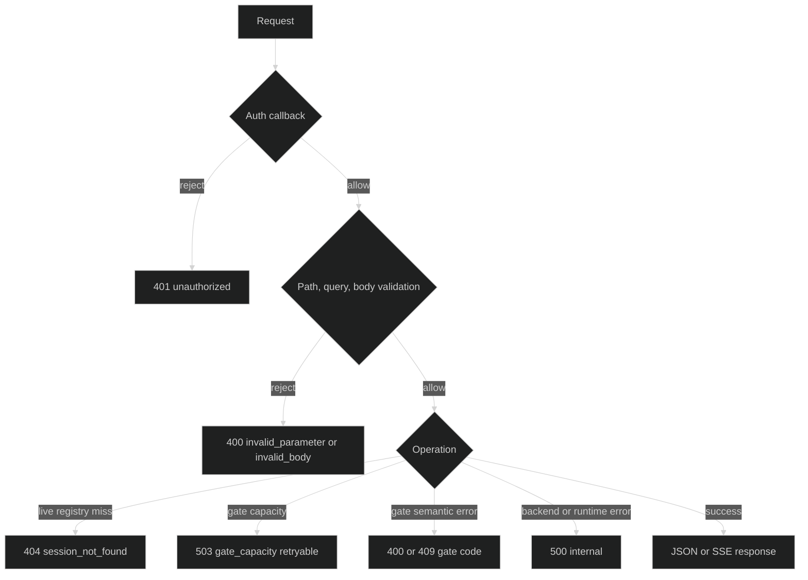

# Errors and status codes

The serve package returns one nested JSON error shape for every handler-level
failure. Status selection is stable and generic; internal causes are logged,
not serialized.

## Error envelope {#envelope}

The wire shape is:

```json
{
  "error": {
    "code": "session_not_found",
    "message": "session not found",
    "retryable": false
  }
}
```

`Content-Type` is `application/json`. `code` is the machine branch, `message`
is a client-safe summary, and `retryable` tells a caller whether retrying the
same request can make sense. The handler passes a cause to its logger through
`writeErrorCause`; the body never includes `cause.Error()`.

## Request errors {#request-errors}

These failures happen before a session or reader operation is invoked:

| Condition | Status | Code | Retryable |
| --- | ---: | --- | --- |
| Malformed UUID path segment | `400` | `invalid_parameter` | `false` |
| Non-integer or out-of-range `limit` or `skip` | `400` | `invalid_parameter` | `false` |
| Negative or non-numeric `from_journal_seq` | `400` | `invalid_parameter` | `false` |
| Malformed JSON, invalid block envelope, or body over the configured cap | `400` | `invalid_body` | `false` |
| Idempotency key longer than 255 bytes | `400` | `invalid_parameter` | `false` |
| Authenticator returns an error | `401` | `unauthorized` | `false` |
| Session is absent from the live registry on a control route | `404` | `session_not_found` | `false` |
| Session is absent from the reader's durable catalog on a status read | `404` | `session_not_found` | `false` |
| Same idempotency key with different raw body | `409` | `idempotency_conflict` | `false` |

The parser uses typed `serve.InvalidParamError{Param, Reason}` values. It does
not echo the supplied value. `limit` defaults to 100 and accepts 1 through
1000; `skip` defaults to 0 and must be nonnegative; `from_journal_seq` defaults
to 0 and parses as an unsigned 64-bit cursor.

## Operation errors {#operation-errors}

After boundary validation, operation failures use these responses:

| Operation | Success | Failure mapping |
| --- | --- | --- |
| `POST /v1/sessions` create | `201` | `500 internal` for `NewSession`; `500 internal` for `Submit` failure. |
| `POST /v1/sessions/{sid}/restore` | `200` | `404 session_not_found` only when the Rig returns `serve.SessionNotFoundError`; otherwise `500 internal`. |
| `POST /v1/sessions/{sid}/input` | `200` with `command_id` | `500 internal` for `Submit` failure. |
| `POST /v1/sessions/{sid}/interrupt` | `200` with `interrupted` | `500 internal` for `Interrupt` failure. |
| Gate response | `202` with `{}` | Gate-specific table below; unknown or non-gate failures are `500 internal`. |
| `GET /v1/sessions` | `200` | `500 internal` for reader failure. |
| `GET /v1/sessions/{sid}/status` | `200` | `404 session_not_found` for typed not-found; `500 internal` for read or visibility validation failure. |
| `GET /v1/sessions/{sid}/journal` | `200` | `500 internal` for replay or visibility validation failure. |
| `GET /v1/sessions/{sid}/events` | `200` stream | `500 internal` when subscription cannot be created; `404 session_not_found` for a registry miss. |

The live control routes consult the process-local registry. The read routes use
the injected Reader and do not require a live session. A `404` on a control
route therefore means only that the requested ID is not live in this process.

## Gate and stream mappings {#gate-and-stream}

Gate failures are selected by the stable `GateErrorKind()` value:

| Kind | Status | Code | Retryable |
| --- | ---: | --- | --- |
| `not_found` | `404` | `gate_not_found` | `false` |
| `action_invalid` | `400` | `gate_action_invalid` | `false` |
| `kind_mismatch` | `400` | `gate_kind_mismatch` | `false` |
| `not_ready` | `409` | `gate_not_ready` | `false` |
| `capacity` | `503` | `gate_capacity` | `true` |
| `append_failed` | `500` | `internal` | `false` |

An SSE connection sends headers and status `200` before waiting for events.
After that point an error cannot be changed into a JSON response. The stream
closes on subscription close, request cancellation, write or flush failure, or
an encoding failure. Enduring frames carry their journal sequence as the SSE
`id`, so a reconnecting client can use the journal read endpoint to recover a
durable gap.



## Typed errors and cause boundaries {#typed-errors}

The handler's typed errors are intended for trusted logs and tests:

| Type | Carries |
| --- | --- |
| `serve.SessionNotFoundError` | Requested session UUID. |
| `serve.LoopNotFoundError` | Requested loop UUID. |
| `serve.StoreReadError` | Operation string and wrapped backend cause. |
| `serve.NonPublicEventError` | Rejected event visibility. |
| `serve.InvalidParamError` | Parameter name and fixed reason. |
| `serve.InvalidAddrError` | Address and wrapped parse cause. |
| `serve.PublicBindWithoutAuthError` | Refused address. |

`StoreReadError` and `InvalidAddrError` implement `Unwrap`; use
`errors.As` or `errors.Is` in trusted code rather than parsing error text.

```go
var readErr serve.StoreReadError
if errors.As(err, &readErr) {
	log.Printf("read operation %q failed: %v", readErr.Op, readErr)
}
```

No typed cause is converted to a public message by default. This is the
boundary that keeps storage paths, provider responses, credentials, and PII
out of HTTP bodies.

## Source and runnable proof {#source-and-runnable-proof}

The nested envelope and serve-level typed errors are in
[`errors.go`](https://github.com/looprig/harness/blob/main/pkg/serve/errors.go).
Path/query parsing is in
[`parse.go`](https://github.com/looprig/harness/blob/main/pkg/serve/parse.go),
and route mappings are implemented in
[`handlers_lifecycle.go`](https://github.com/looprig/harness/blob/main/pkg/serve/handlers_lifecycle.go),
[`handlers_control.go`](https://github.com/looprig/harness/blob/main/pkg/serve/handlers_control.go),
[`handlers_read.go`](https://github.com/looprig/harness/blob/main/pkg/serve/handlers_read.go),
[`handlers_events.go`](https://github.com/looprig/harness/blob/main/pkg/serve/handlers_events.go),
and [`handlers_gate.go`](https://github.com/looprig/harness/blob/main/pkg/serve/handlers_gate.go).
The response fixtures and route cases are in
[`fixtures_test.go`](https://github.com/looprig/harness/blob/main/pkg/serve/fixtures_test.go),
[`handlers_read_test.go`](https://github.com/looprig/harness/blob/main/pkg/serve/handlers_read_test.go),
[`handlers_control_test.go`](https://github.com/looprig/harness/blob/main/pkg/serve/handlers_control_test.go),
[`handlers_gate_test.go`](https://github.com/looprig/harness/blob/main/pkg/serve/handlers_gate_test.go),
and [`handlers_events_test.go`](https://github.com/looprig/harness/blob/main/pkg/serve/handlers_events_test.go).
Run:

```sh
go test ./pkg/serve
```
