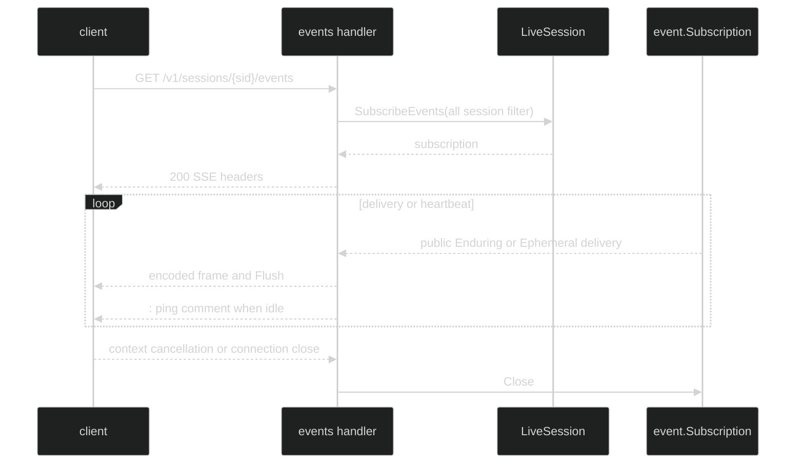

# Event streaming

`GET /v1/sessions/{sid}/events` opens a Server-Sent Events stream for a live
session. The handler subscribes to the whole session, encodes both public
Enduring and public Ephemeral deliveries, and flushes each frame immediately.

## Open the stream {#open-the-stream}

The route resolves `{sid}` before subscribing. A malformed UUID is 400, an
unknown live session is 404, and a subscription failure is 500. The subscription
failure is written as a normal JSON error because the handler does not write SSE
headers until `SubscribeEvents` succeeds.

On success the response is:

```text
HTTP/1.1 200 OK
Content-Type: text/event-stream
Cache-Control: no-store
X-Accel-Buffering: no
```

The stream uses `http.ResponseController` to flush every frame. The server's
write timeout is zero so a long-lived stream is not truncated.

```go
func follow(ctx context.Context, client *http.Client, endpoint string, handle func(string, string)) error {
	req, err := http.NewRequestWithContext(ctx, http.MethodGet, endpoint, http.NoBody)
	if err != nil {
		return err
	}
	res, err := client.Do(req)
	if err != nil {
		return err
	}
	defer res.Body.Close()
	if res.StatusCode != http.StatusOK {
		return fmt.Errorf("events: HTTP %s", res.Status)
	}
	scanner := bufio.NewScanner(res.Body)
	var eventName, data string
	for scanner.Scan() {
		line := scanner.Text()
		switch {
		case strings.HasPrefix(line, "event: "):
			eventName = strings.TrimPrefix(line, "event: ")
		case strings.HasPrefix(line, "data: "):
			data = strings.TrimPrefix(line, "data: ")
		case line == "":
			if eventName != "" {
				handle(eventName, data)
			}
			eventName, data = "", ""
		}
	}
	return scanner.Err()
}
```

The example treats a blank line as the end of one SSE frame. It can ignore
comment lines beginning with `:`.

## Enduring frames {#enduring-frames}

An Enduring delivery is encoded as one complete frame with a sequence ID:

```text
event: enduring
id: 42
data: {"v":1,"event":<event.MarshalEvent envelope>}

```

The body is `{"v":1,"event":...}`. The outer `v` is the serve frame schema
version. The nested event is the durable event codec envelope. The `id:` line is
always present, including `id: 0` for a zero sequence test delivery.

The stream skips an Enduring value that the event codec cannot marshal instead
of emitting a lossy body. It also skips an event whose visibility is not public.

## Ephemeral frames {#ephemeral-frames}

Ephemeral deliveries are never journal-sequenced and never carry an `id:` line:

```text
event: ephemeral
data: {"v":1,"kind":"token_delta","header":{...},"delta":{...}}

```

The supported `kind` values and their delta fields are:

| Kind | Delta |
| --- | --- |
| `token_delta` | Tagged `chunk_type` of `text`, `thinking`, or `tool_use`; tool use also has `index`, `id`, `name`, `input_json`. |
| `tool_call_started` | `tool_execution_id`, `tool_name`, `summary`. |
| `tool_call_completed` | `tool_execution_id`, `is_error`, `result_preview`. |
| `input_queued` | no `delta`; identity remains in `header`. |
| `compaction_started` | `attempt_id`, `reason`, and `basis`. |

Nil, typed-nil, unknown chunk, and unknown future Ephemeral variants are skipped
with a debug log. The transport never marshals `content.Chunk` directly, which
keeps Go field names and unsupported payloads off the wire.

## Lifetime and heartbeats {#lifetime-and-heartbeats}

The default heartbeat is every 20 seconds. An idle stream receives the SSE
comment `: ping\n\n`; an EventSource client ignores it while intermediaries see
traffic. The ticker runs independently of event activity.

The handler returns when the request context is cancelled, the subscription
channel closes, a write fails, or a flush fails. It always calls
`Subscription.Close` on return. A client disconnect should therefore cancel its
request context and let the server release the subscription.



## Source and runnable proof {#source-and-runnable-proof}

- [`events` handler and stream lifetime](https://github.com/looprig/harness/blob/main/pkg/serve/handlers_events.go)
- [`Enduring and Ephemeral frame encoders`](https://github.com/looprig/harness/blob/main/pkg/serve/ephemeral.go)
- [`event stream tests`](https://github.com/looprig/harness/blob/main/pkg/serve/handlers_events_test.go)
- [`heartbeat, cancellation, and write-failure tests`](https://github.com/looprig/harness/blob/main/pkg/serve/handlers_events_test.go)

```sh
go test ./pkg/serve -run 'TestHandleEvents'
```
