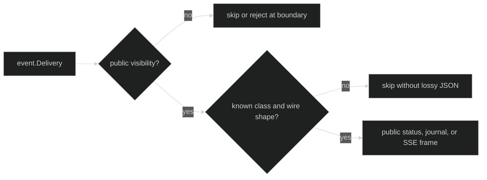

# Event visibility

The HTTP surface exposes only events that the event package marks public. This
is enforced at all outward serialization boundaries, not only by the caller's
subscription filter. A private hustle event or an event with an unknown
visibility value must never reach a status response, journal response, or live
SSE stream.

## Public predicate {#public-predicate}

The serve package applies the event package's authoritative predicate to a
whole-session filter:

```go
// The serve package uses this equivalent boundary for every outward delivery.
func isPublicEvent(ev event.Event) bool {
	return event.ShouldDeliver(event.EventFilter{
		Ephemeral: event.LoopScope{All: true},
		Enduring:  event.LoopScope{All: true},
	}, ev)
}
```

The filter selects the whole session. The predicate still rejects an event whose
visibility is `event.Internal` or an unknown value. Public event types can then
be encoded using the durable event codec or the explicit live DTOs.

## Read boundaries {#read-boundaries}

Status and journal reads validate event-bearing DTOs again immediately before
writing JSON:

| Boundary | Private event behavior | Client result |
| --- | --- | --- |
| `GET /v1/sessions/{sid}/status` with private `LastTurn` or `LastStep` | `validateSessionStatus` returns `*NonPublicEventError` | generic 500 `internal` |
| `GET /v1/sessions/{sid}/journal` with private event | `validateEventJournalPage` rejects the page | generic 500 `internal` |
| `StatusEvent.MarshalJSON` | `validateStatusEvent` rejects before `event.MarshalEvent` | marshal error, classifiable with `errors.As` |

The error retains only the visibility value:

```go
var visibilityErr *serve.NonPublicEventError
if errors.As(err, &visibilityErr) {
	// Treat this as a server-side projection or adapter violation. Do not send
	// the event type or payload to a client while diagnosing it.
	log.Printf("non-public event visibility=%d", visibilityErr.Visibility)
}
```

The response body remains generic. Tests explicitly check that private hustle
names, prompts, run descriptors, and visibility fields are not leaked.

## Live boundary {#live-boundary}

The SSE encoder applies the same predicate before its Enduring or Ephemeral
type switch. A private delivery is skipped and the stream continues. An
unrecognized public delivery is also skipped if its wire shape cannot be
represented safely. This is fail closed: no ad hoc JSON fallback exists.



The `pkg/sessionstore` public event replayer is another defense in depth for
durable reads, but serve still validates the returned DTO because its `Reader`
interface is intentionally adapter-neutral.

## Source and runnable proof {#source-and-runnable-proof}

- [`serve` visibility predicate and DTO validation](https://github.com/looprig/harness/blob/main/pkg/serve/visibility.go)
- [`SSE visibility and explicit frame encoding`](https://github.com/looprig/harness/blob/main/pkg/serve/ephemeral.go)
- [`status and journal response validation`](https://github.com/looprig/harness/blob/main/pkg/serve/handlers_read.go)
- [`visibility error type`](https://github.com/looprig/harness/blob/main/pkg/serve/errors.go)
- [`privacy and visibility tests`](https://github.com/looprig/harness/blob/main/pkg/serve/privacy_visibility_test.go)

```sh
go test ./pkg/serve -run 'Test(StatusEvent|ReadHandlers|EncodeDelivery|HandleEventsSkipsNonPublic)'
```
