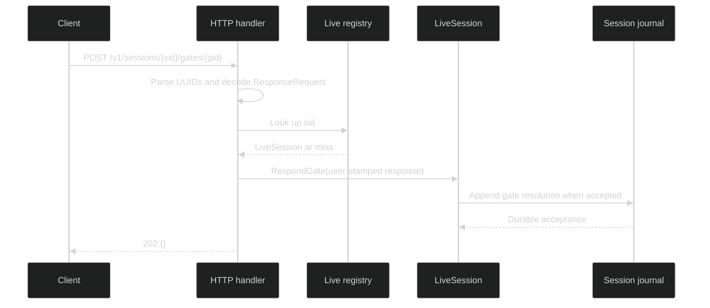

# Gate responses

Answer a live gate with `POST /v1/sessions/{sid}/gates/{gid}`. The HTTP layer
validates UUIDs and JSON shape, stamps the response as user supplied, and
delegates gate semantics and durable acceptance to the live session.

## Request shape {#request-shape}

The route accepts the public `gate.ResponseRequest` value. `sid` and `gid` are
UUID path values; a malformed value returns the normal `invalid_parameter`
error envelope with status `400`. A valid session must also be present in the
process-local live registry.

```go
// gate.ResponseRequest is the complete HTTP request payload.
type ResponseRequest struct {
	Action string                      `json:"action,omitempty"`
	Values map[string]json.RawMessage  `json:"values,omitempty"`
}
```

The `values` map keeps each form answer as raw JSON until the gate's own
validator interprets it. The route does not accept a `source` field. The
server constructs this envelope before calling `RespondGate`:

```go
resp := gate.GateResponse{
	GateID: gid,
	Action: req.Action,
	Values: req.Values,
	Source: gate.ResponseSource{Kind: gate.ResponseFromUser},
}
err := live.RespondGate(ctx, resp)
```

For approval gates, the domain parser recognizes these exact action strings:

| Action | Meaning |
| --- | --- |
| `Approve` | Approve this request. |
| `Approve always for this workspace` | Persist the workspace-scoped approval when the gate supports it. |
| `Deny` | Refuse this request. |

Those values are checked by `gate.ParseApprovalAction` or the gate kind's
validator. An empty body decodes as an empty request and is left for the live
session to reject as `action_invalid`; malformed JSON is rejected by the HTTP
boundary as `invalid_body`.

## Durable acceptance {#durable-acceptance}

On success the server returns `202 Accepted` with the JSON body `{}`. This is an
acceptance boundary, not a claim that the blocked loop has already consumed the
answer. `RespondGate` may append the resolution and route an in-memory command;
the caller should observe the resulting enduring event or status transition
through the session event stream.

The gate ID in the path is authoritative. The body carries action and values,
not another gate identifier. A response is only routed to a session found in
the live registry, so this endpoint cannot answer a session that exists solely
in durable storage and has not been restored into this process.



The HTTP handler never reports consumption as part of the `202` response. Use
`GET /v1/sessions/{sid}/events` to follow the public event stream.

## Status mapping {#status-mapping}

The handler inspects the stable `GateErrorKind()` value exposed by the session
error chain. It does not expose the wrapped cause in the response body.

| Gate kind | HTTP status | Error code | Retryable |
| --- | ---: | --- | --- |
| `not_found` | `404` | `gate_not_found` | `false` |
| `action_invalid` | `400` | `gate_action_invalid` | `false` |
| `kind_mismatch` | `400` | `gate_kind_mismatch` | `false` |
| `not_ready` | `409` | `gate_not_ready` | `false` |
| `capacity` | `503` | `gate_capacity` | `true` |
| `append_failed` | `500` | `internal` | `false` |
| unknown kind or non-gate error | `500` | `internal` | `false` |

All failures use the nested JSON envelope described in
[`errors-and-status`](./errors-and-status.md). A capacity response is the only
gate-specific retryable response because the gate directory may become able to
accept work after it drains.

## Source and runnable proof {#source-and-runnable-proof}

The route, payload decode, provenance stamp, and status table are implemented
in [`handlers_gate.go`](https://github.com/looprig/harness/blob/main/pkg/serve/handlers_gate.go).
The request and mapping cases are exercised in
[`handlers_gate_test.go`](https://github.com/looprig/harness/blob/main/pkg/serve/handlers_gate_test.go),
and the domain response envelope is defined in
[`response.go`](https://github.com/looprig/harness/blob/main/pkg/gate/response.go).
Run the focused package tests from the `harness` repository:

```sh
go test ./pkg/serve
```
