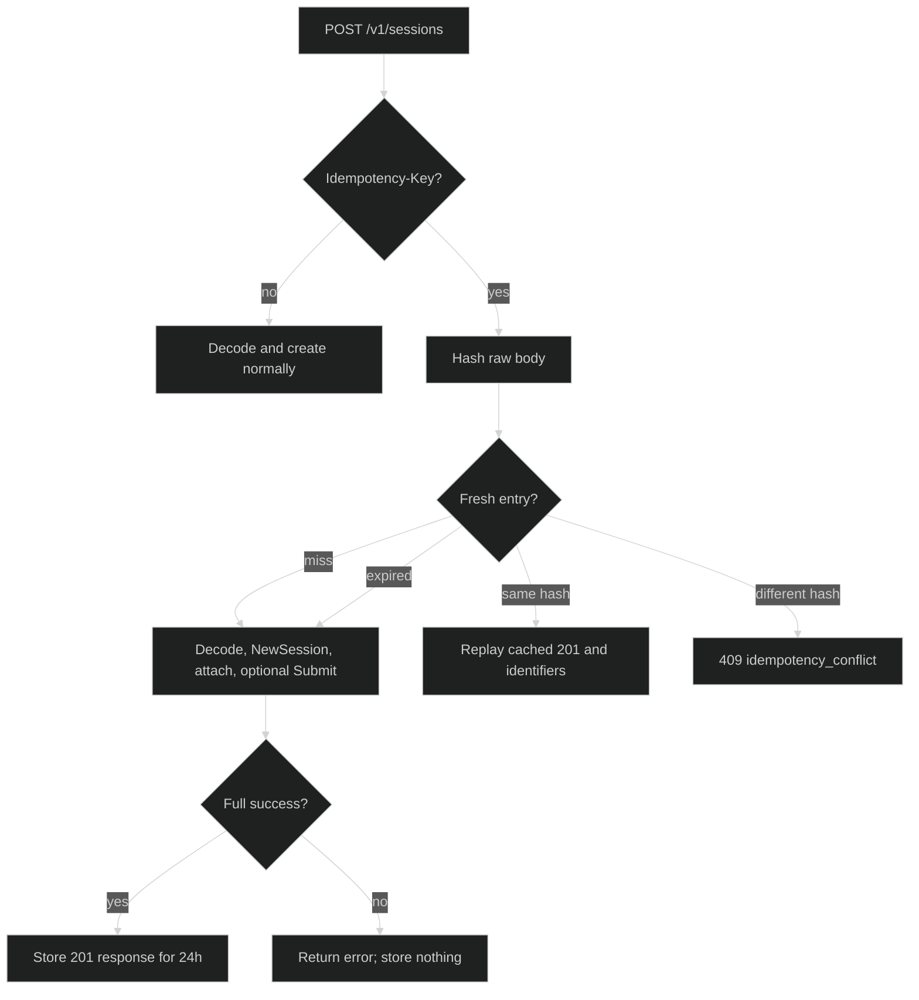

# Idempotency

`POST /v1/sessions` is optionally idempotent. Send an `Idempotency-Key` when a
client may retry a create and needs the completed `201` identifiers replayed.
The implementation is deliberately per Handler process, not a distributed
coordination service.

## Key and body identity {#key-and-body}

The header name is exactly `Idempotency-Key`. An absent or empty value leaves
the normal create path untouched. A nonempty key is limited to 255 bytes. The
server hashes the exact raw request body with SHA-256 before JSON decoding, so
the key is bound to the bytes that the client sent, not to a normalized object.

| Input | Boundary behavior |
| --- | --- |
| No header or empty value | Normal create; no idempotency entry is read or written. |
| Key up to 255 bytes | Look up the key with the raw-body hash. |
| Key over 255 bytes | `400` with `invalid_parameter`; the rig and store are not touched. |
| Existing key, different body bytes | `409` with `idempotency_conflict`; no new session is created. |

The store entry contains the body hash, the successful `createResponse`, and an
expiry time. The default time-to-live is 24 hours. Expiry is lazy: the next
lookup removes an expired entry and treats it as a miss.

```go
req, err := http.NewRequestWithContext(ctx, http.MethodPost,
	baseURL+"/v1/sessions", bytes.NewReader(body))
if err != nil {
	return err
}
req.Header.Set("Idempotency-Key", clientKey)
resp, err := http.DefaultClient.Do(req)
```

The raw body includes the distinction between an absent or empty body and a
body such as `{}`. Retrying must therefore send the same bytes if it expects a
replay.

## Retry behavior {#retry-behavior}

The lookup and create sequence has three outcomes:



A sequential retry with the same key and byte-identical body returns `201` and
the exact original `session_id`. If the original body included blocks, the
replayed response also carries the same `command_id`; `NewSession` and
`Submit` are not called again. A failed create is never cached, so retrying it
starts a fresh attempt.

## Concurrency and scope {#concurrency-and-scope}

The store mutex protects only its in-memory map. It is not held across
`NewSession` or `Submit`. Consequently, two truly concurrent requests with the
same key can both observe a miss and create two sessions. The last completed
success becomes the cached replay. A subsequent request after those calls have
finished uses the stored result. A caller requiring single-flight behavior
must serialize retries or provide coordination above this handler.

The record lives only in the Handler's process. It is not shared across pods,
restarted processes, or independent Handler values. A key that reaches a
different pod can therefore create another session even within the 24-hour
window.

## Source and runnable proof {#source-and-runnable-proof}

The create path and response shape are implemented in
[`handlers_lifecycle.go`](https://github.com/looprig/harness/blob/main/pkg/serve/handlers_lifecycle.go).
The store's bounds, hash comparison, TTL, and lazy eviction are in
[`idempotency.go`](https://github.com/looprig/harness/blob/main/pkg/serve/idempotency.go).
Sequential, expiry, oversized-key, replay, and concurrent behavior are covered
by [`handlers_lifecycle_test.go`](https://github.com/looprig/harness/blob/main/pkg/serve/handlers_lifecycle_test.go)
and [`idempotency_test.go`](https://github.com/looprig/harness/blob/main/pkg/serve/idempotency_test.go).
Run:

```sh
go test ./pkg/serve
```
