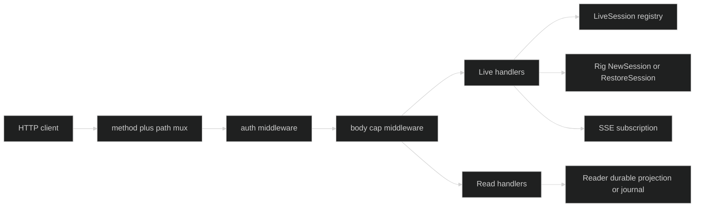

# Overview

> **Deprecated.** `pkg/serve` is a frozen compatibility surface. Its import
> path, routes, schemas, and fixtures remain available while existing consumers
> migrate, but new public HTTP composition should use
> [Factory](/docs/modules/factory) for the client-facing API and
> [Host](/docs/modules/host) to run Harness sessions behind it. The package
> carries a `Deprecated:` marker, so staticcheck reports SA1019 at every import
> site; suppress it on the import line while you migrate. `pkg/serve` does not
> import or delegate to Factory or Host.

`github.com/looprig/harness/pkg/serve` is the HTTP composition seam for a live
Harness session. It does not import `pkg/session`, a store, or an inference
implementation. The composition root supplies a `Rig` for live sessions and a
`Reader` for durable reads, then chooses the complete or read-only surface.

## Migrate to Factory and Host {#migrate-to-factory-and-host}

| Need | `pkg/serve` | Factory and Host |
| --- | --- | --- |
| Public API and authorization | one process, `WithAuth` callback | Factory, with injected authorizer seams |
| Where sessions run | the same process as the HTTP server | Host processes that Factory places sessions on |
| Commands | submitted directly to the live session | admitted durably by Factory, applied by Host through `pkg/runtimecommand` |
| Viewer events | native event bodies over SSE | the redacted public projection stored with each journal frame |

Keep `pkg/serve` only for an existing single-process deployment you have not
migrated yet.

## Request planes {#request-planes}

The complete handler has three deliberately separate planes:

| Plane | Routes | Dependency | Meaning |
| --- | --- | --- | --- |
| Discovery | `GET /v1/capabilities` | read plane | Protocol version and feature list. |
| Live/control | create, restore, input, interrupt, gates, events | `Rig` plus an in-process registry | Operates only on sessions live in this process. |
| Durable reads | list, status, journal | `Reader` | Reads catalog or journal state without consulting the registry. |

`ReadHandler` registers only discovery and durable reads. A control path is not
"disabled" by a runtime check in that mode: it is absent from the mux and
therefore returns the standard `net/http` 404.



Authentication is applied before the body cap and before a route handler. A
live lookup releases the registry lock before calling the session. A read never
needs a live session on the current process.

Sessions created or restored over HTTP outlive the request that created them:
the handler passes the Rig a context that keeps the request's values but is
never cancelled. A live session that also implements the optional
`serve.SessionDone` interface is evicted from the registry once its shutdown
begins, both by a watcher and by a check on every lookup, so later requests for
it get the same 404 as an unknown ID and its SSE streams end. A session that
does not implement `SessionDone` is treated as live until the process exits,
and a wrapper around a live session must forward `Done()` or it opts out of
eviction.

The SSE stream and the journal route send native event bodies. They do not
apply the public-body redaction that `pkg/sessionwire` applies for Factory and
Host, so a model gateway `base_url` or a physical workspace path can reach an
HTTP client. Put this surface only in front of clients you already trust with
that data.

## Route contract {#route-contract}

These are the ten patterns registered by `Handler`. The method is part of each
Go 1.22 pattern. A matching path with the wrong method is a 405 from the mux;
an unknown path is a plain 404 before a serve handler runs.

| Method and path | Request body or query | Success |
| --- | --- | --- |
| `GET /v1/capabilities` | none | `200 application/json`, protocol document |
| `POST /v1/sessions` | optional `{"blocks":[...]}` and optional `Idempotency-Key` | `201`, `{"session_id": "...", "command_id": "..."}`; `command_id` is omitted for idle create |
| `GET /v1/sessions` | `skip` default `0`, `limit` default `100` | `200`, `SessionList` |
| `POST /v1/sessions/{sid}/restore` | none | `200`, `{"session_id":"...","restored":true\|false}` |
| `POST /v1/sessions/{sid}/input` | required non-empty `{"blocks":[...]}` | `200`, `{"command_id":"..."}` |
| `POST /v1/sessions/{sid}/interrupt` | none | `200`, `{"interrupted":true\|false}` |
| `POST /v1/sessions/{sid}/gates/{gid}` | `{"action":"...","values":{...}}` | `202`, `{}` after durable acceptance |
| `GET /v1/sessions/{sid}/events` | none | `200 text/event-stream` |
| `GET /v1/sessions/{sid}/status` | none | `200`, `SessionStatus` |
| `GET /v1/sessions/{sid}/journal` | `from_journal_seq` default `0`, `limit` default `100` | `200`, `EventJournalPage` |

The complete capability response is stable and ordered:

```json
{"protocol":"looprig.serve","version":1,"features":["journal","live_sse","ephemeral_sse","gate_response"]}
```

The read-only response advertises `features: ["journal"]`. Capability
discovery is not health, tenancy, or authentication status.

## Compose the handler {#compose-the-handler}

The public contracts are intentionally narrow:

```go
type LiveSession interface {
	SessionID() uuid.UUID
	Submit(context.Context, []content.Block) (uuid.UUID, error)
	SubscribeEvents(event.EventFilter) (event.Subscription, error)
	RespondGate(context.Context, gate.GateResponse) error
	Interrupt(context.Context) (bool, error)
}

type Rig[S LiveSession, O any] interface {
	NewSession(context.Context, ...O) (S, error)
	RestoreSession(context.Context, uuid.UUID) (S, error)
}

type Reader interface {
	ListSessions(context.Context, Page) (SessionList, error)
	ReadStatus(context.Context, uuid.UUID) (SessionStatus, error)
	ReadJournal(context.Context, uuid.UUID, JournalPage) (EventJournalPage, error)
}

func Handler[S LiveSession, O any](rig Rig[S, O], reads Reader, opts ...Option) http.Handler
func ReadHandler(reads Reader, opts ...Option) http.Handler
func Server(addr string, h http.Handler, opts ...ServerOption) (*http.Server, error)
```

An application can keep its concrete session type while `serve` remains
independent of the session package:

```go
func buildHTTP(rig serve.Rig[*mySession, mySessionOption], reader serve.Reader) (*http.Server, error) {
	// WithAuth is the request trust boundary. The callback may inspect headers,
	// a mTLS identity, or a proxy assertion and returns a non-nil error to deny.
	h := serve.Handler(rig, reader, serve.WithAuth(authenticate), serve.WithMaxBodyBytes(2<<20))
	// Server validates the address and applies the SSE-safe timeout defaults.
	return serve.Server("127.0.0.1:8080", h)
}
```

The returned handler carries an internal proof of whether `WithAuth` was
installed. Pass it directly to `Server`; wrapping it in ordinary middleware
removes that proof and makes a public bind fail closed.

## Source and runnable proof {#source-and-runnable-proof}

- [`Handler`, `ReadHandler`, and route patterns](https://github.com/looprig/harness/blob/main/pkg/serve/mux.go)
- [`LiveSession`, `SessionDone`, `Rig`, and the deprecation notice](https://github.com/looprig/harness/blob/main/pkg/serve/serve.go)
- [Session registry and eviction](https://github.com/looprig/harness/blob/main/pkg/serve/server_core.go)
- [`Reader` and response DTOs](https://github.com/looprig/harness/blob/main/pkg/serve/reader.go)
- [`Handler` route and method tests](https://github.com/looprig/harness/blob/main/pkg/serve/mux_test.go)
- [`capabilities` wire contract tests](https://github.com/looprig/harness/blob/main/pkg/serve/handlers_capabilities_test.go)

Run the package tests from the `harness` repository:

```sh
go test ./pkg/serve
```
