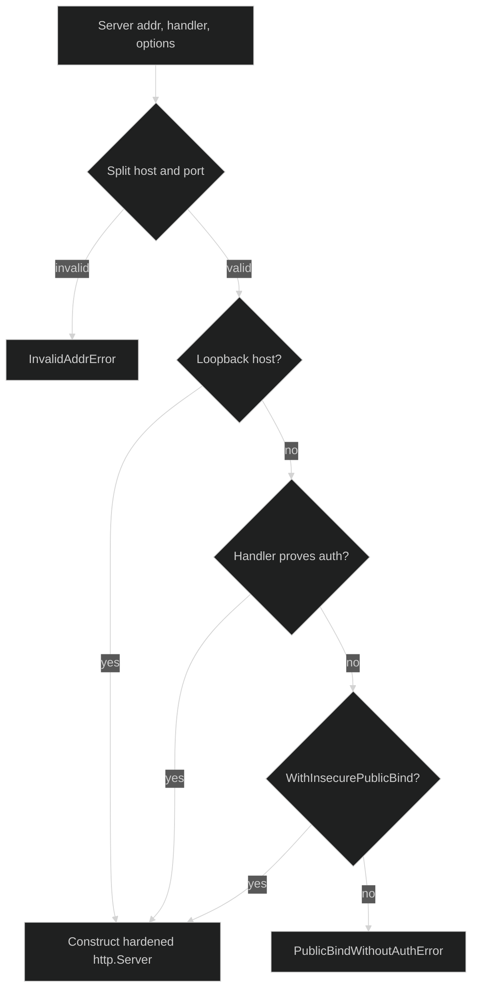

# Public bind protection

`serve.Server` refuses a public address when it cannot prove that
authentication is installed. The check happens during server construction,
before the caller starts listening.

## Loopback classification {#loopback}

`Server` parses `addr` with `net.SplitHostPort` and classifies the host as
loopback only in these cases:

| Host | Classification |
| --- | --- |
| `localhost` | Loopback. |
| `127.0.0.0/8` | Loopback. |
| `::1` | Loopback. |
| Empty host, such as `:8080` | Public wildcard. |
| Any other IP or hostname | Public for this guard. |

An address without a parseable host and port returns
`serve.InvalidAddrError{Addr, Cause}`. The returned error wraps the
`net.SplitHostPort` cause for trusted `errors.Is` and `errors.As` inspection.

```go
srv, err := serve.Server("127.0.0.1:8080", handler)
if err != nil {
	var invalid serve.InvalidAddrError
	if errors.As(err, &invalid) {
		log.Printf("bad listen address %q: %v", invalid.Addr, invalid)
	}
	return err
}
```

`Server` only constructs and returns `*http.Server`; it does not call
`Listen`, `ListenAndServe`, or `Serve`.

## Public refusal {#public-refusal}

For a non-loopback host, the handler must carry the auth proof installed by
`serve.Handler(..., serve.WithAuth(authn))`. Without that proof and without an
explicit opt-in, construction returns `serve.PublicBindWithoutAuthError` and
the server value is `nil`.



The proof is structural. A plain `http.Handler`, or a wrapper that does not
also implement the internal auth-aware marker, is treated as unauthenticated.
This can produce a safe false-negative refusal; it cannot produce a false
positive public bind.

## Explicit proxy opt-in {#explicit-proxy-opt-in}

`serve.WithInsecurePublicBind()` is the only option that relaxes the public
bind guard. Use it only when an upstream authenticating proxy, service mesh,
or equivalent network boundary is responsible for authentication. The option
does not install authentication and does not alter request middleware.

```go
handler, err := serve.Handler(rig, serve.WithAuth(authenticate))
if err != nil {
	return err
}

// A proxy terminates authentication before forwarding to this process.
srv, err := serve.Server("0.0.0.0:8080", handler,
	serve.WithInsecurePublicBind())
if err != nil {
	return err
}
```

The name is intentionally explicit because the server itself will not verify
the proxy assertion. If the proxy is removed, the option leaves this process
public without an in-process auth check.

## Hardened server defaults {#hardened-defaults}

Every successfully constructed server receives these values:

| Field | Value |
| --- | --- |
| `ReadTimeout` | `5s` |
| `ReadHeaderTimeout` | `5s` |
| `IdleTimeout` | `60s` |
| `MaxHeaderBytes` | `1 << 20` |
| `WriteTimeout` | `0`, so a long-lived SSE stream is not truncated by a global write deadline |
| `TLSConfig.MinVersion` | `tls.VersionTLS12` |

Request bodies have a separate 1 MiB default cap in the Handler middleware.

## Source and runnable proof {#source-and-runnable-proof}

The bind policy and server defaults are implemented in
[`server.go`](https://github.com/looprig/harness/blob/main/pkg/serve/server.go),
and the typed failures are defined in
[`errors.go`](https://github.com/looprig/harness/blob/main/pkg/serve/errors.go).
Loopback, malformed-address, auth-aware, opt-in, and default assertions are
covered by [`server_test.go`](https://github.com/looprig/harness/blob/main/pkg/serve/server_test.go).
Run:

```sh
go test ./pkg/serve
```
