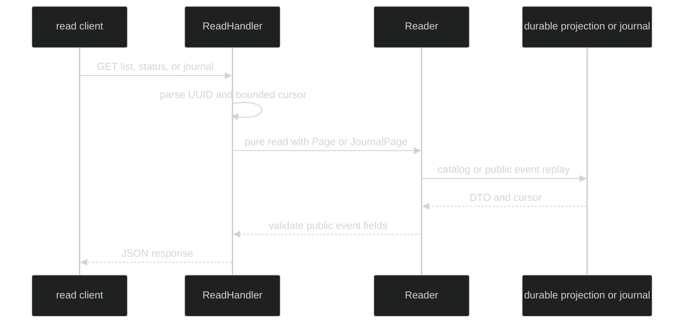

# Read-only endpoints

Use `serve.ReadHandler` when a process should browse durable sessions without
hosting a live `Rig`. The handler has no create, restore, input, interrupt,
gate, or SSE route. Those paths are not authorization fallbacks; they are not
registered and return the mux's plain 404.

## Reader contract {#reader-contract}

The application supplies the narrow read adapter:

```go
type Page struct {
	Skip  int
	Limit int
}

type JournalPage struct {
	From  uint64
	Limit int
}

type Reader interface {
	ListSessions(context.Context, Page) (SessionList, error)
	ReadStatus(context.Context, uuid.UUID) (SessionStatus, error)
	ReadJournal(context.Context, uuid.UUID, JournalPage) (EventJournalPage, error)
}

func ReadHandler(reads Reader, opts ...Option) http.Handler
```

Every method is a pure read. The handler never looks in the complete server's
live registry, so status and journal remain available when a session is not
live on this process.

```go
type catalogReader struct { catalog *catalog.Store }

func (r catalogReader) ListSessions(ctx context.Context, p serve.Page) (serve.SessionList, error) {
	// Query the durable catalog, stable-sort it, then fill NextSkip and Done.
	return r.catalog.List(ctx, p.Skip, p.Limit)
}

func readOnly(reader serve.Reader) http.Handler {
	// Auth is still applied to the read plane when the process has a trust boundary.
	return serve.ReadHandler(reader, serve.WithAuth(authenticate))
}
```

## Endpoint queries {#endpoint-queries}

| Route | Query | Validation | Reader call |
| --- | --- | --- | --- |
| `GET /v1/sessions` | `skip`, `limit` | `skip >= 0`; `1 <= limit <= 1000`; defaults `0`, `100` | `ListSessions(ctx, Page{Skip, Limit})` |
| `GET /v1/sessions/{sid}/status` | none | canonical UUID path segment | `ReadStatus(ctx, sid)` |
| `GET /v1/sessions/{sid}/journal` | `from_journal_seq`, `limit` | non-negative `uint64` cursor; `1 <= limit <= 1000`; defaults `0`, `100` | `ReadJournal(ctx, sid, JournalPage{From, Limit})` |
| `GET /v1/capabilities` | none | none | fixed document |

An absent or empty query value uses its default. `limit=0`, negative values,
non-integers, and values over 1000 produce a 400 `invalid_parameter` envelope.
`from_journal_seq` accepts the full `uint64` range and rejects signs.

## Response types {#response-types}

The JSON shapes are the exported DTOs in `pkg/serve`:

```go
type SessionSummary struct {
	SessionID    uuid.UUID `json:"session_id"`
	State        string    `json:"state,omitempty"`
	Title        string    `json:"title,omitempty"`
	CreatedAt    time.Time `json:"created_at,omitzero"`
	LastActiveAt time.Time `json:"last_active_at,omitzero"`
}

type SessionList struct {
	Sessions []SessionSummary `json:"sessions"`
	Skip     int               `json:"skip"`
	Limit    int               `json:"limit"`
	NextSkip int               `json:"next_skip"`
	Done     bool              `json:"done"`
}

type SessionStatus struct {
	SessionID      uuid.UUID    `json:"session_id"`
	State          string       `json:"state,omitempty"`
	LastJournalSeq uint64       `json:"last_journal_seq"`
	ActiveTurnID   uuid.UUID    `json:"active_turn_id,omitzero"`
	WaitingGateID  uuid.UUID    `json:"waiting_gate_id,omitzero"`
	LastTurn       *StatusEvent `json:"last_turn,omitempty"`
	LastStep       *StatusEvent `json:"last_step,omitempty"`
	UpdatedAt      time.Time    `json:"updated_at,omitzero"`
}

type EventJournalPage struct {
	Events         []StatusEvent `json:"events"`
	NextJournalSeq uint64         `json:"next_journal_seq"`
	Done           bool           `json:"done"`
}
```

`SessionList.NextSkip` and `EventJournalPage.NextJournalSeq` are resume
cursors. `Done` means the returned page had fewer than `Limit` entries. Journal
events are public Enduring events in sequence order. `GatePrepared` and other
internal records are not exposed. `StatusEvent` serializes its nested event
through the event package codec, not by marshaling a Go interface value.

Malformed IDs are 400. A `SessionNotFoundError` from `ReadStatus` is 404. A
reader failure or a non-public event crossing the response boundary is a
generic 500, with the cause logged but not sent to the client.



## Source and runnable proof {#source-and-runnable-proof}

- [`Reader`, paging types, and response DTOs](https://github.com/looprig/harness/blob/main/pkg/serve/reader.go)
- [`ReadHandler` route registration](https://github.com/looprig/harness/blob/main/pkg/serve/mux.go)
- [`query parsing and bounds`](https://github.com/looprig/harness/blob/main/pkg/serve/parse.go)
- [`read handlers`](https://github.com/looprig/harness/blob/main/pkg/serve/handlers_read.go)
- [`read handler tests`](https://github.com/looprig/harness/blob/main/pkg/serve/handlers_read_test.go)
- [`read-only routing tests`](https://github.com/looprig/harness/blob/main/pkg/serve/read_server_test.go)

```sh
go test ./pkg/serve -run 'Test(ServerHandle(ListSessions|Status|Journal)|ReadHandler|Parse)'
```
