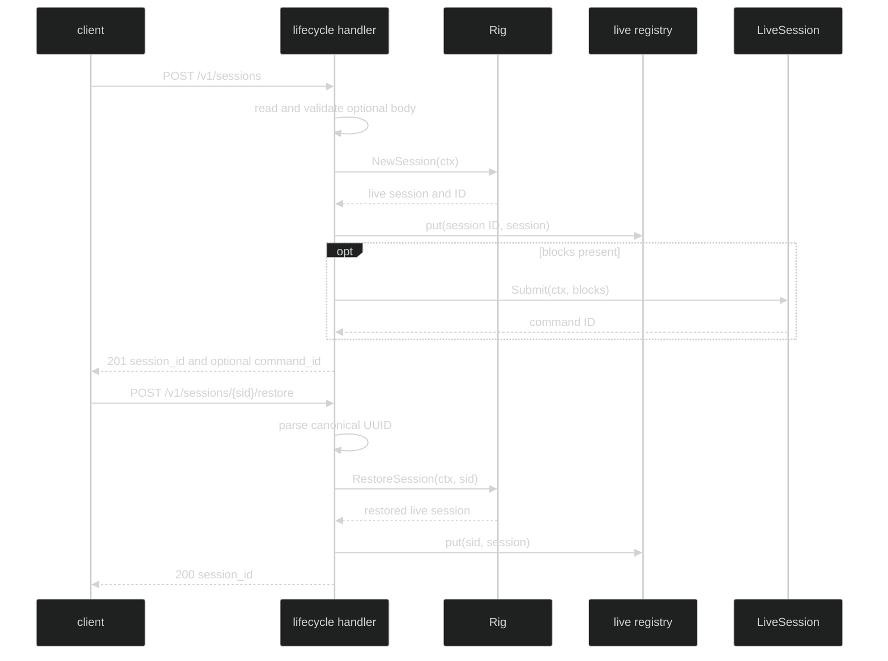

# Session lifecycle endpoints

The live lifecycle routes are a create path for a new session and a restore path
for an existing durable session. Both attach the returned live session to the
handler's in-process registry before the client can use input, interrupt, gates,
or events.

## Create {#create}

`POST /v1/sessions` accepts no body, an empty body, `{}`, or an empty
`blocks` array for an idle session. With blocks, the body is decoded by
`content.UnmarshalBlocks` after the JSON envelope has been read.

| Request | Status | Response |
| --- | --- | --- |
| no body, `{}`, or `{"blocks":[]}` | 201 | `{"session_id":"..."}` |
| `{"blocks":[...]}` | 201 | `{"session_id":"...","command_id":"..."}` |
| malformed JSON, malformed tagged block, or body over cap | 400 | `invalid_body` |
| `Rig.NewSession` failure | 500 | `internal` |
| `Submit` failure after attach | 500 | `internal` |

The handler validates the optional body before calling `Rig.NewSession`, so bad
input cannot leave an unreachable session. It calls `NewSession`, registers the
session, then submits non-empty blocks. If that submit fails, the session stays
registered and the client can use the returned session ID from its own
observability path to decide whether to retry input or interrupt; the handler
does not detach it as a side effect of a submit error.

```go
type createResult struct {
		SessionID uuid.UUID  `json:"session_id"`
		CommandID *uuid.UUID `json:"command_id,omitempty"`
}

func create(ctx context.Context, baseURL string, blocks []content.Block) (createResult, error) {
	var out createResult
	// The wire body is the same tagged-block envelope accepted by Harness.
	body := struct {
		Blocks []content.Block `json:"blocks,omitempty"`
	}{Blocks: blocks}
	raw, err := json.Marshal(body)
	if err != nil {
		return out, err
	}
	req, err := http.NewRequestWithContext(ctx, http.MethodPost, baseURL+"/v1/sessions", bytes.NewReader(raw))
	if err != nil {
		return out, err
	}
	res, err := http.DefaultClient.Do(req)
	if err != nil {
		return out, err
	}
	defer res.Body.Close()
	if res.StatusCode != http.StatusCreated {
		return serve.createResponse{}, fmt.Errorf("create: HTTP %s", res.Status)
	}
	err = json.NewDecoder(res.Body).Decode(&out)
	return out, err
}
```

The example uses a local response struct because `createResponse` is an
unexported wire implementation type. Consumer code should decode the documented
JSON fields, not depend on unexported serve types.

## Restore {#restore}

`POST /v1/sessions/{sid}/restore` parses a canonical UUID before calling
`Rig.RestoreSession`.

| Condition | Status | Response code |
| --- | --- | --- |
| valid restore | 200 | `{"session_id":"..."}` |
| malformed `{sid}` | 400 | `invalid_parameter` |
| `Rig.RestoreSession` returns `serve.SessionNotFoundError` | 404 | `session_not_found` |
| any other restore failure | 500 | `internal` |

On success the returned session is registered under the requested ID. A restore
failure never attaches a partial session.



## Ordering and failure {#ordering-and-failure}

The create path's order matters for recovery. A malformed request is rejected
before session creation; a new-session failure does not attach anything; a
submit failure leaves the newly-created live session attached. This preserves
the session's ownership and makes the failure observable through later status,
events, or a control request rather than silently abandoning resources.

Restore errors are generic at this HTTP boundary because `serve` deliberately
does not import `pkg/session`. A composition root that wants a 404 must return
`serve.SessionNotFoundError`; otherwise the failure is a 500 and the internal
cause is logged only.

## Source and runnable proof {#source-and-runnable-proof}

- [`create` and restore handlers](https://github.com/looprig/harness/blob/main/pkg/serve/handlers_lifecycle.go)
- [`lifecycle response and failure tests`](https://github.com/looprig/harness/blob/main/pkg/serve/handlers_lifecycle_test.go)
- [`route registration`](https://github.com/looprig/harness/blob/main/pkg/serve/mux.go)
- [`block decoder authority`](https://github.com/looprig/harness/blob/main/pkg/serve/handlers_lifecycle.go)

```sh
go test ./pkg/serve -run 'TestServerHandle(Create|Restore)'
```
