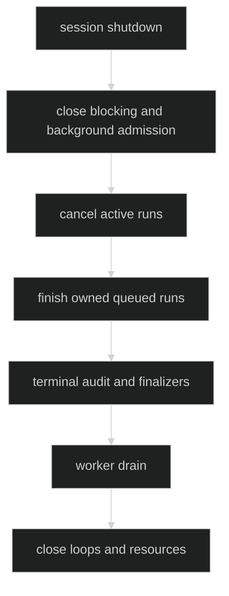

# Cancellation and Shutdown

Cancellation belongs to the run owner and is separate from the caller's
observation context. Shutdown is a session lifecycle transition that drains
owned Hustle activity before closing the resources those runs depend on.

## Cancellation stages

| Stage | Effect |
| --- | --- |
| Preflight, before ownership | Request is rejected; no RunID, audit pair, or finalizer. |
| Queued owned run | Lane removes or closes the node, emits a queue failure, and invokes the finalizer once. |
| Active inference | Runtime cancels the worker context. A terminal `HustleFailed` records canceled or timeout reason as appropriate. |
| Finalization | The finalizer receives the terminal outcome under its bounded finalization context; cleanup errors remain typed. |

Caller cancellation is not a license to drop an owned run. The controller keeps
ownership through terminal audit and finalization.

Proof: [execution ownership](https://github.com/looprig/harness/blob/main/internal/hustleruntime/execution.go) and [cancellation tests](https://github.com/looprig/harness/blob/main/internal/hustleruntime/advanced_test.go).

## Shutdown order

`Controller.Close(ctx)` closes both admissions, cancels active execution,
finishes queued owned runs through their finalizers, waits for worker drain,
and reports any finalizer failures as `CloseError`. Session shutdown keeps the
session context alive while Hustle activity, terminal audit, and finalization
complete; only then does it publish idle/stopped lifecycle and release the
session lease.

Proof: [controller Close](https://github.com/looprig/harness/blob/main/internal/hustleruntime/controller.go) and [Hustle shutdown ordering tests](https://github.com/looprig/harness/blob/main/internal/sessionruntime/hustle_shutdown_test.go).

## Re-entry and finalizer safety

Finalizers run once for every owned run. A finalizer must not synchronously
invoke session shutdown from the finalizer context; the runtime returns the
typed `HustleShutdownReentryError` in that case. Finalizer, activity release,
audit, and cleanup failures remain inspectable through `errors.As` and do not
erase the original terminal reason.

Proof: [finalizer boundary](https://github.com/looprig/harness/blob/main/internal/hustleruntime/execution.go) and [shutdown re-entry test](https://github.com/looprig/harness/blob/main/internal/sessionruntime/hustle_shutdown_test.go).

## Source and proof

- [Hustle controller shutdown](https://github.com/looprig/harness/blob/main/internal/hustleruntime/controller.go)
- [Typed runtime errors](https://github.com/looprig/harness/blob/main/internal/hustleruntime/errors.go)
- [Session Hustle shutdown](https://github.com/looprig/harness/blob/main/internal/sessionruntime/hustle.go)
- [Shutdown proof](https://github.com/looprig/harness/blob/main/internal/sessionruntime/hustle_shutdown_test.go)
