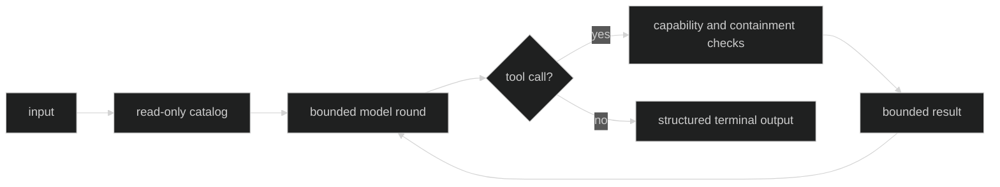

# Evidence

Evidence is an opt-in, bounded tool loop on a Hustle definition. Its binding is
read-only by construction and is distinct from Loop tools, delegation, gates,
workspace mutation, and session control.

## Definition and limits

```go
policy := hustle.EvidenceToolPolicy{
	Revision: "evidence-v1",
	Limits: hustle.ToolLoopLimits{
		MaxRounds: 4, MaxCalls: 12, MaxCallsPerRound: 4,
		MaxResultBytes: 64 << 10, MaxEvidenceBytes: 256 << 10,
	},
	Definitions: []tool.Definition{readOnlyTool},
}
reviewer, err := hustle.Define(
	hustle.WithName("permission.review"),
	hustle.WithParticipation(hustle.ParticipationBlocking),
	hustle.WithTimeout(10*time.Second),
	hustle.WithLimits(hustle.Limits{InputBytes: 1 << 20, OutputBytes: 1 << 20}),
	hustle.WithCurrentLoopModel(),
	hustle.WithSystemPrompt("Review the supplied evidence.", "prompt-v1"),
	hustle.WithPolicyRevision("review-v1"),
	hustle.WithOutputSchema(schema),
	hustle.WithEvidenceTools(policy),
)
_ = reviewer
_ = err
```

An evidence policy must have a revision, a bounded definition catalog, bounded
round/call/result/evidence limits, structured output, and blocking
participation. The definition and produced-tool-name digests are part of the
descriptor.

Proof: [evidence policy definition](https://github.com/looprig/harness/blob/main/pkg/hustle/definition.go) and [evidence option tests](https://github.com/looprig/harness/blob/main/pkg/hustle/definition_test.go).

## Read-only binding

The exact invocation binding is:

```go
// package hustle
type EvidenceBindings struct {
	SessionID     uuid.UUID
	LoopID        uuid.UUID
	ReadWorkspace *tool.ReadWorkspaceBinding
}
```

`tool.ReadWorkspaceBinding` supplies only a canonical root. The binding cannot
carry mutation permits, observation invalidation, delegation, gates, grants,
session controllers, or loop control. Tool definitions are copied at option
creation and bound per invocation.

Proof: [EvidenceBindings and read-only capability](https://github.com/looprig/harness/blob/main/pkg/hustle/definition.go) and [tool binding types](https://github.com/looprig/harness/blob/main/pkg/tool/definition.go).

## Bounded evidence loop

The internal runtime enforces maximum rounds, total calls, calls per round,
individual result bytes, and aggregate evidence bytes. Unknown or unprepared
tools, forbidden capability kinds, containment or access refusal, cancellation,
deadline, and bound exhaustion become redacted `EvidenceError` reasons. Raw
tool arguments and results do not enter Hustle audit events.



Proof: [evidence runtime](https://github.com/looprig/harness/blob/main/internal/hustleruntime/evidence_runner.go) and [evidence failure tests](https://github.com/looprig/harness/blob/main/internal/hustleruntime/tool_execution_test.go).

## Source and proof

- [Evidence definition contracts](https://github.com/looprig/harness/blob/main/pkg/hustle/definition.go)
- [Read-only tool bindings](https://github.com/looprig/harness/blob/main/pkg/tool/definition.go)
- [Evidence error vocabulary](https://github.com/looprig/harness/blob/main/internal/hustleruntime/errors.go)
- [Evidence boundary tests](https://github.com/looprig/harness/blob/main/internal/hustleruntime/evidence_boundary_test.go)
