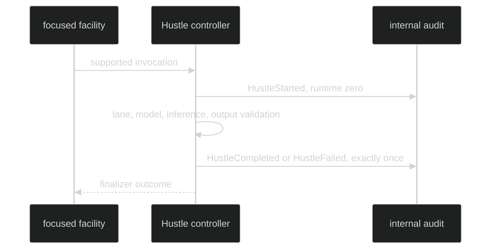

# Internal Audit

Hustle lifecycle records are an internal audit stream. They establish
ownership, model identity, bounded terminal status, and restore evidence. They
are not ordinary public Session events.

## Audit event types

```go
// package event
type HustleRunDescriptor struct {
	Definition hustle.DefinitionDescriptor
	RunID      hustle.RunID
	Runtime    ModelRuntime
}

type HustleStarted struct {
	Run HustleRunDescriptor
}
type HustleCompleted struct {
	Run      HustleRunDescriptor
	Duration time.Duration
	Usage    *content.Usage
}
type HustleFailed struct {
	Run        HustleRunDescriptor
	Duration   time.Duration
	Stage      hustle.Stage
	ReasonCode hustle.ReasonCode
	Usage      *content.Usage
}
```

The concrete events also carry the stamped `event.Header`. `HustleStarted`
requires a zero `Runtime`, because model resolution has not happened.
`HustleCompleted` requires a resolved runtime. `HustleFailed` may carry zero
runtime only for failures before model resolution and must obey
`hustle.ReasonAllowed`.

Proof: [Hustle events](https://github.com/looprig/harness/blob/main/pkg/event/event.go) and [event validation](https://github.com/looprig/harness/blob/main/pkg/event/validate.go).

## Visibility and delivery

All three events have `Visibility() == event.Internal`, session scope, and an
enduring lifecycle class. Ordinary event filters do not deliver them. A
trusted audit consumer can correlate `Run.RunID`, descriptor policy revision,
stage, reason, runtime, duration, and optional usage without receiving raw
prompt, model endpoint, or provider response bytes. The session wire
projection classifies all three as private, so they never appear in a public
journal page or viewer stream.



Proof: [audit publication](https://github.com/looprig/harness/blob/main/internal/hustleruntime/audit.go) and [visibility tests](https://github.com/looprig/harness/blob/main/pkg/event/hustle_test.go).

## Ownership ordering

`HustleStarted` is published before scheduler eligibility. Once it succeeds,
the runtime owns a RunID and must publish one terminal lifecycle event even if
queue admission, model resolution, inference, output validation, or
finalization fails. Pre-ownership request rejection has no audit pair and does
not invoke the finalizer.

Proof: [ownership sequence](https://github.com/looprig/harness/blob/main/internal/hustleruntime/execution.go) and [ownership tests](https://github.com/looprig/harness/blob/main/internal/hustleruntime/ownership_test.go).

## Source and proof

- [Event declarations](https://github.com/looprig/harness/blob/main/pkg/event/event.go)
- [Event validation rules](https://github.com/looprig/harness/blob/main/pkg/event/validate.go)
- [Audit publisher](https://github.com/looprig/harness/blob/main/internal/hustleruntime/audit.go)
- [Audit proof](https://github.com/looprig/harness/blob/main/internal/hustleruntime/execution_test.go)
