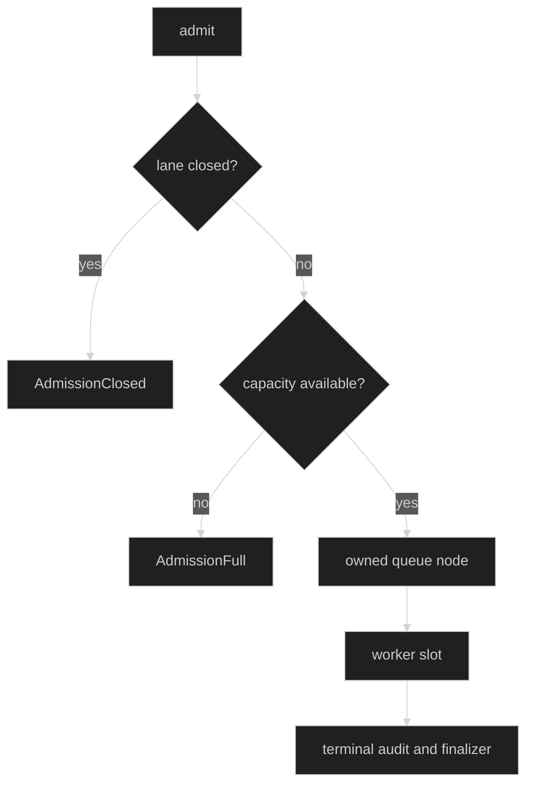

# Limits and Lanes

Rig registration supplies all lane and lifecycle bounds. `WithHustleLimits` is
required when at least one Hustle is registered and rejected when no Hustle
needs it.

## Rig limits

```go
limits := rig.HustleLimits{
	BlockingConcurrent:   1,
	BlockingQueued:       4,
	BackgroundConcurrent: 2,
	BackgroundQueued:     8,
	AuditTimeout:          time.Second,
	FinalizationTimeout:   time.Second,
	WorkerDrainTimeout:    2 * time.Second,
}
runtime, err := rig.Define(
	rig.WithHustles(compactor),
	rig.WithHustleLimits(limits),
)
_ = runtime
_ = err
```

The exact public fields are `BlockingConcurrent`, `BlockingQueued`,
`BackgroundConcurrent`, `BackgroundQueued`, `AuditTimeout`,
`FinalizationTimeout`, and `WorkerDrainTimeout`. Concurrent values and all
timeouts must be positive. Queued values are from zero through
`rig.MaxHustleQueued`, which is `10_000`.

Proof: [Rig Hustle limits](https://github.com/looprig/harness/blob/main/pkg/rig/options.go) and [limit validation tests](https://github.com/looprig/harness/blob/main/pkg/rig/options_test.go).

## Lane ownership

The internal `hustleruntime.LaneLimits` has `Concurrent` and `Queued`; their
sum is the total ownership cap. A queued run owns a slot before it executes,
so a caller cannot create more work than the configured bound. FIFO ordering is
preserved within each lane, and closing a lane rejects new admission while
finishing owned queue nodes through their finalizers.



Proof: [lane limits and controller contract](https://github.com/looprig/harness/blob/main/internal/hustleruntime/contracts.go) and [lane tests](https://github.com/looprig/harness/blob/main/internal/hustleruntime/lane_test.go).

## Queue and run failures

Pre-ownership failures use `AdmissionError` or `RequestError`, so they have no
RunID and do not invoke a finalizer. Owned queue failures use
`QueueFailureError` with `RunID`, `Participation`, `Stage`, and a reason of
`canceled`, `timeout`, `closed`, or `poisoned`. Owned execution failures use
`RunError`; both preserve finalizer and cleanup errors through unwrapping.

Proof: [Hustle runtime error types](https://github.com/looprig/harness/blob/main/internal/hustleruntime/errors.go) and [preflight tests](https://github.com/looprig/harness/blob/main/internal/hustleruntime/preflight_test.go).

## Source and proof

- [Public Rig limit API](https://github.com/looprig/harness/blob/main/pkg/rig/options.go)
- [Internal lane implementation](https://github.com/looprig/harness/blob/main/internal/hustleruntime/lane.go)
- [Controller close behavior](https://github.com/looprig/harness/blob/main/internal/hustleruntime/controller.go)
- [Lane test suite](https://github.com/looprig/harness/blob/main/internal/hustleruntime/lane_test.go)
