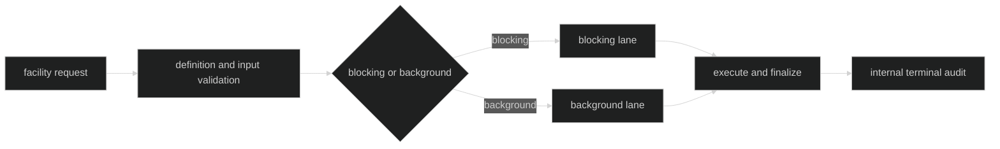

# Participation Modes

`hustle.Participation` selects one immutable session lane. The lane is a
definition property, not a per-request hint.

## Blocking and background

| Mode | Ownership behavior | Typical facility |
| --- | --- | --- |
| `ParticipationBlocking` | Acquires blocking activity, retains ownership through finalization, and participates in session shutdown drain. | Compaction or a request that must complete before its caller proceeds. |
| `ParticipationBackground` | Uses the background lane and returns to the owning facility while session activity continues under the run's lifecycle. | A best-effort classification or asynchronous observation. |

Both modes validate input, persist `HustleStarted`, run bounded inference, and
persist one terminal audit event. A background mode does not make the output
public or remove finalization ownership.

Proof: [participation constants](https://github.com/looprig/harness/blob/main/pkg/hustle/definition.go) and [lane execution tests](https://github.com/looprig/harness/blob/main/internal/hustleruntime/execution_test.go).

## Admission capacity

Each lane has executing and queued capacity. A run owns one slot across its
queue and execution; queue capacity is not an additional unbounded backlog.
FIFO order applies within a lane. A canceled queued run is finalized with a
queue failure and releases ownership.

Proof: [lane controller](https://github.com/looprig/harness/blob/main/internal/hustleruntime/lane.go) and [queue cancellation tests](https://github.com/looprig/harness/blob/main/internal/hustleruntime/advanced_test.go).

## No caller-controlled lane switch

The definition's `Participation` is included in its descriptor and policy
revision. A facility selects a registered name; it cannot change a blocking
definition into background execution by changing request JSON. Rig validation
also requires compaction definitions to be blocking.

Proof: [descriptor participation validation](https://github.com/looprig/harness/blob/main/pkg/hustle/definition.go) and [compaction Hustle compatibility checks](https://github.com/looprig/harness/blob/main/pkg/rig/definition.go).

## Source and proof

- [Hustle participation and definition](https://github.com/looprig/harness/blob/main/pkg/hustle/definition.go)
- [Runtime lane limits](https://github.com/looprig/harness/blob/main/internal/hustleruntime/contracts.go)
- [Scheduler lane implementation](https://github.com/looprig/harness/blob/main/internal/hustleruntime/lane.go)
