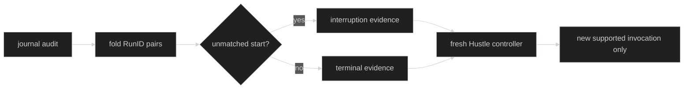

# Restore Behavior

Restore treats Hustle audit as evidence of ownership, not as a serialized
worker queue. A fresh controller is created for the restored Session.

## Audit folding

Restore matches `HustleStarted` to `HustleCompleted` or `HustleFailed` by
`RunID`, definition descriptor, and cause/session coordinates. An unmatched
start is interruption evidence. Duplicate starts, mismatched descriptors,
duplicate terminals, or terminal events without a valid start fail closed.

No queue node, inference worker, response observer, finalizer, or activity lease
is recreated from an audit record.

Proof: [Session Hustle restore](https://github.com/looprig/harness/blob/main/internal/sessionruntime/hustle.go) and [restore tests](https://github.com/looprig/harness/blob/main/internal/sessionruntime/hustle_restore_test.go).

## Fresh runtime state

The restored runtime binds the current registered definitions and lane limits.
It does not resume an interrupted model call. A supported facility may submit a
new invocation, receiving a new RunID and a new `HustleStarted` record. Policy
or descriptor mismatch is a configuration restore failure, not a request to
silently use a different definition.

Proof: [Hustle restore implementation](https://github.com/looprig/harness/blob/main/internal/sessionruntime/hustle.go) and [restore lifecycle tests](https://github.com/looprig/harness/blob/main/internal/sessionruntime/hustle_restore_test.go).

## Why queue state is not replayed

Queue position and worker identity are process-local. Replaying them would
double inference or invoke a finalizer without a live ownership record. The
durable audit preserves enough evidence to report what happened and enough
definition identity to reject incompatible restore, while the new controller
re-establishes bounded admission from current Rig configuration.

Proof: [runtime ownership model](https://github.com/looprig/harness/blob/main/internal/hustleruntime/execution.go) and [restore tests](https://github.com/looprig/harness/blob/main/internal/sessionruntime/hustle_restore_test.go).

## Source and proof

- [Hustle restore folding](https://github.com/looprig/harness/blob/main/internal/sessionruntime/hustle.go)
- [Hustle audit events](https://github.com/looprig/harness/blob/main/pkg/event/event.go)
- [Restore proof](https://github.com/looprig/harness/blob/main/internal/sessionruntime/hustle_restore_test.go)
