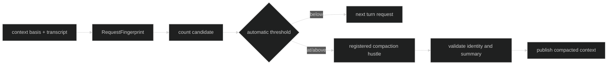

# Compaction Policy

Compaction is an explicit context policy attached to a loop definition:

```go
type CounterPolicy uint8

const (
	CounterPolicyUnknown CounterPolicy = iota
	CounterPolicyRequireExact
	CounterPolicyAllowConservative
)

type CompactionPolicy struct {
	Automatic        bool
	CounterPolicy    CounterPolicy
	CompactAt        event.BasisPoints
	RearmBelow       event.BasisPoints
	ReservedOutput   content.TokenCount
	SafetyMargin     content.TokenCount
	MaxSummaryTokens content.TokenCount
	CountTimeout     time.Duration
	Hustle           hustle.Name
}

func WithCompaction(policy CompactionPolicy) Option
func (p CompactionPolicy) Validate(capability contextcount.CounterCapability) error
```

Harness supplies no compaction defaults. The definition must include a nonzero
output reservation, summary-token budget, positive count timeout, and a valid
registered hustle name. Heuristic counter quality additionally requires a
nonzero safety margin.

## Automatic validation

`Automatic` enables threshold-triggered compaction. Then `RearmBelow` must be
nonzero and strictly below `CompactAt`, `CompactAt` must be below
`event.FullScaleBasisPoints`, and `CounterPolicy` must admit the counter quality:

| Policy | Accepted counter qualities |
| --- | --- |
| `CounterPolicyRequireExact` | `CountQualityExactProvider`, `CountQualityExactLocal` |
| `CounterPolicyAllowConservative` | exact qualities plus `CountQualityHeuristicEstimate` |
| `CounterPolicyUnknown` | none; invalid when automatic |

With `Automatic` false, thresholds and counter policy are not used for the
automatic trigger, but the common reservation, summary budget, timeout, hustle,
and heuristic-margin checks still apply. `WithContextObservation` and
`WithCompaction` are mutually exclusive because they represent different
admission policies.

```go
policy := loop.CompactionPolicy{
	Automatic:        true,
	CounterPolicy:    loop.CounterPolicyAllowConservative,
	CompactAt:        8_500,
	RearmBelow:       6_000,
	ReservedOutput:   512,
	SafetyMargin:     256,
	MaxSummaryTokens: 256,
	CountTimeout:     2 * time.Second,
	Hustle:           "context.compact",
}
if err := policy.Validate(capability); err != nil {
	var fieldErr *loop.CompactionPolicyError
	if errors.As(err, &fieldErr) {
		log.Println("invalid field", fieldErr.Field)
	}
	return err
}
```

## Identity and summary contract

The policy is part of `Definition.PolicyRevision`. Request measurement identity
uses `RequestFingerprintInput`, which includes system/tool/runtime revisions,
the full model and basis, and both counter capabilities. A compaction result is
accepted only when its basis, model, request fingerprint, and output shape match
the input. The summary must be one nonempty user text message; malformed
transcripts and output are rejected with typed errors that do not render model
bytes.



The Rig must register the named hustle and provide `HustleLimits`; a loop
compaction policy referring to an unregistered or incompatible hustle fails
Rig definition.

## Source and proof

- [Compaction policy, validation, and request fingerprints](https://github.com/looprig/harness/blob/main/pkg/loop/compaction_policy.go)
- [Compaction input/output typed contracts](https://github.com/looprig/harness/blob/main/pkg/loop/compaction.go)
- [Compaction policy tests](https://github.com/looprig/harness/blob/main/pkg/loop/compaction_policy_test.go)
- [Rig compaction hustle validation](https://github.com/looprig/harness/blob/main/pkg/rig/definition.go)
