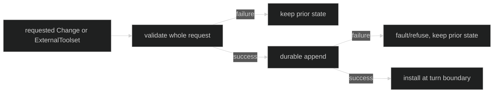

# Configuration Changes

Live configuration changes use the trusted controller, never a mutable
`loop.Definition`:

```go
type Change interface {
	InferenceModel() (model.Model, bool)
	InferenceEffort() (model.Effort, bool)
	// sealed by the loop package
}

func ChangeModel(model model.Model) Change
func ChangeEffort(effort model.Effort) Change

type Controller interface {
	Handle
	SetMode(context.Context, ModeName) error
	Change(context.Context, ...Change) error
	Interrupt(context.Context) error
}
```

`Change` values are immutable. The controller validates a complete batch before
applying anything, and the definition remains unchanged for future sessions.

## Atomic changes

`ChangeModel` validates model structure, durable key, declared transport, and
model effort. `ChangeEffort` validates the effort against the selected model.
Passing an empty batch or a batch with neither model nor effort is refused. A
valid batch is appended durably and then becomes visible at a turn boundary;
the turn already in flight keeps its starting configuration.

```go
err := controller.Change(ctx,
	loop.ChangeModel(candidate),
	loop.ChangeEffort(effort), // effort is a model.Effort selected by the caller.
)
if err != nil {
	var refusal *loop.ChangeError
	if errors.As(err, &refusal) {
		switch refusal.Kind {
		case loop.ChangeInvalidModel, loop.ChangeInvalidEffort,
			loop.ChangeInvalidMode:
			// Correct the request; no partial change occurred.
		case loop.ChangeLoopShuttingDown, loop.ChangeLoopExited,
			loop.ChangeContextDone, loop.ChangeDurableAppendFailed:
			// Treat as a lifecycle or persistence failure.
		}
	}
	return err
}
```

The sealed interface prevents consumers from inventing a change implementation
that the runtime cannot inspect. The two factory functions are the complete
public change set.

## External tools

An optional `ExternalToolInstaller` is separate from `Controller`:

```go
type ExternalToolset struct {
	Source      string
	Generation  string
	Definitions []tool.Definition
}

type ExternalToolInstaller interface {
	ReplaceExternalTools(context.Context, ExternalToolset) error
}
```

The replacement is atomic and applies at the next turn boundary. `Source` and
`Generation` must be nonempty bounded identifiers. An empty `Definitions` slice
clears that source's slot. A failed build, invalid tool info, or collision with
a declared tool or another source leaves the previous generation installed.
Foreign loops return `ChangeExternalToolsUnsupported` because Harness does not
own their tool bindings.



## Source and proof

- [Controller, sealed Change, and external tool contracts](https://github.com/looprig/harness/blob/main/pkg/loop/controller.go)
- [Loop change runtime validation and atomicity](https://github.com/looprig/harness/blob/main/internal/sessionruntime/loop_change.go)
- [Controller and external-tool tests](https://github.com/looprig/harness/blob/main/pkg/loop/controller_test.go)
