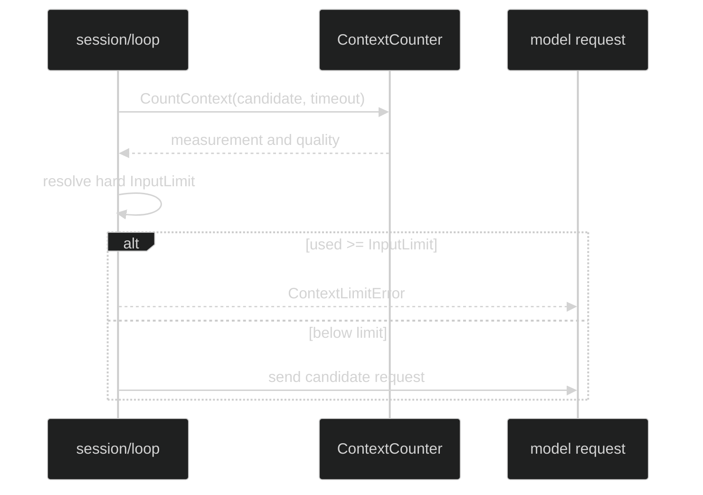

# Context Observation

Observation is the non-compacting context policy. Configure it with:

```go
type ContextObservationPolicy struct {
	ReservedOutput content.TokenCount
	SafetyMargin   content.TokenCount
	CountTimeout   time.Duration
}

func WithContextObservation(policy ContextObservationPolicy) Option
func (p ContextObservationPolicy) Validate(
	capability contextcount.CounterCapability,
) error
```

Every field is explicit. `ReservedOutput` must be nonzero and `CountTimeout`
must be positive. When the counter quality is
`CountQualityHeuristicEstimate`, `SafetyMargin` must also be nonzero. Exact
provider and exact local counters may use a zero safety margin.

## Hard admission

Observation counts the candidate request before admission and compares it to
the limit returned by `ResolveContextLimits`. It does not rewrite the
conversation and does not invoke a compaction hustle. If the candidate reaches
the limit, the runtime returns a typed `*loop.ContextLimitError` containing the
`event.ContextMeasurement` and refuses that request.

The option requires the complete context group: `WithContextCounter`,
`WithInferenceCapability`, and exactly one of observation or compaction. Adding
both policies returns `DefinitionConflictingContextPolicy`; adding a policy
without a counter or capability returns the corresponding missing-context
error.



## Policy fields and errors

| Field | Required rule | Typed field constant |
| --- | --- | --- |
| `ReservedOutput` | `> 0` | `ContextObservationFieldReservedOutput` |
| `SafetyMargin` | `> 0` for heuristic estimates; otherwise explicit | `ContextObservationFieldSafetyMargin` |
| `CountTimeout` | `> 0` | `ContextObservationFieldCountTimeout` |

`Validate` returns `*loop.ContextObservationPolicyError`; inspect its `Field`
with `errors.As`. It performs metadata checks only and does not call the
counter's I/O method during definition construction.

## Source and proof

- [Observation policy type and validation](https://github.com/looprig/harness/blob/main/pkg/loop/context_observation.go)
- [Definition context-policy coupling](https://github.com/looprig/harness/blob/main/pkg/loop/definition.go)
- [Observation policy and admission tests](https://github.com/looprig/harness/blob/main/pkg/loop/context_observation_test.go)
