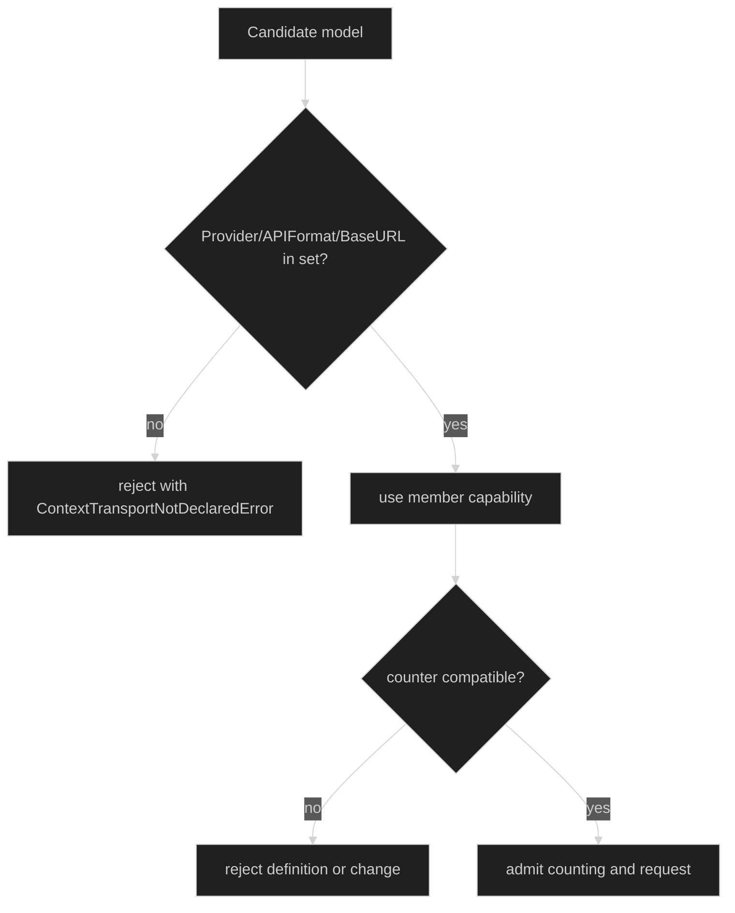

# Context Transports

A context transport couples wire identity to an inference counting posture:

```go
type ContextTransport struct {
	Provider   model.ProviderName
	APIFormat  model.APIFormat
	BaseURL    string
	Capability contextcount.InferenceCapability
}

func WithContextTransports(transports ...ContextTransport) Option
type BoundDefinition interface {
	ContextTransportCapability(model.Model) (contextcount.InferenceCapability, bool)
}
func (d Definition) ValidateContextModel(model.Model) error
```

The transport key is exactly `(Provider, APIFormat, BaseURL)`. Model name,
sampling, caps, limits, and origin do not change transport identity. Effort is a
request parameter, not a trust-boundary change.

## Declare the set

With a counter and capability, omitting `WithContextTransports` synthesizes one
member from the base `WithInference` model and `WithInferenceCapability`.
Supplying the option replaces that synthesized set with the complete allowed
set. The set must:

- contain the base model's transport with exactly the declared base capability;
- contain no duplicate `(Provider, APIFormat, BaseURL)` member;
- use valid capabilities compatible with the loop's counter;
- include every model used by a declared mode.

```go
definition, err := loop.Define(
	loop.WithName("assistant"),
	loop.WithInference(client, primary),
	loop.WithContextCounter(counter),
	loop.WithInferenceCapability(primaryCapability),
	loop.WithContextTransports(
		loop.ContextTransport{
			Provider: primary.Provider, APIFormat: primary.APIFormat,
			BaseURL: primary.BaseURL, Capability: primaryCapability,
		},
		loop.ContextTransport{
			Provider: backup.Provider, APIFormat: backup.APIFormat,
			BaseURL: backup.BaseURL, Capability: backupCapability,
		},
	),
	loop.WithContextObservation(policy),
)
if err != nil {
	return err
}
```

## Membership and switching

`Definition.ValidateContextModel` and the bound method reject a candidate whose
transport is not declared. A live `ChangeModel` therefore cannot move a loop to
an undeclared endpoint or posture. The capability lookup returns `(zero, false)`
for a nonmember; it never falls back to the base capability.



The transport set is immutable and included in `Definition.PolicyRevision`.
Changing a transport, endpoint, or capability is therefore a restore-visible
policy change.

## Source and proof

- [ContextTransport type, membership key, and typed error](https://github.com/looprig/harness/blob/main/pkg/loop/context_transport.go)
- [Context option group validation and mode binding](https://github.com/looprig/harness/blob/main/pkg/loop/definition.go)
- [Transport validation and switching tests](https://github.com/looprig/harness/blob/main/pkg/loop/context_transport_test.go)
