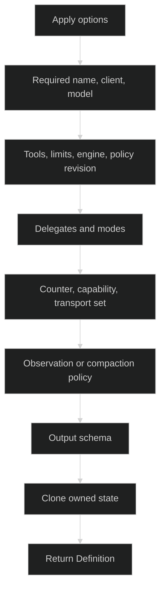

# Define a Loop

`loop.Define` is the only constructor for a public `loop.Definition`:

```go
func Define(opts ...Option) (Definition, error)
```

The zero value of `Definition` is invalid. A successful result owns copies of
models, modes, tool-definition slices, delegates, context transports, and the
optional output schema. Reusing the same options to create a second definition
does not make the definitions share those mutable containers.

## Definition options

`Option` is declared as `type Option func(*definitionOptions) error`; callers
normally use the exported option functions below.

| Option | Effect and validation |
| --- | --- |
| `WithName(identity.AgentName)` | required nonblank registration name |
| `WithInference(inference.Client, model.Model)` | required client and structurally valid model/key/effort |
| `WithSystem(string)` | base system instructions |
| `WithDisplayName(string)`, `WithDescription(string)` | presentation metadata; description participates in Rig topology identity |
| `WithOutputSchema(inference.OutputSchema)` | clones and validates a final structured-output policy |
| `WithTools(...tool.Definition)` | additive declared factories; names must be nonblank and not reserved |
| `WithAccessGate(AccessGate)` | fail-closed prepared-request gate; requires policy revision |
| `WithToolMiddlewares(...tool.ToolMiddleware)` | additive middleware; nil entries are rejected and require policy revision |
| `WithToolLimits(ToolLimits)` | singleton base limits; zero fields receive defaults |
| `WithDrainTimeout(time.Duration)` | singleton nonnegative shutdown drain timeout; zero becomes five seconds |
| `WithEngine(Engine)` | native or foreign engine marker; `EngineAdapter` is bind-time only and rejected here |
| `WithRuntimeContext(RuntimeContextProvider)` | per-turn volatile blocks; nil is rejected and requires policy revision |
| `WithPolicyRevision(string)` | stable identity for opaque policy collaborators |
| `WithDelegates(...identity.AgentName)` | additive allowed child names |
| `WithDelegation(Delegation)` | `DelegationSyncOnly` or `DelegationManaged` |
| `WithModes(...Mode)` and `WithInitialMode(ModeName)` | declare named alternatives and choose the initial one |
| `WithContextCounter(contextcount.ContextCounter)` | fixed complete-request counter |
| `WithInferenceCapability(contextcount.InferenceCapability)` | fixed transport posture; required with a counter |
| `WithContextTransports(...ContextTransport)` | complete admitted transport set; omitted means the base model's one transport |
| `WithContextObservation(ContextObservationPolicy)` | hard admission policy without compaction |
| `WithCompaction(CompactionPolicy)` | manual and optional automatic compaction policy |

Options are not all interchangeable. Duplicate singleton options return
`*loop.DefinitionError{Kind: loop.DefinitionDuplicateOption}`. Context options
are checked as a group after all options have run, so option order cannot turn an
incomplete counter/capability/policy set into a valid definition.

## Immutable result

The useful design-time accessors are:

```go
func (d Definition) Name() identity.AgentName
func (d Definition) Description() string
func (d Definition) Engine() Engine
func (d Definition) Delegates() []identity.AgentName
func (d Definition) Modes() []Mode
func (d Definition) ToolRequirements() tool.Requirements
func (d Definition) ToolDefinitions() []tool.Definition
func (d Definition) InitialMode() ModeName
func (d Definition) FingerprintInitial() InitialFingerprint
func (d Definition) Delegation() Delegation
func (d Definition) PolicyRevision() string
func (d Definition) Bind(context.Context, tool.Bindings) (BoundDefinition, error)
```

`Delegates` and `Modes` are fresh slices. `PolicyRevision` is a deterministic
SHA-256 projection of execution behavior and opaque revisions. `FingerprintInitial`
resolves the initial model, effective system, and produced tool names without
building tool instances. `ToolDefinitions` returns the base and mode tool
definitions, deduplicated by name, also without building instances. `Bind` is
where factories run and IDs are checked.

## Validation order



Typical failures include `DefinitionMissingName`, `DefinitionInvalidClient`,
`DefinitionInvalidModel`, `DefinitionInvalidTool`, `DefinitionMissingPolicyRevision`,
`DefinitionMissingInitialMode`, `DefinitionInvalidModeBinding`,
`DefinitionConflictingContextPolicy`, and `DefinitionInvalidOutputSchema`.
Use `errors.As` instead of parsing error strings:

```go
var de *loop.DefinitionError
if errors.As(err, &de) {
	log.Printf("field=%s kind=%s", de.Field, de.Kind)
}
```

## Source and proof

- [Define, validation, cloning, accessors, and binding](https://github.com/looprig/harness/blob/main/pkg/loop/definition.go)
- [Definition error kinds](https://github.com/looprig/harness/blob/main/pkg/loop/definition_errors.go)
- [Validation and defensive-copy proof](https://github.com/looprig/harness/blob/main/pkg/loop/definition_test.go)
