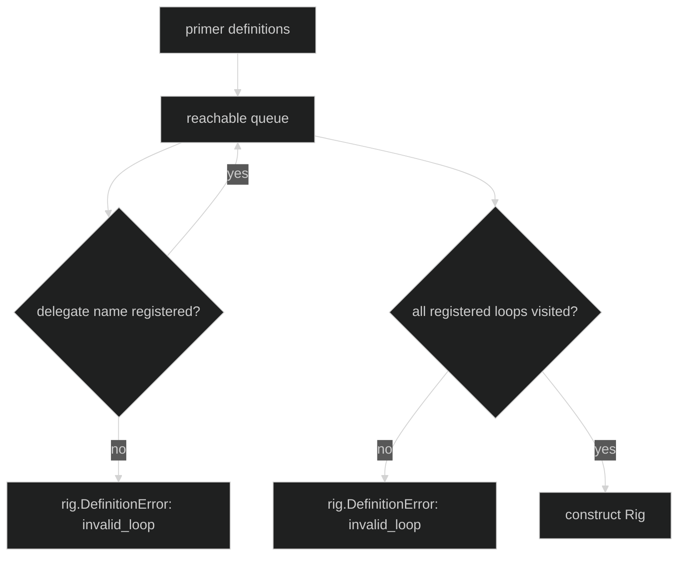

# Delegation Policy

Delegation has a policy value and an allowlist of names:

```go
type DelegationStyle uint8

const (
	DelegationSyncOnly DelegationStyle = iota
	DelegationManaged
)

type Delegation struct{ Style DelegationStyle }

func WithDelegates(names ...identity.AgentName) Option
func WithDelegation(policy Delegation) Option
```

`WithDelegates` is additive and deduplicated when the definition freezes. Empty
or whitespace-only names are rejected. `DelegationSyncOnly` and
`DelegationManaged` are the only valid styles; an unknown numeric value is a
`DefinitionInvalidDelegation` error.

## Graph validation

The loop definition only declares possible delegate names. The Rig is the
composition root that verifies each name is registered and that every loop is
reachable from at least one primer. This makes an unreachable worker an early
definition error rather than dead configuration.



`DelegationSyncOnly` permits only the synchronous model-facing action set. The
managed style is the one used by Harness's lifecycle-aware delegation tools;
the Rig also injects the derived agent-tool definitions into every mode of a
delegate-capable loop during binding. The injected tools are included in the
frozen topology/tool fingerprint, so changing delegation topology is restore-
visible.

```go
planner, err := loop.Define(
	loop.WithName("planner"),
	loop.WithInference(client, plannerModel),
	loop.WithDelegates("worker"),
	loop.WithDelegation(loop.Delegation{Style: loop.DelegationManaged}),
)
if err != nil {
	return err
}
rigged, err := rig.Define(
	rig.WithLoops(planner, worker),
	rig.WithPrimers("planner"),
	rig.WithDelegationLimits(rig.DelegationLimits{Depth: 2, Quota: 4}),
	rig.WithSessionStore(store),
)
```

The exact method name is `WithLoops`, not a mutable registry method. A loop
cannot dynamically authorize an arbitrary child name from model output.

## Source and proof

- [Delegation types and definition options](https://github.com/looprig/harness/blob/main/pkg/loop/deps.go)
- [Delegate freezing and binding-time injected tools](https://github.com/looprig/harness/blob/main/pkg/loop/definition.go)
- [Rig reachability and delegation tests](https://github.com/looprig/harness/blob/main/pkg/rig/rig_test.go)
- [Delegation composition proof](https://github.com/looprig/harness/blob/main/examples/composition/example_test.go)
