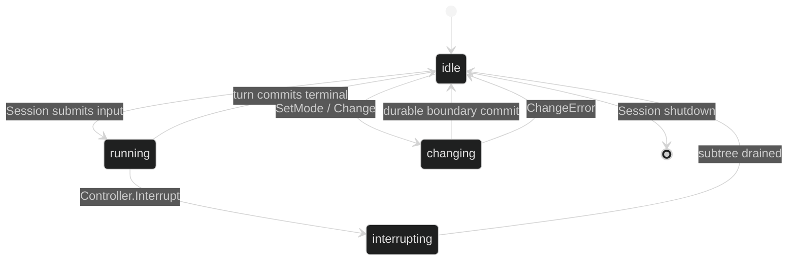

# Live Loop Controller

The runtime exposes a read-only view and a trusted mutation surface:

```go
type Handle interface {
	ID() uuid.UUID
	Mode() ModeName
	Model() model.Model
}

type Controller interface {
	Handle
	SetMode(context.Context, ModeName) error
	Change(context.Context, ...Change) error
	Interrupt(context.Context) error
}
```

`Handle` is safe to hand to read-only UI code. It identifies one live loop and
reports the active mode and model snapshot. It does not expose tools, journal
writes, actor channels, or internal runtime types.

## Handle

`ID()` is the loop UUID assigned for the session. `Mode()` returns the empty
name for the base mode. `Model()` returns the effective model for the selected
mode and current runtime changes. The value is a snapshot; read it again after
a successful controller change instead of caching it as authority.

```go
func render(handle loop.Handle) string {
	return fmt.Sprintf("loop=%s mode=%q model=%s",
		handle.ID(), handle.Mode(), handle.Model().Name)
}
```

## Controller

`SetMode` accepts only predeclared names and commits at a turn boundary.
`Change` accepts the sealed `ChangeModel` and `ChangeEffort` values and applies
the full batch atomically. `Interrupt` cancels the loop's current turn and the
entire delegate subtree. It holds admission until the subtree is idle, so a
parent waiting for a delegate cannot immediately start a replacement step.

The controller is trusted by design. Expose it only to the component that owns
session control, not to model-facing tool code. Session-wide interruption is a
different operation on `session.Session`; controller interruption is one loop
subtree.



## Ownership

`Controller` belongs to the session runtime and is invalid after shutdown.
Every call takes a context; cancellation before the actor commits yields
`ChangeContextDone`. Do not call `Shutdown` through this interface. The owning
`session.SessionController` closes subscriptions, sessions, and all loop
actors in the documented lifecycle order.

## Source and proof

- [Handle and Controller interfaces](https://github.com/looprig/harness/blob/main/pkg/loop/controller.go)
- [Interrupt and control routing](https://github.com/looprig/harness/blob/main/internal/sessionruntime/interrupt.go)
- [Controller contract tests](https://github.com/looprig/harness/blob/main/pkg/loop/controller_test.go)
