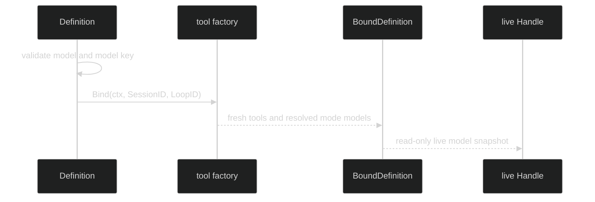

# Models and Inference

`WithInference` stores an `inference.Client` and a provider-neutral
[`model.Model`](/docs/guides/inference/models) in the immutable definition:

```go
func WithInference(client inference.Client, model model.Model) Option
```

`Define` rejects a nil client, an invalid model, an invalid durable model key,
or an invalid sampling effort. It also validates every model explicitly set on
a `Mode`. The definition clones the model and its sampling values, so changing
the caller's model after `Define` cannot change a live session's policy.

## What belongs to the model

The loop treats the model as a descriptor, not as a credential container. The
descriptor is passed to the inference client at request time and participates in
the definition and restore fingerprints. Provider endpoints and credentials are
owned by the client/composition root; runtime identity projections deliberately
omit raw credentials and endpoints. The public bodies of `LoopStarted`,
`LoopInferenceChanged`, and `LoopModeChanged` omit the model's base URL; only
the private journal body that restore reads keeps it.

`Definition.FingerprintInitial` returns an `InitialFingerprint` with the selected
initial `model.Model`, the effective system text, and produced tool names. A
mode's nonzero model and effort override the base values for that projection.

## Bound model view

`Definition.Bind` returns a sealed `BoundDefinition`. Its selected accessors are
declared in the interface as:

```go
type BoundDefinition interface {
	Client() inference.Client
	Model() model.Model
	Effort() model.Effort
	ValidateContextModel(model.Model) error
}
```

The actual interface also includes identity, system, tool, mode, context,
access, output, delegation, and runtime-identity methods; it is not a struct
callers can construct.
`BoundDefinition.Model` and `Mode.Model` return defensive model copies. The
bound view resolves the initial mode, stamps the effective effort into the
selected model, and creates fresh invokable tools with the binding IDs.



## Runtime identity

When a composition root selects a catalog runtime, it may produce a bound view
with runtime profile, source, selection kind, alias, target provider/model, and
effort. `BoundDefinition.RuntimeIdentity()` exposes this secret-free tuple and
`RuntimeIdentity.Digest()` returns its stable SHA-256 identity. A
`RuntimeSelectionHarnessManaged` tuple intentionally omits concrete model and
effort identity because the child harness owns that selection.

## Source and proof

- [Inference option, model validation, cloning, and bound model accessors](https://github.com/looprig/harness/blob/main/pkg/loop/definition.go)
- [Runtime identity projection and binding overrides](https://github.com/looprig/harness/blob/main/pkg/loop/bound_overrides.go)
- [Model cloning and mode resolution tests](https://github.com/looprig/harness/blob/main/pkg/loop/mode_test.go)
- [Runtime identity proof](https://github.com/looprig/harness/blob/main/pkg/loop/bound_runtime_test.go)
