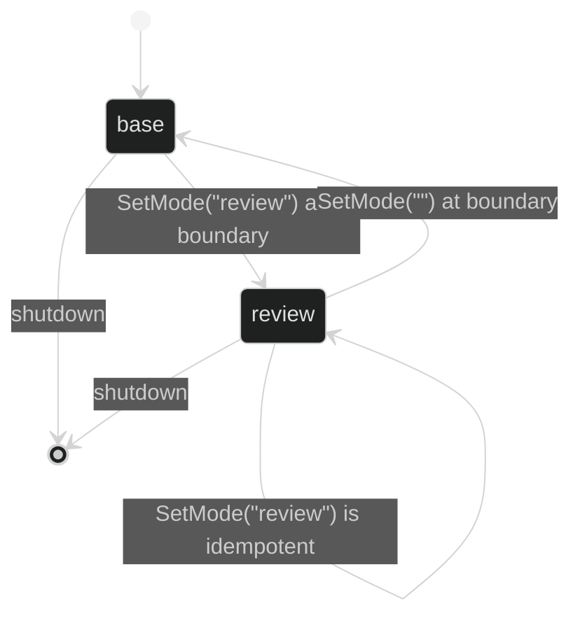

# Modes

A mode is a named, predeclared alternative to a loop's base model, effort,
tools, limits, and instructions:

```go
type Mode struct {
	Name         ModeName
	Model        model.Model
	Effort       model.Effort
	Tools        []tool.Definition
	ToolLimits   ToolLimits
	Instructions string
}

type BoundMode struct {
	Name         ModeName
	Model        model.Model
	Effort       model.Effort
	Tools        []tool.InvokableTool
	ToolLimits   ToolLimits
	Instructions string
}

func WithModes(modes ...Mode) Option
func WithInitialMode(name ModeName) Option
```

The empty `ModeName` is the implicit base mode. Declared mode names must be
nonblank and unique. If any mode is declared, `WithInitialMode` is required and
must name one of them. Setting an initial mode with no declared modes is an
`DefinitionInvalidInitialMode` error.

## Resolution

At bind time Harness always creates a base `BoundMode`, then one bound mode for
each declaration. A mode with no model uses the base model. A mode with
`EffortNone` uses the base effort. A mode with no tools uses the base tool
definitions. Positive mode limits override only that field of the base limits;
zero means inherit. The selected mode's `Instructions` is combined with the
base system text by `EffectiveSystem`.

```go
review := loop.Mode{
	Name:         "review",
	Effort:       model.EffortLow,
	ToolLimits:   loop.ToolLimits{Calls: 20},
	Instructions: "List risks before edits.",
}
definition, err := loop.Define(
	loop.WithName("assistant"),
	loop.WithInference(client, selectedModel),
	loop.WithModes(review),
	loop.WithInitialMode("review"),
)
```

`Definition.Modes` and `BoundDefinition.Modes` return defensive copies.
`BoundDefinition.Mode(name)` returns `(BoundMode, bool)` and also copies its
model and tool slice. Mutating a returned mode cannot change future turns.

## Live selection

The initial mode is design-time policy. A live controller can select only the
predeclared names with `SetMode(ctx, name)`. An unknown name returns a typed
`ChangeError` with `Kind: ChangeInvalidMode`; the definition and active runtime
remain unchanged. Selection is committed at the next actor turn boundary, so a
step already in flight continues under its starting mode.



## Source and proof

- [Mode and BoundMode definitions, defaults, and cloning](https://github.com/looprig/harness/blob/main/pkg/loop/mode.go)
- [Mode validation and resolution](https://github.com/looprig/harness/blob/main/pkg/loop/definition.go)
- [Mode tests](https://github.com/looprig/harness/blob/main/pkg/loop/mode_test.go)
