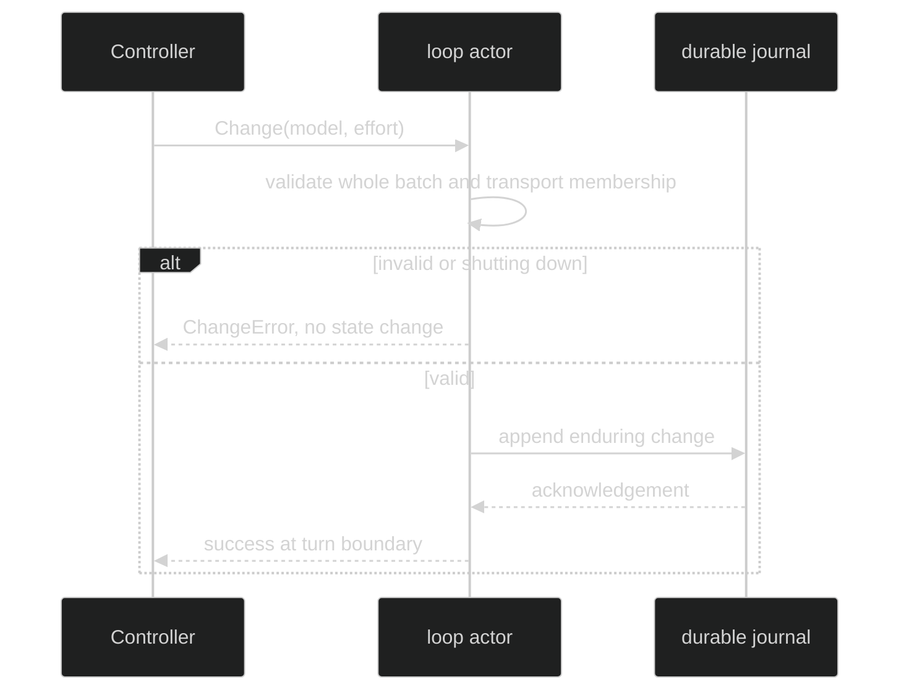

# Runtime Model Selection

There are two separate selection layers:

1. A parent composition resolves a catalog row into a bound runtime tuple.
2. A live loop controller applies a validated model or effort change at a turn
   boundary.

The live read surface is:

```go
type Handle interface {
	ID() uuid.UUID
	Mode() ModeName
	Model() model.Model
}

func ChangeModel(model.Model) Change
func ChangeEffort(model.Effort) Change
```

`Handle.Model()` is read-only by convention and returns a model value. A
`Controller` embeds `Handle` and accepts one or more sealed `Change` values.

## Catalog selection

`RuntimeCatalog` is parent-scoped and immutable. `Resolve` uses empty harness,
alias, and effort selectors as deterministic defaults; explicit selectors are
checked only inside the selected/default harness. `ResolveWithExplicitEffort`
distinguishes omitted effort from an explicit `model.EffortNone`. A managed
native entry has no concrete model row and returns
`RuntimeSelectionHarnessManaged`.

```go
resolved, err := catalog.ResolveWithExplicitSource(
	identity.AgentName("worker"),
	loop.AgentHarnessName("claude"),
	loop.RuntimeSourceGateway,
	loop.ModelAlias("balanced"),
	effort, // model.Effort selected by the caller.
	true,
)
if err != nil {
	var catalogErr *loop.RuntimeCatalogError
	if errors.As(err, &catalogErr) {
		log.Println(catalogErr.Kind)
	}
	return err
}
```

The resolved tuple carries both the model-facing alias and the concrete target
alias used by a gateway/launcher. The target descriptor is a defensive clone.
`RuntimeIdentity.Digest` excludes endpoints and credentials, and managed
selection excludes model and effort identity.

## Live change

Controller validation is whole-batch and atomic. A model change validates the
model, key, transport membership, and supported effort; an effort change checks
the currently selected model. If any item is invalid, no item is applied and no
durable change event is emitted. A successful change is persisted before the
new setting becomes visible.

```go
if err := liveLoop.Change(ctx,
	loop.ChangeModel(candidate),
	loop.ChangeEffort(model.EffortHigh),
); err != nil {
	var changeErr *loop.ChangeError
	if errors.As(err, &changeErr) {
		log.Printf("change refused: %s", changeErr.Kind)
	}
	return err
}
fmt.Println(liveLoop.Model().Name)
```



## Source and proof

- [Runtime catalog and deterministic resolution](https://github.com/looprig/harness/blob/main/pkg/loop/runtime_catalog.go)
- [Handle, Controller, Change values, and typed errors](https://github.com/looprig/harness/blob/main/pkg/loop/controller.go)
- [Bound runtime identity and tuple pinning](https://github.com/looprig/harness/blob/main/pkg/loop/bound_overrides.go)
- [Catalog and controller tests](https://github.com/looprig/harness/blob/main/pkg/loop/runtime_catalog_test.go)
