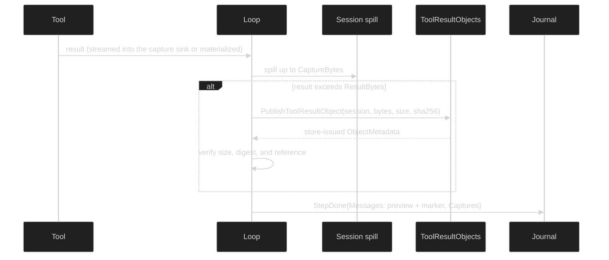

# Tool-result capture

A build log, a test run, or a large file read can be far bigger than the model
should see in one message. `ToolLimits.ResultBytes` already bounds what enters
the conversation, but on its own the elided part is simply gone. Tool-result
capture keeps the complete result as a durable object beside the session
journal, shows the model a bounded preview with a marker, and lets a loop that
binds `read_tool_result` page through the rest.

Capture is off unless the Rig wires a store. Without it, a loop shapes an
oversized result to its preview budget and commits exactly what it always did.

## How it works



Each committed `StepDone` carries one `event.ToolResultCapture` per tool result
in `Captures`. A capture records the tool execution and tool-use IDs, the
retained and original byte counts, whether it was truncated and why, the
encoding, and a `Reference` to the stored object. `Reference` is nil when the
committed message already holds the complete result.

A tool can stream its raw output into the capture sink by implementing
`tool.CapturingInvokableTool`; otherwise Harness captures the materialized
result. Which definitions stream is part of the
[Tools capture contract](/docs/guides/tools/core-concepts#large-results-and-capture).

## Wire capture into a Rig

Use the same `sessionstore.Store` for the journal and for capture, so each
object lives in the journal's own scope and outlives any workspace:

```go
store, err := sessionstore.Open(backend)
if err != nil {
	return err
}

assistant, err := loop.Define(
	loop.WithName("assistant"),
	loop.WithInference(client, selectedModel),
	loop.WithTools(
		tools.Bash(),
		tools.ReadToolResultDefinition(), // pages captures; needs WithToolResultObjects
	),
	// Bound the preview. With ResultBytes zero nothing is ever elided,
	// so nothing is captured.
	loop.WithToolLimits(loop.ToolLimits{ResultBytes: 50 << 10}),
)
if err != nil {
	return err
}

runtime, err := rig.Define(
	rig.WithLoops(assistant),
	rig.WithPrimers("assistant"),
	rig.WithSessionStore(store),
	// spillBase must be absolute, must already exist when a session starts,
	// and must be an owner-only directory that is not a symlink.
	rig.WithToolResultObjects(store.ToolResultObjects(), "/var/lib/agent/tool-spill"),
)
```

`tools.ReadToolResultDefinition` comes from the [Tools](/docs/guides/tools)
module and is described in
[read_tool_result](/docs/guides/tools/built-in-tools/readtoolresult).

`rig.Define` validates the wiring:

| Problem | `DefinitionError.Kind` |
| --- | --- |
| nil store, or a spill base that is not absolute | `DefinitionInvalidToolResultCapture` (`Name` is `objects` or `spill_base`) |
| both `WithToolResultObjects` and the deprecated `WithToolResultCapture` | `DefinitionDuplicateOption` |
| spill base equal to, inside, or containing the workspace region | `DefinitionToolResultSpillOverlapsWorkspace` |
| a loop declares a tool requiring `tool.RequiresToolResultReader` but no readable store is wired | `DefinitionToolResultReaderWithoutObjects` |

Each session creates `<spillBase>/<sessionID>` owner-only and removes it at
shutdown. Keeping the spill outside the workspace region keeps it out of every
workspace checkpoint.

`(*rig.Rig).CaptureSafety()` returns a `tool.CaptureSafetyDescriptor` projected
from every loop's tool definitions. Its `Safe()` method reports whether each
high-output tool either streams into capture or is bounded by
`loop.DefaultMaterializedToolResultBytes` (32 MiB), which lets a placement
decision be made before any session exists.

## Limits

| Knob | Default | Meaning |
| --- | --- | --- |
| `ToolLimits.ResultBytes` | 0, unbounded | model-visible text per result; a positive value must be at least 256 |
| `ToolLimits.CaptureBytes` | `loop.DefaultToolResultCaptureBytes`, 8 MiB | bytes retained per result; a positive value must be at least 256 |
| `loop.DefaultMaterializedToolResultBytes` | 32 MiB | the declared memory maximum for one materialized result |
| `tool.MaxToolResultPageBytes` | 64 KiB | the most retained bytes one `read_tool_result` page returns |

A result longer than `CaptureBytes` is retained up to the ceiling and marked
truncated with reason `capture_ceiling`; a producer that already bounded its
own output is marked `source_limit`. A materialized result is resident in
memory before the loop can bound it, so a pooled host should budget
`DefaultMaterializedToolResultBytes` times the loop's parallel tool-call limit
for materialized tools.

## What the model sees

The model receives a preview shaped so that the preview plus a one-line marker
fits `ResultBytes`. The marker states how many bytes were retained, whether a
truncated tail is unavailable and why, and, only when the calling loop has a
reader bound, how to read more:

```text
[tool output shaped; all 1843200 bytes retained; read the rest with read_tool_result capture_id="6f1c..."]
```

The capture ID is the tool execution ID. The marker names the reader only when
`BoundMode.ToolResultReaderBound()` is true: the mode has a tool named
`loop.ReadToolResultToolName` (`read_tool_result`) built by a definition that
declares `tool.RequiresToolResultReader`. A same-named tool without the
requirement, such as an MCP tool, does not count, so the model is never told to
call a tool with no reader behind it.

## Let the model read a capture

A definition that declares `tool.RequiresToolResultReader` receives
`tool.Bindings.ToolResults`, a `tool.ToolResultReader`:

```go
type ToolResultReader interface {
	ReadToolResult(ctx context.Context, request ToolResultPageRequest) (ToolResultPage, error)
}

type ToolResultPageRequest struct {
	CaptureID string // the tool execution ID from the marker
	Offset    uint64
	MaxBytes  uint64 // zero means the reader's ceiling; always clamped
}
```

The reader is bound per session and per calling loop. The model can name only
a capture ID, never a session, tenant, reference, or path, and only a capture
its own loop produced: a parent cannot page a child's captures, and a child
cannot page its parent's. The reader streams the whole stored object through
its integrity check before returning any window, so a page is never served from
bytes that no longer match. A UTF-8 page ends on a rune boundary; a binary page
is base64 in `ToolResultPage.Render()`, sized so the encoded text stays within
the budget. `NextOffset` reports where the next page starts.

Failures are `*tool.ToolResultReadError`. Every kind is safe to show the model,
and `Error()` never includes the store diagnostic held in `Cause`:

| Kind | Meaning |
| --- | --- |
| `unknown_capture` | malformed ID, or a capture this loop did not produce |
| `not_retained` | no object was stored because the model already saw the complete result |
| `offset_out_of_range` | offset at or past the end of the retained bytes |
| `integrity` | the stored object did not verify |
| `unavailable` | the store could not serve the object |

The capture index behind the reader is rebuilt when a session is restored, so
captures from before a restart stay readable.

## Serve captures to other readers

A viewer or object route that serves tool-result objects should prove that a
committed step references the object, not merely that the object exists:

```go
capture, found, err := store.LookupToolResultCapture(ctx, runtimeSessionID, ref)
switch {
case err != nil:
	var budget *sessionstore.ToolResultCaptureScanBudgetError
	if errors.As(err, &budget) {
		// Not "not found": the evidence may be older than the scanned window.
		return errRefuse
	}
	return err
case !found:
	return errNotFound // no committed StepDone in this session names ref
}
_ = capture
```

The lookup scans the session's public events backwards from the tip, up to
`sessionstore.ToolResultCaptureScanBudget` (65,536) records. Running out of
budget returns `*ToolResultCaptureScanBudgetError`, never a silent miss. A found
capture is cached per `Store` (up to 4,096 entries); a miss is not cached.

`ToolResultObjects()` writes SessionStore objects of kind `tool-result` under
the Store's tenant and the runtime session ID. `OpenToolResultObject` returns
an error wrapping `loop.ErrToolResultObjectIntegrity` when stored bytes fail
verification, so a reader can tell corruption from unavailability.

## Failures

If a result cannot be retained, for example because the spill cannot be
created, the object write fails, or the stored size or digest does not match
what was captured, the loop commits the step with an error-marked tool result
in place of the output and ends the turn with `TurnFailed`. It does not
continue to another model request with a preview whose elided bytes exist
nowhere. A step's `Captures` list is all or nothing, so a partial list is never
recorded.

## Retention

Captured objects live as long as the session journal. Nothing reclaims them:
an object whose publish succeeded but whose `StepDone` never committed is an
orphan that stays until SessionStore offers an object reaping API. Captures can
hold output that the preview discarded, such as environment dumps or verbose
logs, so treat them with the same care as the journal.

## Migrate from WithToolResultCapture

`rig.WithToolResultCapture` and `loop.ToolResultObjectStore` are deprecated.
With that seam the loop minted each object's identity itself, so no store can
resolve it and a capture retained that way can never be read back. Replace it
with `rig.WithToolResultObjects(store.ToolResultObjects(), spillBase)`; the
spill-base rules are the same. The two options cannot be combined.

## Source and proof

- [`rig.WithToolResultObjects` and `CaptureSafety`](https://github.com/looprig/harness/blob/v0.41.0/pkg/rig/capture.go)
- [`loop.ToolResultObjects` and limits](https://github.com/looprig/harness/blob/v0.41.0/pkg/loop/tool_capture.go)
- [`ToolLimits`](https://github.com/looprig/harness/blob/v0.41.0/pkg/loop/mode.go)
- [`tool.ToolResultReader`](https://github.com/looprig/harness/blob/v0.41.0/pkg/tool/tool_result_reader.go)
- [`event.ToolResultCapture`](https://github.com/looprig/harness/blob/v0.41.0/pkg/event/turn.go)
- [`Store.ToolResultObjects` and `LookupToolResultCapture`](https://github.com/looprig/harness/blob/v0.41.0/pkg/sessionstore/tool_results.go)
- [Capture and marker implementation](https://github.com/looprig/harness/blob/v0.41.0/internal/loopruntime/tool_result_capture.go)
