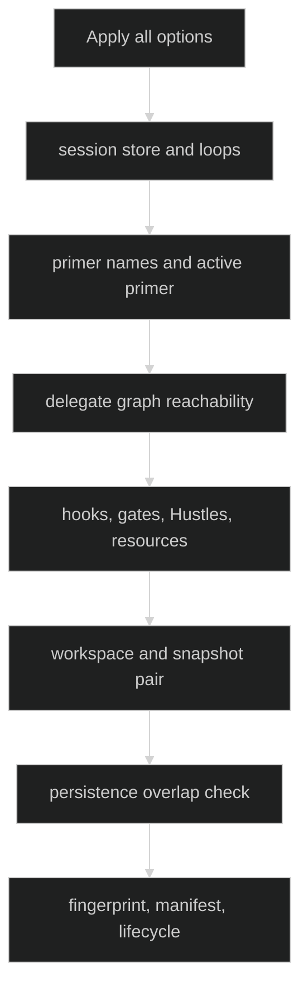

# Define a Rig

The constructor is:

```go
func Define(options ...Option) (*Rig, error)
type Option func(*definitionState) error
```

`definitionState` is private. Consumers express the assembly only through the
exported option functions. Options are applied in argument order, but all
cross-feature checks run after every option has been collected.

## Option signatures

| Function | Public signature |
| --- | --- |
| `WithLoops` | `func WithLoops(definitions ...loop.Definition) Option` |
| `WithPrimers` | `func WithPrimers(names ...string) Option` |
| `WithActivePrimer` | `func WithActivePrimer(name string) Option` |
| `WithSessionStore` | `func WithSessionStore(store *sessionstore.Store) Option` |
| `WithDelegationLimits` | `func WithDelegationLimits(limits DelegationLimits) Option` |
| `WithFingerprintFields` | `func WithFingerprintFields(fields ConfigFingerprintFields) Option` |
| `WithHooks` | `func WithHooks(set hook.Set) Option` |
| `WithRuntimeCatalog` | `func WithRuntimeCatalog(catalog loop.RuntimeCatalog) Option` |
| `WithGateCaps` | `func WithGateCaps(caps GateCaps) Option` |
| `WithAllowConfigMismatch` | `func WithAllowConfigMismatch() Option` |
| `WithRestoreDecider` | `func WithRestoreDecider(decider session.RestoreDecider) Option` |
| `WithForeignBuilders` | `func WithForeignBuilders(builder foreign.Builder, restored foreign.RestoredBuilder) Option` |
| `WithForeignServicesBuilders` | `func WithForeignServicesBuilders(builder foreign.ServicesBuilder, restored foreign.ServicesRestoredBuilder) Option` |
| `WithSessionResourceStorage` | `func WithSessionResourceStorage(provider SessionResourceStorageProvider) Option` |
| `WithHustles` / `WithHustleLimits` | `func WithHustles(definitions ...hustle.Definition) Option`; `func WithHustleLimits(limits HustleLimits) Option` |
| `WithSnapshots` | `func WithSnapshots(policy SnapshotPolicy) Option` |
| `WithExclusiveWorkspace` | `func WithExclusiveWorkspace(*workspacestore.Store, string, storage.Leaser) Option` |
| `WithSessionWorkspaces` | `func WithSessionWorkspaces(*workspacestore.Store, string) Option` |
| `WithSharedWorkspace` | `func WithSharedWorkspace(*workspacestore.Store, string) Option` |

Permission-review options are listed on [Gates and Hooks](/docs/guides/harness/rig/gates-and-hooks); their pairings are validated at the same Define boundary.

## Cross-feature validation



Important invariants include:

- duplicate loop names, missing loops, missing primers, and unknown primers
  fail with `*rig.DefinitionError`;
- a delegate name must be registered and every registered loop must be reachable
  from the primer set;
- a workspace-requiring tool requires a workspace placement;
- a configured placement requires snapshots, and snapshots without placement
  are rejected;
- a required snapshot on a shared workspace is invalid;
- a process-service tool requires a session-resource provider;
- every registered compaction hustle and required Hustle limit must match.

The resulting Rig owns copies of additive option slices and hook sets. A later
mutation of a caller-owned `[]loop.Definition`, `[]string`, `hook.Set`, or
fingerprint map cannot rewrite the assembly.

## Source and proof

- [Rig constructor and cross-feature checks](https://github.com/looprig/harness/blob/main/pkg/rig/definition.go)
- [Rig option implementations and singleton rules](https://github.com/looprig/harness/blob/main/pkg/rig/options.go)
- [Define validation tests](https://github.com/looprig/harness/blob/main/pkg/rig/rig_test.go)
