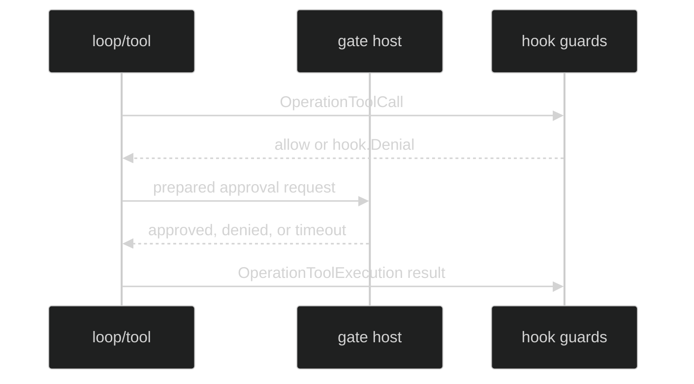

# Gates and Hooks

Rig-level gates and hooks are consumer-owned collaborators captured into the
immutable assembly. They observe or authorize bounded operations; they do not
become model-facing tools or bypass loop ownership.

## Hook set

```go
func WithHooks(set hook.Set) Option

type hook.Set struct {
	PolicyRevision string
	Guards         []hook.Guard
	Around         []hook.Around
}
```

`hook.ValidateSet` requires a nonblank bounded `PolicyRevision` when guards are
present and forbids one when only around observers are present. Guards must use
valid guardable operations and nonnil checks. Around callbacks may observe all
valid operations. Guards run in registration order; around begins run in order
and finish in reverse order. Call and result snapshots are read-only and
callbacks must be concurrency-safe.

```go
hooks := hook.Set{
	PolicyRevision: "audit-v1",
	Guards: []hook.Guard{{
		Operation: hook.OperationToolCall,
		Check: func(ctx context.Context, call hook.Call) error {
			return nil // return hook.Deny("reason_code", "bounded reason") to refuse.
		},
	}},
}
runtime, err := rig.Define(
	rig.WithHooks(hooks),
	// loops, primers, and session store omitted here for brevity
)
```

The Rig clones the guard/around slices before compiling them. A guard policy
revision contributes to the manifest identity; operational around observers do
not change behavioral identity by themselves.

## Permission review

The permission-review option family is intentionally paired:

```go
func WithPermissionClassifiers(gate.PermissionClassifierSet) Option
func WithPermissionReviewPolicy(gate.PermissionReviewPolicy) Option
func WithPermissionReviewLimits(PermissionReviewLimits) Option
func WithPermissionReviewEvidence(
	gate.EvidenceAccessEvaluator,
	gate.EvidenceContainmentVerifier,
	[]string,
) Option
func WithPermissionReviewSecurityCeiling(string) Option
func WithPermissionReviewObservations(gate.EvidenceObservationVerifier) Option
```

Classifiers require a sealed permission-review policy and a nonblank consumer
security ceiling. A classifier that declares evidence tools requires the
read-only evidence access/containment option and an allowlist of kinds. Limits
default to `DefaultPermissionReviewBreakerThreshold` (20) per numeric field
when classifiers are configured; explicit limits replace all fields as a set.
Observation verification is optional and fails closed if an observation is
recorded without a verifier. Unused pairing options are rejected rather than
silently ignored.

## Gate caps

```go
type GateCaps struct {
	MaxOpen    int
	MaxTimeout time.Duration
}

func WithGateCaps(caps GateCaps) Option
```

Negative values are invalid. The caps bound live permission-gate admission;
they do not turn an omitted gate into an approval. The runtime releases a gate
slot when its await context is cancelled or the session closes.



## Source and proof

- [Hook set cloning and Rig compilation](https://github.com/looprig/harness/blob/main/pkg/rig/options.go)
- [Hook contracts, operations, validation, and denial](https://github.com/looprig/harness/blob/main/pkg/hook/hook.go)
- [Permission-review option pairings](https://github.com/looprig/harness/blob/main/pkg/rig/options.go)
- [Gate cap and hook integration tests](https://github.com/looprig/harness/blob/main/pkg/rig/gate_host_test.go)
