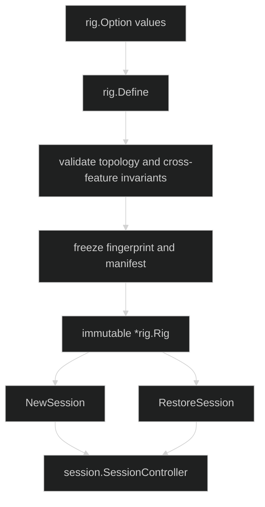

# Rig

A `rig.Rig` is the immutable composition root for a family of sessions. It
freezes loop topology, primers, session storage, workspace placement, snapshot
policy, hooks, gates, Hustles, runtime catalogs, and lifecycle limits before it
creates any live actor. It is reusable: one Rig can create multiple independent
sessions.

## How it works

`rig.Define(options ...Option) (*Rig, error)` applies options, compiles hooks,
checks the loop graph, validates cross-feature requirements, computes a
secret-free fingerprint/manifest, and builds the lifecycle. The minimum valid
assembly contains a nonnil session store, at least one loop, and at least one
primer that names a registered loop. The active primer is inferred only when
there is exactly one primer, or is set explicitly with `WithActivePrimer`.



## Define a Rig

```go
runtime, err := rig.Define(
	rig.WithLoops(assistant),
	rig.WithPrimers("assistant"),
	rig.WithSessionStore(sessions),
)
if err != nil {
	var definitionErr *rig.DefinitionError
	if errors.As(err, &definitionErr) {
		log.Printf("rig rejected: %s", definitionErr.Kind)
	}
	return fmt.Errorf("define rig: %w", err)
}

live, err := runtime.NewSession(ctx)
if err != nil {
	return fmt.Errorf("start session: %w", err)
}
defer live.Shutdown(context.Background())
```

Workspace placement requires a matching `WithSnapshots` policy. A loop whose
tools require workspace binding requires one of the workspace options. A loop
whose tools require process services requires `WithSessionResourceStorage`.
These are Define-time checks, not best-effort session defaults.

## Immutable assembly

`Rig` has no exported fields and no methods for changing definitions after
construction. The only public methods are:

```go
func (r *Rig) NewSession(context.Context, ...SessionOption) (session.SessionController, error)
func (r *Rig) RestoreSession(context.Context, uuid.UUID) (session.SessionController, error)
```

Live input, subscriptions, gate responses, compaction, and shutdown belong to
the returned `session.SessionController` and its embedded/session data-plane
contracts. A Rig does not expose or require the internal
`sessionruntime.Lifecycle` type.

## Source and proof

- [Rig definition validation and lifecycle assembly](https://github.com/looprig/harness/blob/main/pkg/rig/definition.go)
- [Rig public type and package boundary](https://github.com/looprig/harness/blob/main/pkg/rig/doc.go)
- [Rig construction, topology, and reuse tests](https://github.com/looprig/harness/blob/main/pkg/rig/rig_test.go)
- [Lifecycle example](https://github.com/looprig/harness/blob/main/examples/lifecycle/example_test.go)
