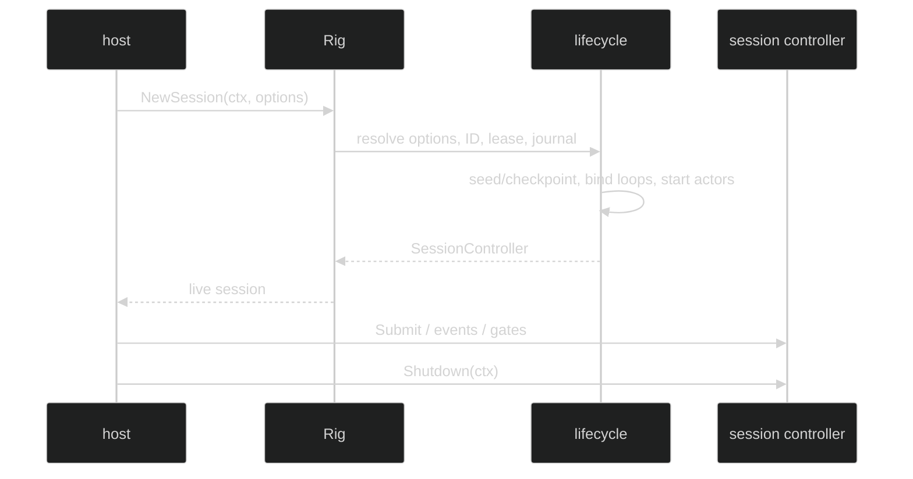

# Lifecycle

`Rig` exposes exactly two live-entry operations:

```go
func (r *Rig) NewSession(
	ctx context.Context,
	opts ...SessionOption,
) (session.SessionController, error)

func (r *Rig) RestoreSession(
	ctx context.Context,
	id uuid.UUID,
) (session.SessionController, error)
```

Both return `session.SessionController`. The controller embeds the ordinary
`session.Session` data plane and adds active-loop selection, loop-controller
lookup, workspace checkpoint/restore, and `Shutdown`.

## New session

`NewSession` resolves `SessionOption` values first, then allocates an ID,
acquires the session lease, opens the journal, applies optional workspace seed
state, binds loops, and publishes the start record. A failure unwinds acquired
resources in reverse order. With a seed, the workspace checkpoint is committed
before any loop starts.



## Restore session

`RestoreSession` takes a nonzero UUID, reads the stored lifecycle and manifest,
compares the Rig's current fingerprint, and consults the configured restore
decider before acquiring workspace or binding live collaborators. It reconstructs
the same session ID, loop IDs, active primer, journals, gates, and workspace
pointer. A fingerprint mismatch is not silently ignored.

```go
restored, err := runtime.RestoreSession(ctx, savedID)
if err != nil {
	var lifecycleErr *rig.LifecycleError
	if errors.As(err, &lifecycleErr) {
		log.Println("restore failed", lifecycleErr.Kind)
	}
	return err
}
defer restored.Shutdown(context.Background())
```

## Shutdown

`Shutdown` belongs to `session.SessionController`, not `Rig` or `loop.Controller`.
It stops admission, interrupts and drains loops/subtrees, finishes required
journal/checkpoint work, stops process and foreign services, releases workspace
and session leases, and is idempotent at the controller boundary. The caller
must continue to service or close event subscriptions according to the session
contract while shutdown drains.

`Rig` maps construction failures to `*rig.LifecycleError` kinds such as
`LifecycleContextDone`, `LifecycleIDGenerationFailed`, `LifecycleLeaseFailed`,
`LifecycleJournalFailed`, `LifecycleAppenderFailed`,
`LifecycleProcessNotificationsUnsupported`, and `LifecycleSessionFailed`.

## Source and proof

- [NewSession and RestoreSession public methods](https://github.com/looprig/harness/blob/main/pkg/rig/lifecycle.go)
- [Session and SessionController contracts](https://github.com/looprig/harness/blob/main/pkg/session/session.go)
- [Lifecycle construction/unwind and restore tests](https://github.com/looprig/harness/blob/main/pkg/rig/lifecycle_test.go)
- [End-to-end lifecycle example](https://github.com/looprig/harness/blob/main/examples/lifecycle/example_test.go)
