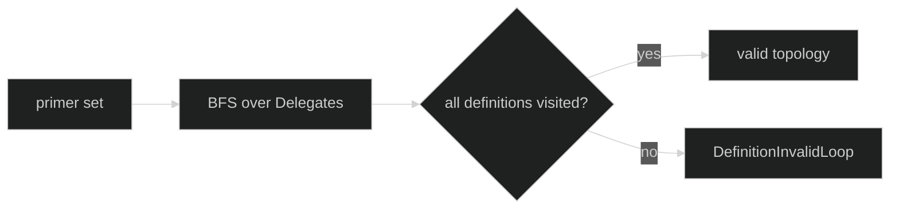

# Loops and Primers

Register immutable loop definitions and choose one or more entry loops:

```go
func WithLoops(definitions ...loop.Definition) Option
func WithPrimers(names ...string) Option
func WithActivePrimer(name string) Option
```

`WithLoops` and `WithPrimers` are additive. `Define` copies the slices, rejects
zero/unnamed definitions, and rejects duplicate definition names. Primer names
must be unique and must match a registered definition. With exactly one primer,
the active primer defaults to that name. With multiple primers,
`WithActivePrimer` is required and must name one of them.

## Registration

The loop's `Definition.Name()` is the registry key. Descriptions and delegates
remain on the immutable definition. A loop may list delegate names before or
after the corresponding definition is passed to `WithLoops`; the final Rig
validation sees the complete set, so option order is not a hidden dependency.

```go
planner, err := loop.Define(
	loop.WithName("planner"),
	loop.WithInference(plannerClient, plannerModel),
	loop.WithDelegates("worker"),
)
if err != nil { return err }
worker, err := loop.Define(
	loop.WithName("worker"),
	loop.WithInference(workerClient, workerModel),
)
if err != nil { return err }

assembled, err := rig.Define(
	rig.WithLoops(planner, worker),
	rig.WithPrimers("planner"),
	rig.WithSessionStore(store),
)
```

## Primers

A primer is a loop that can receive the first user input. It is not a mutable
pointer to an actor; `NewSession` binds all registered loops and marks the
active primer in lifecycle state. A session can have multiple allowed primers
for explicit selection while retaining one active initial primer.

The topology fingerprint includes loop names, descriptions, policy revisions,
delegate edges, primer order, and the active primer. Changing any of those
inputs makes a restore compare unequal. This protects delegate capability
descriptions and initial routing from silently drifting.

## Reachability



An unreferenced worker is rejected even if its definition is otherwise valid.
That keeps the Rig's graph closed and prevents a typo in a delegate edge from
leaving an apparently configured but impossible runtime.

## Source and proof

- [Loop/primer collection and reachability checks](https://github.com/looprig/harness/blob/main/pkg/rig/definition.go)
- [WithLoops, WithPrimers, and WithActivePrimer](https://github.com/looprig/harness/blob/main/pkg/rig/options.go)
- [Primer topology and reachability tests](https://github.com/looprig/harness/blob/main/pkg/rig/rig_test.go)
