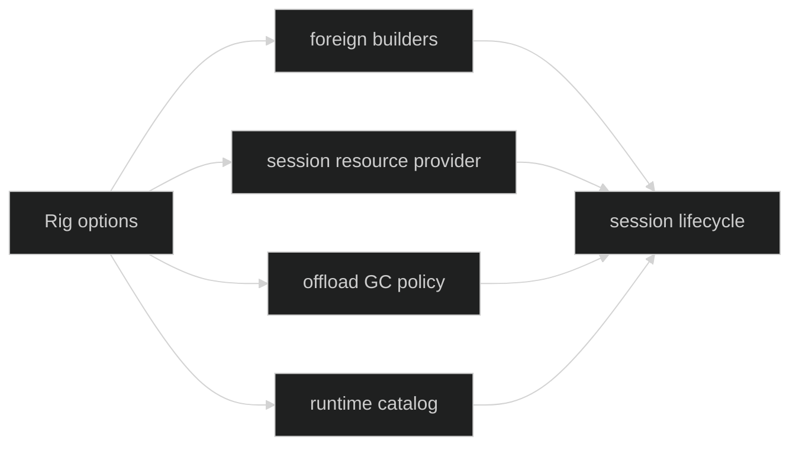

# Runtime Services

Rig options wire services that the session runtime owns after construction.
They are composition seams, not mutable services exposed from `Rig`.

## Foreign builders

```go
func WithForeignBuilders(
	foreign.Builder,
	foreign.RestoredBuilder,
) Option
func WithForeignServicesBuilders(
	foreign.ServicesBuilder,
	foreign.ServicesRestoredBuilder,
) Option
```

The legacy builder receives a bound loop, event publisher, ID generator, and
factory. The services-aware builder additionally receives a per-loop
`foreign.Services` value containing an opaque broker descriptor and narrow
delivery hook. Both live and restored callbacks are required. Nil callbacks or
duplicate options fail at Rig definition. A runtime profile selects the builder
through the parent-scoped loop runtime catalog; unknown profiles fail closed.

The Rig never serializes a foreign builder or broker capability. On restore it
rebuilds the callback-owned runtime from the durable profile and bound
definition.

## Session resource storage

Process-service tools require a durable per-session resource location:

```go
type SessionResourceStorage struct {
	Path     string
	Identity string
}

type SessionResourceStorageProvider interface {
	StorageForSession(context.Context, uuid.UUID) (SessionResourceStorage, error)
}

func WithSessionResourceStorage(SessionResourceStorageProvider) Option
```

The provider must be safe for concurrent calls and return the same durable path
and identity for a session ID across restart. Rig stores the provider interface
but does not mutate its state. A nil or typed-nil provider returns
`DefinitionInvalidResourceStorage`; a process-services tool without one returns
`DefinitionMissingResourceStorage`.

## Offload GC

```go
type OffloadGCPolicy struct {
	Interval time.Duration
	Timeout  time.Duration
}

func WithOffloadGC(policy OffloadGCPolicy) Option
```

Both fields must be positive. This policy reaps orphaned session journal blobs
left after a blob-durable-before-pointer crash gap. It never collects workspace
snapshots. Invalid interval/timeout values return typed errors at `Define`.

## Runtime catalog

`WithRuntimeCatalog(loop.RuntimeCatalog)` forwards one immutable parent-scoped
catalog to new and restored sessions. The catalog selects explicit gateway or
native tuples, or a harness-managed native entry; it is not a global registry.
Its digest is included in bound runtime identity and restore fingerprints.



## Source and proof

- [Foreign builder options and lifecycle wiring](https://github.com/looprig/harness/blob/main/pkg/rig/options.go)
- [Foreign builder/service contracts](https://github.com/looprig/harness/blob/main/pkg/foreign/builder.go)
- [Session resource storage contract](https://github.com/looprig/harness/blob/main/pkg/rig/session_resource_storage.go)
- [Offload GC policy](https://github.com/looprig/harness/blob/main/pkg/rig/offload_gc.go)
- [Runtime-service validation tests](https://github.com/looprig/harness/blob/main/pkg/rig/session_resource_storage_test.go)
