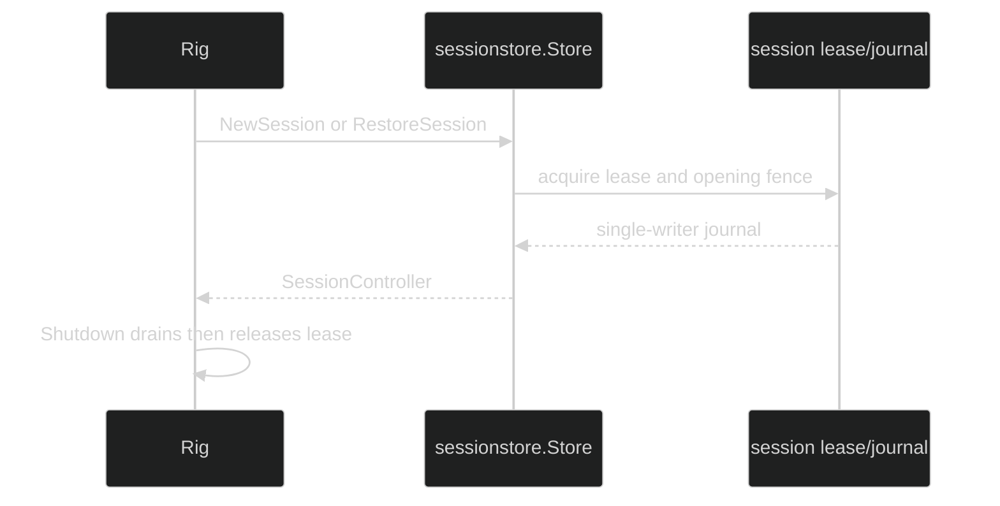

# Session Store

Every Rig requires a nonnil `*sessionstore.Store`:

```go
func WithSessionStore(store *sessionstore.Store) Option
```

`WithSessionStore(nil)` and a missing store fail with
`*rig.DefinitionError` (`DefinitionInvalidSessionStore` or
`DefinitionMissingSessionStore`). The Rig retains the store for new and
restored sessions; it does not open an unconfigured backend implicitly.

## Open a store

The store itself is opened over a validated `*storage.Composite`:

```go
backend := memstore.New()
sessions, err := sessionstore.Open(backend)
if err != nil {
	return fmt.Errorf("open session store: %w", err)
}
runtime, err := rig.Define(
	rig.WithLoops(assistant),
	rig.WithPrimers("assistant"),
	rig.WithSessionStore(sessions),
)
```

`sessionstore.Open` rejects a nil composite or any nil Ledger, Leaser, KV, or
Blobs primitive with `*sessionstore.InvalidBackendError`. The store is built on
the [`github.com/looprig/sessionstore`](https://github.com/looprig/sessionstore)
module, whose own `Open` then requires an OrderedIndex and a Blobs provider that
implements `storage.BlobReaderLifecycle` with a positive close bound. A backend
that fails either check is refused before any provider I/O with that module's
`*InvalidBackendError` (`Component` is `OrderedIndex` or
`BlobReaderLifecycle`). `memstore` qualifies; `fsstore` Blobs does not and is
refused, so a disk-backed deployment needs a conforming Blobs provider such as
`s3store`.

The default large record offload threshold is 512 KiB;
`sessionstore.WithOffloadThreshold(n)` overrides it with a positive byte count
and ignores a non-positive one. `sessionstore.WithTenant(tenant)` names the
tenant every record is filed under (default `local`); a tenant that disagrees
with the one recorded in the backend is refused at `Open`. See
[session store](/docs/guides/harness/session-persistence/session-store) for the
store's full contract.

The store provides durable session leases, append-only journals, event replay,
catalog projections, and optional blob offload. `Rig.Define` asks its
`PersistencePaths` when a workspace placement is configured to ensure the
session persistence region does not overlap the managed workspace.

## Ownership and restore

The Rig owns the store reference for its lifecycle, while the store owns backend
resources. A session acquires its own session lease, opens its journal, and
releases the lease during `SessionController.Shutdown` or a nonterminal
residency release. Restore opens the same
session ID and compares the frozen configuration identity before binding
workspace or loop collaborators.



Do not delete or reuse the backend while a session may still hold its lease.
The catalog is a derived listing projection; the journal is authoritative.

## Source and proof

- [Rig store requirement and lifecycle wiring](https://github.com/looprig/harness/blob/main/pkg/rig/definition.go)
- [Session-store backend validation and options](https://github.com/looprig/harness/blob/main/pkg/sessionstore/sessionstore.go)
- [Session journal opening fence and lease ownership](https://github.com/looprig/harness/blob/main/pkg/sessionstore/journal.go)
- [Store requirement and lifecycle tests](https://github.com/looprig/harness/blob/main/pkg/rig/rig_test.go)
