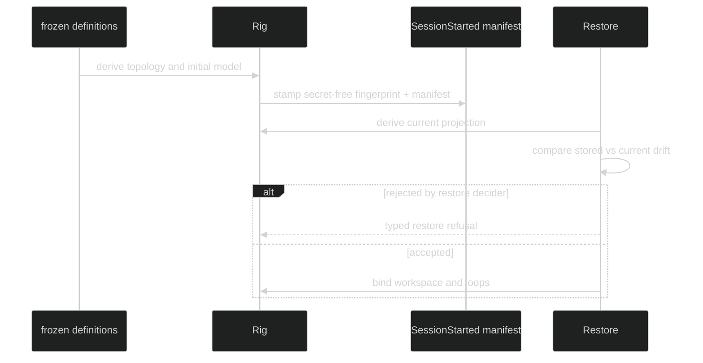

# Validation and Fingerprints

Rig identity is a secret-free compatibility projection used by new-session
stamping and restore. The consumer-owned scalar inputs are:

```go
type ConfigFingerprintFields struct {
	AgentKind                  string
	RuntimeSkills              bool
	WorkspaceRoot              string
	AdapterID                  string
	Posture                    string
	NativePermissionPolicyRev string
	ExternalCapabilityRev     string
	WorkspaceTrust             string
	PermissionStrictness      event.StrictnessLevel
	ConfinementRev             string
	ConfinementStrictness      event.StrictnessLevel
	AppFields                  map[string]string
	RuntimeProfile             string
	RuntimeCatalogRev          string
	RuntimeIdentityRev         string
}

func WithFingerprintFields(fields ConfigFingerprintFields) Option
func FingerprintFrom(definition loop.BoundDefinition) event.ConfigFingerprint
```

`Define` freezes fields and owns a copy of `AppFields`. Raw credentials,
endpoints, prompts, workspace contents, and capability bytes never enter the
fingerprint. Runtime identity is the opaque digest from
`loop.BoundDefinition.RuntimeIdentity().Digest()`.

## Fingerprint fields

| Field | Role |
| --- | --- |
| `AgentKind` | consumer's role identity |
| `RuntimeSkills` | whether runtime skills are enabled |
| `WorkspaceRoot` | canonical placement mode and region, when configured |
| `AdapterID`, `Posture` | foreign adapter and permission posture |
| `NativePermissionPolicyRev` | native permission policy identity |
| `ExternalCapabilityRev` | external capability catalog identity |
| `WorkspaceTrust`, strictness fields | consumer-owned trust posture labels |
| `ConfinementRev` | confinement configuration digest |
| `AppFields` | sorted application-defined compatibility strings |
| `RuntimeProfile`, `RuntimeCatalogRev`, `RuntimeIdentityRev` | selected runtime identity |

The loop projection contributes model ID (omitted for harness-managed runtime),
effective-system revision, tool-policy revision, and topology revision. Topology
also includes sorted loop policy/delegate metadata, primer order, active primer,
registered Hustles and their limits, hooks, and permission-review identity where
configured.

## Manifest and drift

The lifecycle stamps both legacy `event.ConfigFingerprint` and the richer
`event.ConfigManifest`. The manifest carries application fields, workspace and
confinement strictness, hook policy revision, and permission-review configured/
policy state. Its app-field map is copied so later caller mutation cannot change
stored identity.



## Restore policy

`WithAllowConfigMismatch()` is the legacy blanket opt-in. Prefer
`WithRestoreDecider(session.RestoreDecider)`, which receives the typed drift
assessment and can reject or explicitly accept it. Omitting both leaves the
default fail-secure policy, which rejects warning-level drift. A planned model,
access, topology, runtime, or workspace change should normally create a fresh
session rather than weakening restore checks.

## Source and proof

- [Fingerprint field type and projections](https://github.com/looprig/harness/blob/main/pkg/rig/fingerprint.go)
- [Rig option wiring for fields and restore policy](https://github.com/looprig/harness/blob/main/pkg/rig/options.go)
- [Restore drift and manifest tests](https://github.com/looprig/harness/blob/main/pkg/rig/fingerprint_test.go)
- [Restore decision ordering](https://github.com/looprig/harness/blob/main/pkg/rig/lifecycle_test.go)
