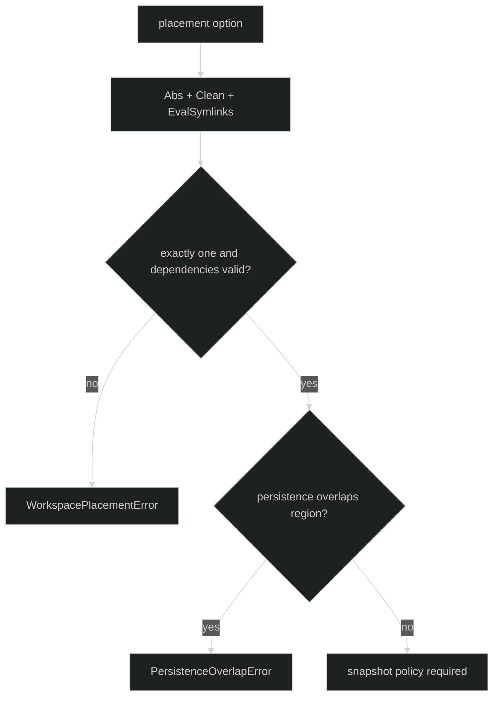

# Workspaces and Snapshots

Workspace placement is optional at Rig level, but required when any bound tool
declares `tool.RequiresWorkspace`. Exactly one placement option may be supplied:

```go
func WithExclusiveWorkspace(
	store *workspacestore.Store,
	root string,
	leaser storage.Leaser,
) Option
func WithSessionWorkspaces(store *workspacestore.Store, baseDir string) Option
func WithSharedWorkspace(store *workspacestore.Store, root string) Option
```

| Mode | Root ownership | Lease | Concurrent sessions | Typical use |
| --- | --- | --- | --- | --- |
| exclusive | one fixed canonical root | session lease plus hashed root lease | one writer | a checkout that must be fenced |
| session | `baseDir/<sessionID>` | session lease only | isolated roots | independent ephemeral sessions |
| shared | one fixed canonical root | no root lease | concurrent owners allowed | humans/external tools share the tree |

## Placement and canonicalization

`Define` canonicalizes `root` or `baseDir` with absolute clean paths and
symlink-aware resolution. Nonexistent tails are joined to the longest existing
resolved ancestor. Exclusive roots derive the lease name
`workspace-roots/<sha256(canonical-root)>`, so lexical and symlink aliases
contend on the same lease.

The workspace store must be nonnil. Empty roots, multiple placement options,
missing exclusive leasers, and canonicalization failures return typed
`*rig.WorkspacePlacementError`. Harness also checks that session-store and
workspace-store persistence paths are not equal to or below the managed region;
an overlap returns `*rig.PersistenceOverlapError`.

The placement mode and canonical region are recorded in the session's
configuration fingerprint. On restore, a change of mode, a different exclusive
or shared root, or an added or removed placement is workspace drift. Two
per-session placements compare by mode alone, so a session can restore on a
host whose `baseDir` is mounted at a different path. Restore then materializes
the latest checkpoint into `baseDir/<sessionID>` when that directory is absent
or empty. A non-empty directory whose contents do not match the checkpoint is
never cleared; restore fails with a wrapped `*workspacestore.DestNotEmptyError`.
Edits made after the last checkpoint are not carried to the new host.



## Snapshot policy

```go
type SnapshotTrigger uint8
const (
	SnapshotTriggerUnset SnapshotTrigger = iota
	SnapshotManual
	SnapshotOnIdle
	SnapshotOnTurnDone
	SnapshotOnStepDone
)

type SnapshotPriority uint8
const (
	SnapshotBestEffort SnapshotPriority = iota
	SnapshotRequired
)

type SnapshotPolicy struct {
	Trigger  SnapshotTrigger
	Priority SnapshotPriority
	Timeout  time.Duration
}

func WithSnapshots(policy SnapshotPolicy) Option
```

An unset trigger resolves to `SnapshotOnIdle`; zero timeout resolves to 60
seconds. Negative timeout and unknown trigger/priority values are rejected.
Placement without `WithSnapshots` returns `SnapshotPolicyRequired`.
`WithSnapshots` without placement returns `SnapshotPolicyWithoutWorkspace`.
`SnapshotRequired` is forbidden for shared placement because concurrent writers
cannot promise a stable required snapshot boundary.

## Source and proof

- [Workspace placement options, canonical paths, leases, and overlap checks](https://github.com/looprig/harness/blob/main/pkg/rig/workspace.go)
- [Snapshot policy types and validation](https://github.com/looprig/harness/blob/main/pkg/rig/snapshot_policy.go)
- [Workspace and snapshot validation tests](https://github.com/looprig/harness/blob/main/pkg/rig/workspace_test.go)
- [Workspace seed and snapshot integration proof](https://github.com/looprig/harness/blob/main/pkg/rig/workspace_integration_test.go)
