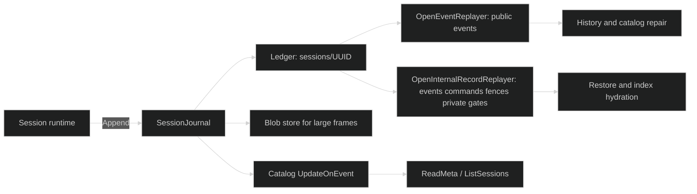
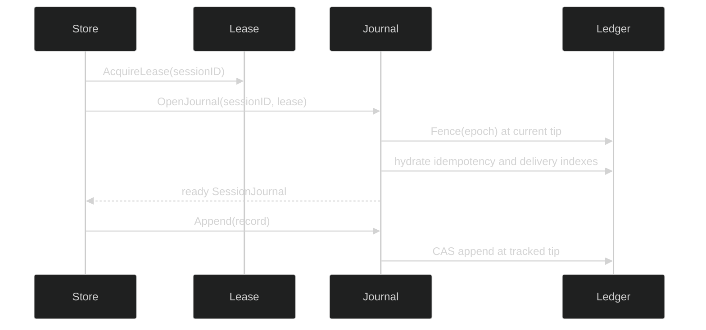

# Overview

Harness persistence has one authoritative ordered ledger per session and a
derived catalog for cheap listing. The journal stores Enduring events, command
intent records, lease fences, and private gate-preparation records. Large
envelopes are stored in the session's content-addressed blob prefix and the
ledger receives an integrity-checked pointer.

## Durable boundaries

There are three different guarantees to keep separate:

| Surface | Guarantee | Typical consumer |
| --- | --- | --- |
| `journal.SessionJournal.Append` | one serialized durable frame and sequence | runtime writer |
| `journal.EventReplayer` | ordered public or privileged events, cold only | history/status reader |
| `sessionstore.Catalog` | derived projection, repairable, no ledger cursor for reads | session picker |

The catalog is never the source of truth. A successful journal append may be
followed by a best-effort catalog update; `RepairCatalog` folds the ledger when
the projection is missing, stale, or corrupt.

## Two read views

`OpenEventReplayer` returns public events only. It filters commands, fences,
private gate payloads, and internal visibility. Restore and storage maintenance
use the privileged `OpenInternalEventReplayer` or
`OpenInternalRecordReplayer` seam. The full record view is required to rebuild
idempotency and delegate-delivery indexes and to recover gate payloads.

## Ownership flow

Every live writer holds a session lease. `OpenJournal` immediately appends a
`FenceRecord` with that lease's epoch, then hydrates idempotency state before
returning. Appends are serialized under a mutex and fenced at the tracked
ledger tip. GC also requires the lease and must be serialized with appends.

## Choose a surface

- Use [records and append](/docs/guides/harness/session-persistence/journal/records-and-append) for a writer.
- Use [replay](/docs/guides/harness/session-persistence/journal/replay) for a cold ordered read.
- Use [the session catalog](/docs/guides/harness/session-persistence/session-store/catalog) for a picker or status endpoint.
- Use [restore](/docs/guides/harness/session-persistence/session-store/restore) only through `Rig.RestoreSession`.
- Use [garbage collection](/docs/guides/harness/session-persistence/session-store/garbage-collection) only while the single-writer lease is held.

## Source and proof

- [`pkg/journal` contracts](https://github.com/looprig/harness/tree/main/pkg/journal)
- [`sessionstore.Store`](https://github.com/looprig/harness/blob/main/pkg/sessionstore/sessionstore.go)
- [`sessionstore` journal writer](https://github.com/looprig/harness/blob/main/pkg/sessionstore/journal.go)
- [`persistence lifecycle tests`](https://github.com/looprig/harness/blob/main/pkg/sessionstore/journal_test.go)
