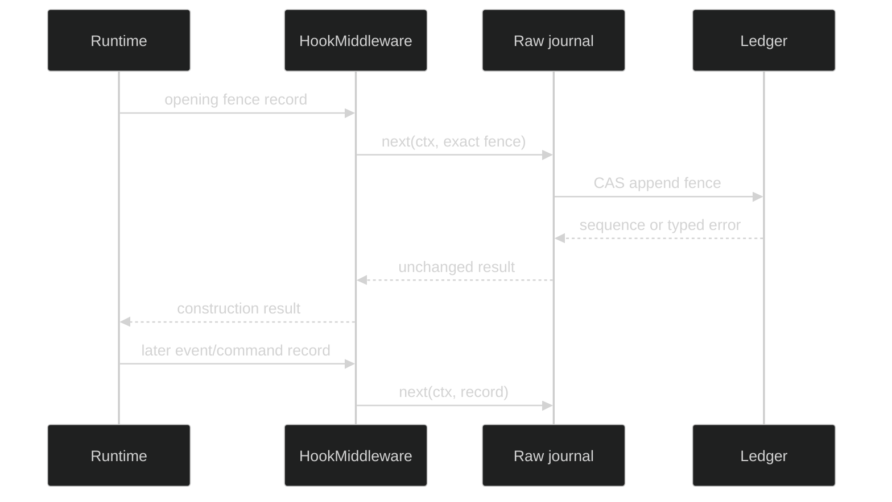

# Hooked journals

Journal hooks observe the durable append seam without changing the journal
contract. They are middleware around one `AppendFunc`; they do not observe
live event fan-out, catalog writes, or commands that never reach the journal.

## Hook contract

The exact public types are:

```go
type AppendFunc func(context.Context, JournalRecord) (uint64, error)

type AppendMiddleware func(next AppendFunc) AppendFunc

func WithHooks(j SessionJournal, runner *hook.Runner, sessionID uuid.UUID) SessionJournal
func HookMiddleware(runner *hook.Runner, sessionID uuid.UUID) AppendMiddleware
```

Middleware must call `next` synchronously exactly once with the supplied record
and return its exact sequence and error. `WithHooks` returns nil for a nil
journal and the original journal when the runner does not handle
`hook.OperationJournalAppend`.

`WithHooks` decorates through `journal.Decorate`, which returns a journal that
advertises exactly the optional contracts of the one it wraps. A hooked
idempotent journal is still a `journal.IdempotentJournal`, and a
committed-bytes journal is still a `journal.CommittedPublicJournal`, so the hub
keeps its duplicate signal and a Host keeps the committed public event stream.
Write your own decorators with the same function:

```go
type AroundAppend func(ctx context.Context, rec JournalRecord, next func(context.Context) error) error

func Decorate(inner SessionJournal, around AroundAppend) SessionJournal
```

`next` must be called exactly once. Returning without calling it skips the
append, and returning a different error substitutes it.

## Middleware order

The lifecycle applies opening-fence middleware while the journal is being
constructed, then applies ordinary append hooks around later appends. The
opening-fence path is intentionally one-shot: it cannot be suppressed,
duplicated, or rewritten by a decorator.



The hook call carries bounded metadata: operation, session coordinates, record
family, record ID, start/end time, and outcome. `describeRecord` recognizes
event, command, gate-prepared, fence, and command-application records;
disposition records are appended unobserved. Unknown or panic-prone
metadata is passed through unchanged.

## Failure semantics

The wrapper preserves the journal result. A hook start failure delegates
directly. If the delegate returns an error, the hook classifies cancellation or
failure but returns the same error. If the delegate panics, the hook records a
typed `appendPanicError` result and re-panics; a hook observer panic does not
change the append result. A successful append remains successful even if the
caller context is cancelled after the backend committed.

```go
wrapped := journal.WithHooks(raw, hooks, sessionID)
seq, err := wrapped.Append(ctx, journal.NewEventRecord(ev))
if err != nil {
	var appendErr *journal.AppendError
	if errors.As(err, &appendErr) {
		log.Printf("definite append conflict at %d", appendErr.Expected)
	}
	return err
}
log.Printf("append sequence=%d", seq)
```

Hooks are observation, not a retry layer. Retrying in middleware can violate
the exactly-once `next` rule and can make an ambiguous append impossible to
classify. Let the journal's idempotent backend handle retry identity.

## Wire the journal

Use the checked appender constructors after applying hooks:

```go
raw, err := store.OpenJournal(ctx, id, lease)
if err != nil {
	return err
}
observed := journal.WithHooks(raw, runner, id)
events, err := journal.NewJournalEventAppenderChecked(observed)
if err != nil {
	return err
}
_ = events
```

The runtime itself also uses `OpenJournalWithOpeningAppend` when a hook must
observe the ownership fence. Do not replace the raw journal with an arbitrary
decorator that changes append ordering or hides lease errors.

## Source and proof

- [`AppendFunc`, middleware, and hook wrapper](https://github.com/looprig/harness/blob/main/pkg/journal/hooked.go)
- [`opening append wiring`](https://github.com/looprig/harness/blob/main/pkg/sessionstore/journal.go)
- [`hook operation and call data`](https://github.com/looprig/harness/blob/main/pkg/hook/data.go)
- [`hook behavior tests`](https://github.com/looprig/harness/blob/main/pkg/journal/hooked_test.go)
- [`opening-fence hook tests`](https://github.com/looprig/harness/blob/main/pkg/sessionstore/journal_hook_test.go)
