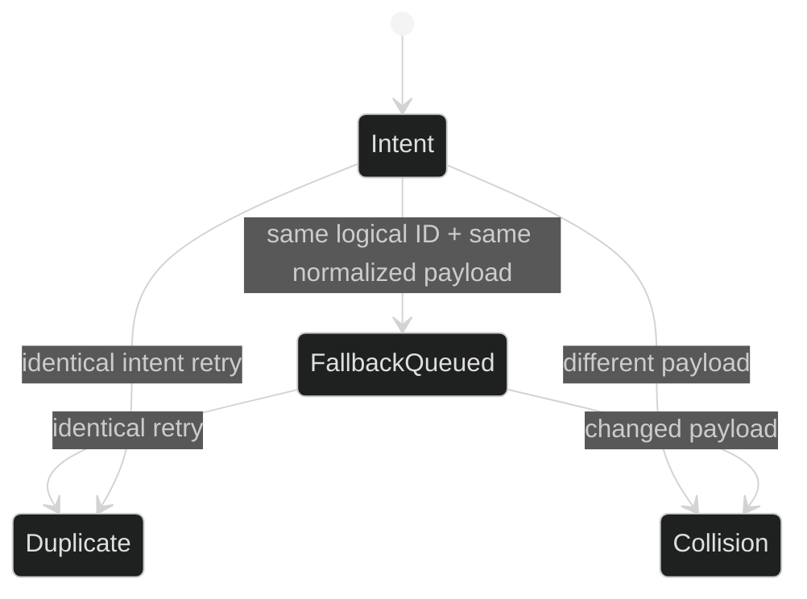

# Idempotency

Idempotency protects the journal from replayed delivery and ambiguous caller
retries. The identity is checked under the same lock that serializes appends,
so an identical retry returns the original sequence without writing a second
frame. A reused ID with different durable bytes fails closed.

## Append result

The optional extension is:

```go
type AppendResult struct {
	Sequence uint64
	Appended bool
}

type IdempotentJournal interface {
	SessionJournal
	AppendIdempotent(context.Context, JournalRecord) (AppendResult, error)
}
```

`Appended` is true only when this call created a new frame. A duplicate returns
`Appended: false` and the original sequence. `SessionJournal.Append` remains
available for callers that only need a sequence and error.

## Fingerprint rule

The journal compares the persisted kind plus codec body, not the whole Go
wrapper. `CommandRecord`'s transient session and loop route therefore do not
change the fingerprint. The public constructor is:

```go
type Fingerprint struct { /* kind and SHA-256 are package-private */ }
func NewFingerprint(kind string, body []byte) Fingerprint
```

Two records are identical only when the backend would persist byte-identical
kind and payload. If the same ID has a different fingerprint, the journal
returns:

```go
type IdempotencyCollisionError struct {
	ID  string
	Seq uint64
}
```

The error names the original sequence and is discoverable with `errors.As`.

## Index contract

The in-memory index is deliberately not concurrency-safe on its own:

```go
type IdempotencyIndex struct { /* entries are package-private */ }
func NewIdempotencyIndex() *IdempotencyIndex
func (*IdempotencyIndex) Observe(id string, seq uint64, fp Fingerprint)
func (*IdempotencyIndex) Check(id string, fp Fingerprint) (seq uint64, duplicate bool, err error)
```

The storage journal hydrates it from the complete ledger after the opening
fence. New records are observed only after their CAS append commits. This
ordering prevents a failed append from poisoning the retry decision.

## Delegate phases

Machine delegate delivery has a stronger state machine than ordinary retries:

1. `intent` must append first.
2. `fallback_queued` may append once, with the same phase-normalized payload.
3. A fallback before intent, changed payload, duplicate phase, or route mismatch
   returns `*journal.DeliveryTransitionError` or
   `*journal.CommandRouteMismatchError`.

The fallback physical ID has a typed suffix, but its normalized fingerprint
clears only `DelegateDeliveryPhase`; blocks, target loop, agency, hand-back,
timestamps, and other durable fields remain part of the comparison.



## Retry example

```go
func appendOnce(ctx context.Context, j journal.SessionJournal, rec journal.JournalRecord) (uint64, error) {
	idem, ok := j.(journal.IdempotentJournal)
	if !ok {
		return j.Append(ctx, rec)
	}
	result, err := idem.AppendIdempotent(ctx, rec)
	if err != nil {
		var collision *journal.IdempotencyCollisionError
		if errors.As(err, &collision) {
			return 0, fmt.Errorf("do not retry forged id %q: %w", collision.ID, err)
		}
		return 0, err
	}
	if !result.Appended {
		log.Printf("deduplicated retry at sequence %d", result.Sequence)
	}
	return result.Sequence, nil
}
```

The event appender uses this result to skip a second live broadcast. A retry
that is durable but deduplicated is success, not a persistence fault.

## Source and proof

- [`AppendResult` and `IdempotentJournal`](https://github.com/looprig/harness/blob/main/pkg/journal/idempotency.go)
- [`fingerprints and index`](https://github.com/looprig/harness/blob/main/pkg/journal/idempotency.go)
- [`command physical IDs and delivery phases`](https://github.com/looprig/harness/blob/main/pkg/journal/record.go)
- [`storage idempotent append`](https://github.com/looprig/harness/blob/main/pkg/sessionstore/journal.go)
- [`idempotency tests`](https://github.com/looprig/harness/blob/main/pkg/journal/idempotency_test.go)
- [`storage retry and collision tests`](https://github.com/looprig/harness/blob/main/pkg/sessionstore/journal_test.go)
