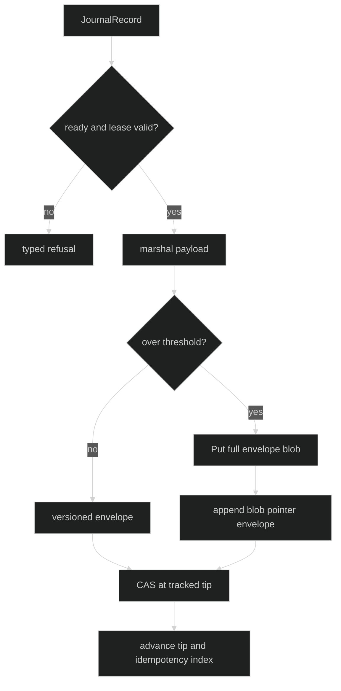

# Journal overview

The `pkg/journal` package defines backend-neutral contracts. It does not open a
ledger or know whether the backend is NATS or storage. `pkg/sessionstore`
implements those contracts over `storage.Composite`.

## Writer contract

The exact required writer interface is one method:

```go
type SessionJournal interface {
	Append(context.Context, JournalRecord) (seq uint64, err error)
}
```

The implementation must serialize records, return strictly increasing ledger
sequences, and refuse to write after its lease is lost. The storage implementation
also satisfies the optional `IdempotentJournal` extension described in
[idempotency](/docs/guides/harness/session-persistence/journal/idempotency).

## Reader contracts

Cold replay is split into events and all records:

```go
type EventReplayer interface {
	Open(context.Context, ReplayRequest) (EventCursor, error)
}

type EventCursor interface {
	Next(context.Context) (event.Event, uint64, error)
	Close() error
}

type RecordReplayer interface {
	Open(context.Context, ReplayRequest) (RecordCursor, error)
}

type RecordCursor interface {
	Next(context.Context) (JournalRecord, uint64, error)
	Close() error
}
```

`Next` returns `io.EOF` only when a cold backlog is drained. A malformed frame,
missing blob, or read failure is a typed error, never an implicit end of log.
`Follow: true` fails with `*journal.FollowUnsupportedError` in the storage
backend; it does not silently downgrade to a cold read.

## Append path



The blob is written before its pointer. The pointer carries the key, byte size,
and SHA-256; replay verifies all three relationships before decoding.

## Persistence errors

Errors carry stable typed context and preserve their leaf through `Unwrap`:

| Error | Meaning |
| --- | --- |
| `*journal.JournalNotReadyError` | opening fence has not committed |
| `*journal.JournalLeaseLostError` | append attempted after ownership loss |
| `*journal.AppendError` | definite CAS conflict or append failure |
| `*journal.AmbiguousAckError` | append outcome could not be resolved |
| `*journal.MarshalRecordError` | payload cannot be encoded |
| `*journal.RecordTooLargeError` | offload failed for an over-threshold frame |
| `*journal.IdempotencyCollisionError` | same ID names different durable bytes |

```go
var lost *journal.JournalLeaseLostError
if errors.As(err, &lost) {
	// Stop this writer. A new owner must open a new journal and fence the tip.
}
```

## Source and proof

- [`SessionJournal`, replay interfaces, and errors](https://github.com/looprig/harness/blob/main/pkg/journal/journal.go)
- [`replay contracts`](https://github.com/looprig/harness/blob/main/pkg/journal/replay.go)
- [`record contracts`](https://github.com/looprig/harness/blob/main/pkg/journal/record.go)
- [`storage journal implementation`](https://github.com/looprig/harness/blob/main/pkg/sessionstore/journal.go)
- [`journal contract tests`](https://github.com/looprig/harness/blob/main/pkg/sessionstore/journal_test.go)
