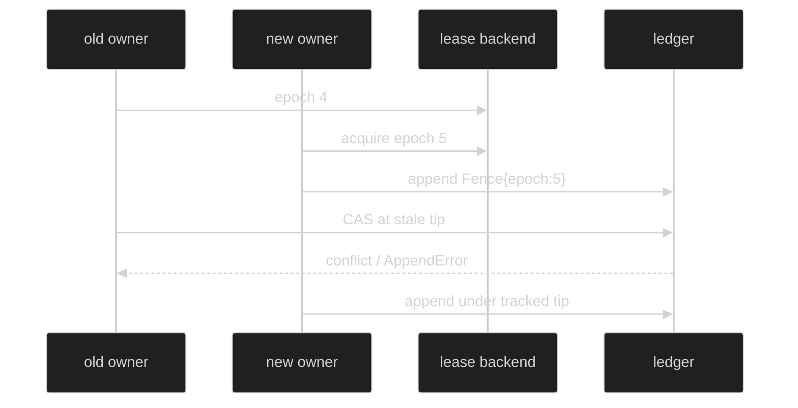

# Leases

The session journal is single-writer. A lease grants one live owner and an
epoch that fences stale owners at the ledger CAS boundary. The composition root
acquires and releases the lease; the journal and object GC receive only the
narrow ownership view they need.

## Lease contract

The exact public contract is:

```go
type Lease interface {
	SessionID() uuid.UUID
	Epoch() uint64
	Valid() bool
	Lost() <-chan struct{}
	Release(context.Context) error
}
```

`Epoch` increases across handovers. `Valid` is a fast non-blocking state check;
`Lost` closes when the lease is lost. `Release` is owned by the holder and is
idempotent. The journal itself never releases its lease, except that a journal
whose opening fence loses the ownership race releases that spent grant.

The storage contract allows a provider to end a grant by expiry or by a
higher-epoch takeover, but the in-memory store is release-only and the
filesystem store's grant is an advisory lock the operating system drops when
the holding process exits. Treat loss as something your code causes by
releasing, not as something that will happen on its own; an unreleased grant
stays held for as long as its holder lives.

## Fencing

`Store.OpenJournal` refuses a lease that is no longer held with
`*journal.JournalLeaseLostError`, reads the current tip, appends a
`FenceRecord` carrying the lease epoch at that tip, and marks the journal ready
only after the fence commits. The fence is attempted exactly once. If another
writer moves the tip first, the grant is released and
`*sessionstore.OpeningFenceConflictError` is returned; acquire a fresh lease,
which has a strictly higher epoch, and open a new journal. A grant is never
rebased onto a newer tip. Every later append uses a CAS against the tracked tip. A stale writer
can pass its local `Valid` check and still lose the backend CAS; the hard fence
then returns `*journal.AppendError`.



The fence is an internal record. Ordinary event replay does not expose it;
full record replay does, so maintenance and index hydration can see ownership
boundaries.

## Acquisition and release

The store adapter exposes:

```go
func (s *Store) AcquireLease(context.Context, uuid.UUID) (journal.Lease, error)
func (s *Store) OpenJournal(context.Context, uuid.UUID, journal.Lease) (journal.SessionJournal, error)
```

An already-held session returns `*journal.LeaseHeldError` with the session ID
and holder epoch. Retrying later in the same process keeps failing until the
holder releases or exits. A nil lease passed to `OpenJournal` returns
`*sessionstore.NilLeaseError`. A successful rig construction installs
`lease.Release` on the session. Shutdown releases workspace-root ownership
first, then the session lease, after the last durable append.

## Lease loss

Once `Valid` is false or `Lost` is closed, the journal refuses new appends with
`*journal.JournalLeaseLostError`, which unwraps to
`*journal.LeaseLostError`. The journal does not re-read the tip or try to
recover in place. Stop using the stale writer and let a new lifecycle acquire a
new lease and fence the stream.

```go
var lost *journal.JournalLeaseLostError
if errors.As(err, &lost) {
	log.Printf("writer lost epoch for session %s", lost.SessionID)
	return err
}
```

## Source and proof

- [`Lease` and fence errors](https://github.com/looprig/harness/blob/main/pkg/journal/lease.go)
- [`FenceRecord`](https://github.com/looprig/harness/blob/main/pkg/journal/record.go)
- [`Store.AcquireLease`](https://github.com/looprig/harness/blob/main/pkg/sessionstore/lease.go)
- [`OpenJournal` opening fence](https://github.com/looprig/harness/blob/main/pkg/sessionstore/journal.go)
- [`lease and stale-writer tests`](https://github.com/looprig/harness/blob/main/pkg/sessionstore/lease_test.go)
