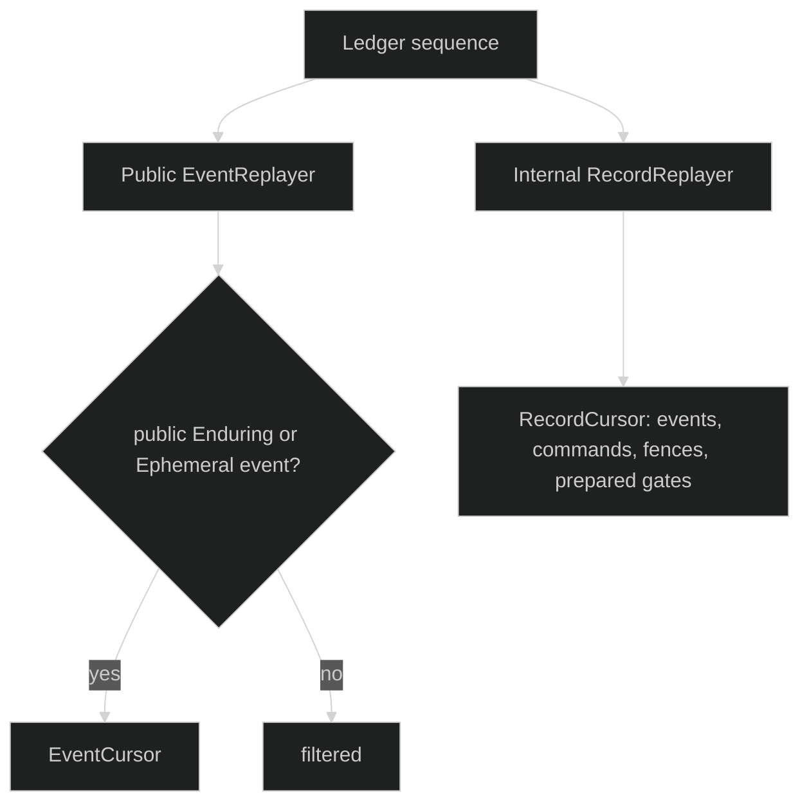

# Replay

Replay is a cold, ordered read over one session ledger. The reader never turns
an I/O or decode failure into `io.EOF`, and the storage backend does not claim a
live follow mode.

## Replay position

The exact backend-neutral request is:

```go
type StartPos struct { /* package-private inclusive sequence */ }
func Beginning() StartPos
func FromSeq(uint64) StartPos
func (StartPos) Seq() uint64

type ReplayRequest struct {
	SessionID uuid.UUID
	LoopID    uuid.UUID
	From      StartPos
	Follow    bool
}
```

Sequences are one-based and inclusive. `Beginning()` and `FromSeq(0)` start at
the first record. A non-zero `LoopID` keeps session-scoped events and events
from that loop; a zero loop ID reads all loops.

The storage facade adds the exported positioning carrier used when constructing
a replayer:

```go
type sessionstore.ReplayRequest struct {
	FromSeq uint64
}
```

`Store.OpenEventReplayer(id, req)` binds the ledger and `FromSeq`; its returned
`Open` call still receives the journal-level filter and `Follow` flag.

## Event and record cursors

```go
type EventCursor interface {
	Next(context.Context) (event.Event, uint64, error)
	Close() error
}

type RecordCursor interface {
	Next(context.Context) (journal.JournalRecord, uint64, error)
	Close() error
}
```

`EventCursor` yields events only. `RecordCursor` yields `EventRecord`,
`CommandRecord`, `FenceRecord`, and `GatePreparedRecord` in one ledger sequence.
Both `Close` methods are idempotent. A `Next` after close returns `io.EOF`.

## Visibility and narrowing

The store exposes three constructors:

```go
func (s *Store) OpenEventReplayer(id uuid.UUID, req ReplayRequest) (journal.EventReplayer, error)
func (s *Store) OpenInternalEventReplayer(id uuid.UUID, req ReplayRequest) (journal.EventReplayer, error)
func (s *Store) OpenInternalRecordReplayer(id uuid.UUID, req ReplayRequest) (journal.RecordReplayer, error)
```

The first is product-facing and filters internal events, commands, fences, and
private gate preparation. The second includes internal events but still yields
events only. The third is privileged and returns every record. Restore uses the
third view because a private gate payload and command intent cannot be
reconstructed from public events.



## Integrity fail-closed

For an offloaded frame, replay fetches the pointer's blob, verifies SHA-256,
size, and matching inner/outer idempotency IDs, then decodes the real envelope.
The typed failures are `*BlobUnavailableError`, `*BlobIntegrityError`,
`*BlobPointerIDMismatchError`, `*ReplayDecodeError`, and `*ReplayReadError`.
Use `errors.As`; do not skip the bad sequence or treat it as completed history.

## Replay example

```go
func readEvents(ctx context.Context, store *sessionstore.Store, id uuid.UUID) error {
	r, err := store.OpenEventReplayer(id, sessionstore.ReplayRequest{FromSeq: 1})
	if err != nil {
		return err
	}
	c, err := r.Open(ctx, journal.ReplayRequest{
		SessionID: id,
		From:      journal.Beginning(),
	})
	if err != nil {
		return err
	}
	defer c.Close()
	for {
		ev, seq, err := c.Next(ctx)
		if errors.Is(err, io.EOF) {
			return nil
		}
		if err != nil {
			return fmt.Errorf("replay sequence: %w", err)
		}
		fmt.Printf("%d %T\n", seq, ev)
	}
}
```

Setting `Follow: true` on the storage backend returns
`*journal.FollowUnsupportedError`, which lets a caller choose an explicit live
subscription instead of accidentally believing a cold cursor is tailing.

## Source and proof

- [`StartPos` and journal replay contract](https://github.com/looprig/harness/blob/main/pkg/journal/replay.go)
- [`sessionstore replay requests and constructors`](https://github.com/looprig/harness/blob/main/pkg/sessionstore/replay.go)
- [`event and record cursor implementation`](https://github.com/looprig/harness/blob/main/pkg/sessionstore/replay.go)
- [`replay tests`](https://github.com/looprig/harness/blob/main/pkg/sessionstore/replay_test.go)
