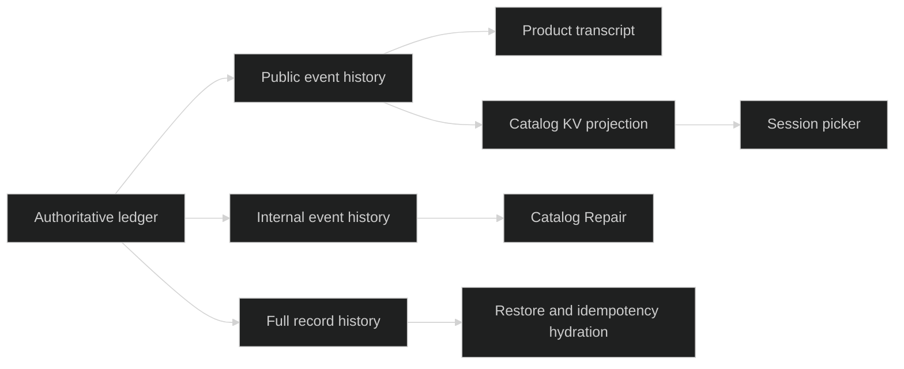

# Event history

Event history is a cold read that does not create a live session or acquire a
writer lease. Use the public replayer for product history and the internal
replayers only for restore, catalog repair, and storage maintenance.

## Public history

```go
func (s *Store) OpenEventReplayer(
	id uuid.UUID,
	req ReplayRequest,
) (journal.EventReplayer, error)
```

The returned `EventReplayer` yields Public `event.Event` values in ledger
sequence order. It drops command intent records, lease fences, private
`GatePreparedRecord` values, command application and disposition records, and
Internal events. The values are native events. A viewer that must see exactly
the redacted public wire bodies should read the committed public event stream
or SessionStore's public journal instead; see
[the event envelope](/docs/guides/harness/events/event-envelope). A zero session UUID is a
concrete ledger name, not a wildcard.

## Internal history

Restore and repair use:

```go
func (s *Store) OpenInternalEventReplayer(
	id uuid.UUID, req ReplayRequest,
) (journal.EventReplayer, error)

func (s *Store) OpenInternalRecordReplayer(
	id uuid.UUID, req ReplayRequest,
) (journal.RecordReplayer, error)
```

The internal event view includes Internal events but still omits commands,
fences, and private gate payloads. The record view includes every journal
record variant and reconstructs command and fence routing with the bound
session ID. It is not a product history endpoint because command bodies and private
gate payloads are not ordinary event visibility.

## History and catalog

The event appender calls `Catalog.UpdateOnEvent` only after a durable append.
That update is best-effort and returns nil even if the derived KV write fails.
History remains authoritative. `Catalog.RepairCatalog` uses the internal event
replayer to rebuild a stale or corrupt projection and writes it under KV
revision CAS.



## History example

```go
func listDurable(ctx context.Context, s *sessionstore.Store, id uuid.UUID) ([]event.Event, error) {
	r, err := s.OpenEventReplayer(id, sessionstore.ReplayRequest{FromSeq: 1})
	if err != nil {
		return nil, err
	}
	c, err := r.Open(ctx, journal.ReplayRequest{SessionID: id, From: journal.Beginning()})
	if err != nil {
		return nil, err
	}
	defer c.Close()
	var out []event.Event
	for {
		ev, _, err := c.Next(ctx)
		if errors.Is(err, io.EOF) {
			return out, nil
		}
		if err != nil {
			return nil, err
		}
		out = append(out, ev)
	}
}
```

Replay returns `io.EOF` only for a clean cold drain. A missing or corrupt
offload blob returns a typed error and must be surfaced to the caller.

## Source and proof

- [`public and internal replayers`](https://github.com/looprig/harness/blob/main/pkg/sessionstore/replay.go)
- [`Catalog.UpdateOnEvent and RepairCatalog`](https://github.com/looprig/harness/blob/main/pkg/sessionstore/catalog.go)
- [`history visibility tests`](https://github.com/looprig/harness/blob/main/pkg/sessionstore/hustle_visibility_test.go)
- [`replay tests`](https://github.com/looprig/harness/blob/main/pkg/sessionstore/replay_test.go)
