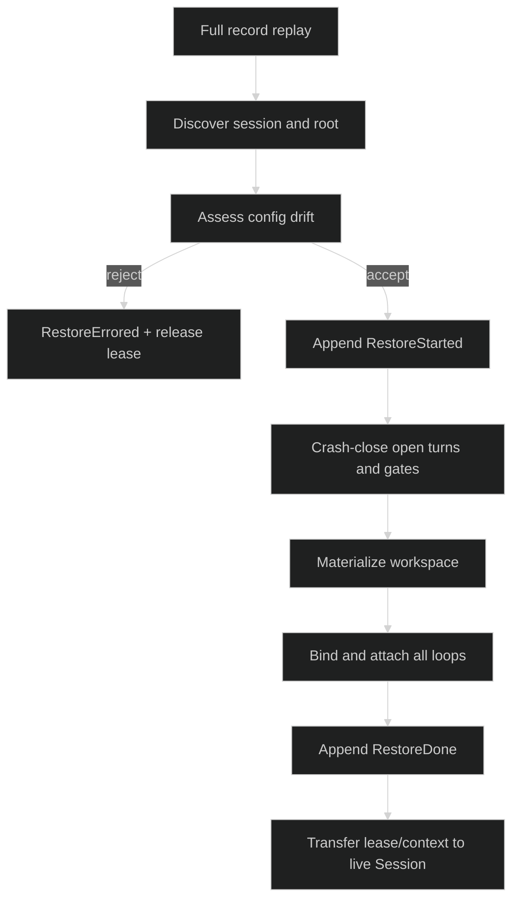

# Restore

Restore reconstructs a live session from the full durable record stream while
holding the session's single-writer lease. It preserves the session and loop
IDs, closes incomplete work explicitly, and makes the rebuilt controller
reachable only after `RestoreDone` commits.

## Restore entry point

Product code enters through:

```go
func (r *Rig) RestoreSession(
	ctx context.Context,
	id uuid.UUID,
) (session.SessionController, error)
```

The internal `sessionruntime.RestoreTopology` receives the topology, store,
and captured options. `sessionstore.Store` itself does not restore a live
controller; it supplies lease, journal, and replay dependencies.

## Replay and discovery

Restore acquires the lease and opens the journal, which appends the new
ownership fence. It then opens `OpenInternalRecordReplayer` from sequence zero
and discovers:

- the first `SessionStarted` and its config fingerprint or latest adopted
  manifest;
- the root `LoopStarted` with zero spawning cause and its stable loop ID;
- every durable child loop start and its topology name;
- internal gate-prepared payloads, commands, fences, and lifecycle audit;
- the current workspace pointer and unresolved delegate delivery phases.

Default policy rejects config drift. Manifest sessions pass a typed
`event.DriftAssessment` to the configured `RestoreDecider`; a rejection or
decider error returns `*session.RestoreRejectedError`. A legacy fingerprint
session returns `*session.ConfigMismatchError` unless the explicit override was
captured in the Rig.

## Crash repair

Restore repairs only what the durable stream proves:

1. Append `RestoreStarted` as the first restore mutation.
2. Append `ConfigurationAdopted` when an accepted manifest decision changes
   configuration or upgrades the manifest schema.
3. Close unsupported or payload-less open gates durably.
4. For each loop with `TurnStarted` and no terminal, append
   `TurnInterrupted` with its stored turn ID and index.
5. Materialize the latest checkpoint or restore workspace pointer before
   building live loops.
6. Rebuild native or foreign loops from folded context, messages, runtime
   selection, gates, and process notifications.

Unmatched hustle starts remain audit evidence. Restore does not recreate a
queue, worker, finalizer, or synthetic hustle terminal for them.



## Commit and ownership

`RestoreDone` is the commit point. Before it, a loop-build, append, workspace,
resource, or active-selection failure cancels the partially built session,
appends `RestoreErrored` through the existing journal when possible, releases
workspace-root ownership, releases the session lease, and returns no
controller. After success, the restored session owns `lease.Release` and
performs the normal shutdown order.

The restored session starts with fresh in-memory gate answer slots,
subscriptions, review cancellation handles, and actor contexts. Durable gate
payloads and open public gates are folded; a caller must reattach a host to
await a host-owned answer on the new live instance.

## Restore errors

Use `errors.As` against the stable categories:

```go
var discovery *session.RestoreDiscoveryError
var restore *session.RestoreError
var rejected *session.RestoreRejectedError
switch {
case errors.As(err, &discovery):
	// No SessionStarted or root LoopStarted can be reconstructed.
case errors.As(err, &rejected):
	// Inspect rejected.Assessment and rejected.Cause.
case errors.As(err, &restore):
	// Inspect restore.Kind: lease, journal, replay, append, loop, or materialize.
}
```

Runtime adapter mismatches are category-only (`missing_runtime`,
`runtime_unavailable`, `target_mismatch`, `credential_mismatch`, or
`effort_mismatch`) so provider and credential details do not leak through a
model-facing error.

## Source and proof

- [`Rig.RestoreSession`](https://github.com/looprig/harness/blob/main/pkg/rig/lifecycle.go)
- [`RestoreTopology` contract and order](https://github.com/looprig/harness/blob/main/internal/sessionruntime/restore_constructor.go)
- [`restore errors`](https://github.com/looprig/harness/blob/main/pkg/session/errors.go)
- [`sessionstore record replay`](https://github.com/looprig/harness/blob/main/pkg/sessionstore/replay.go)
- [`restore round-trip and crash tests`](https://github.com/looprig/harness/blob/main/internal/sessionruntime/restore_roundtrip_test.go)
