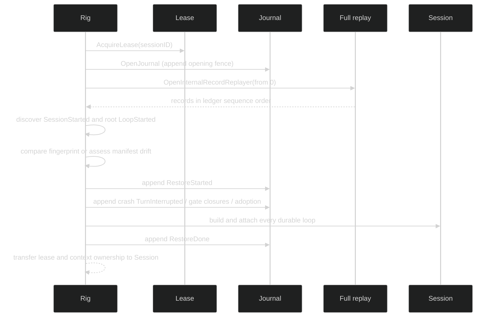

# Create and restore

`Rig` owns construction. A caller supplies a validated topology and a
`sessionstore.Store`; the lifecycle mints or receives the session identity,
acquires the per-session lease, opens the journal, and only then exposes a live
controller.

## Public entry points

The exact public methods are:

```go
func (r *Rig) NewSession(ctx context.Context, opts ...SessionOption) (session.SessionController, error)
func (r *Rig) RestoreSession(ctx context.Context, id uuid.UUID) (session.SessionController, error)
```

`NewSession` accepts `WithSeedSnapshot` and `WithSessionID` through
`SessionOption`; the seed is materialized before the first loop starts, and
`WithSessionID` replaces the minted ID with one the caller chose (see
[session options](/docs/guides/harness/rig/session-options)).

The `ctx` passed to either method is the parent of the session's lifetime, not
just of construction: cancelling it later stops the session. From a
request-scoped caller such as an HTTP handler, pass
`context.WithoutCancel(ctx)`. `RestoreSession` takes the existing
ID and has no per-call options. Restore-only policy such as allowing config
mismatch is captured when the rig is defined.

## New-session ownership

The live path is ordered so no reachable session can write without ownership:

1. Check the caller context and validate topology requirements.
2. Mint a non-zero session UUID, or adopt the one given by `WithSessionID`.
3. Acquire `Store.AcquireLease` for that UUID.
4. Call `Store.OpenJournalWithOpeningAppend`; the first record is a
   `journal.FenceRecord` containing the lease epoch.
5. Build checked event, command, and gate appenders over that journal.
6. Resolve workspace placement and process resources, materialize an optional
   seed, and construct the root loop.
7. Commit `SessionStarted` and root `LoopStarted` through the durable hub tap.
8. Return the controller with the lease-release hook owned by the session.

If a stage after lease acquisition fails, the lifecycle releases the lease. If
the `Session` has accepted cleanup ownership, its construction abort path seals
hub admission, drains already-admitted publication, cancels loops/resources,
releases the workspace root, then releases the session lease.

## Restore transaction

Restore is a replay and rebuild transaction, not a call to `NewSession` with a
pre-filled ID:



If the opening fence loses a handover race with another writer, restore claims
the session again under a fresh lease at a higher epoch and keeps that lease.
The first restore mutation after the fence is `RestoreStarted`. Open turns are
closed with durable `TurnInterrupted` records, with one exception: when the
active primer's open turn is parked at a resumable gate, its gates stay open
and the turn resumes from the parked step once the restore commits, so an
answer that arrives after failover reaches the waiting tool. A gate is
resumable in a native loop with no compaction inside the turn, when it is a
permission gate or an ask-user gate from a tool whose
`tool.UserInputReplaySafe` method returns true.

The workspace pointer is parsed and materialized before `RestoreDone`. `RestoreDone` is the commit point: a
failure before it records `RestoreErrored`, releases ownership, and returns no
live session.

## Ownership and failure

Restore fails closed by default on config drift. Legacy sessions return
`*session.ConfigMismatchError`; manifest sessions return
`*session.RestoreRejectedError` when the configured decider rejects the typed
assessment. Discovery, lease, journal, replay, append, loop, runtime, and
materialization stages are wrapped in `*session.RestoreError` with a
`RestoreErrorKind`. Use `errors.As` to preserve the stage while inspecting the
cause.

```go
live, err := rig.RestoreSession(ctx, id)
if err != nil {
	var mismatch *session.ConfigMismatchError
	var rejected *session.RestoreRejectedError
	var restore *session.RestoreError
	switch {
	case errors.As(err, &mismatch):
		// Rebuild the Rig with the intended configuration or explicit policy.
	case errors.As(err, &rejected):
		// Inspect rejected.Assessment and rejected.Source.
	case errors.As(err, &restore):
		// Inspect restore.Kind; Cause remains available through Unwrap.
	}
	return err
}
defer live.Shutdown(context.Background())
```

## Lifecycle excerpt

The following excerpt comes from a lifecycle example that exercises real `rig.Define`, an in-memory
`sessionstore`, submit, subscription, shutdown, and restore:

```go
id := live.SessionID()
if err := live.Shutdown(ctx); err != nil {
	return err
}
restored, err := harness.RestoreSession(ctx, id)
if err != nil {
	return err
}
defer restored.Shutdown(context.Background())
fmt.Println(restored.SessionID() == id)
```

The restore keeps the same session ID and loop identity. It does not replay
Ephemeral delivery or recreate abandoned in-memory cancellation handles. It
does replay one kind of owed work: a Host-admitted input recorded as `applied`
whose effect never reached the journal runs again under its original runtime
command ID, at most once.

## Source and proof

- [`Rig.NewSession` and `Rig.RestoreSession`](https://github.com/looprig/harness/blob/main/pkg/rig/lifecycle.go)
- [`Lifecycle.NewSession`](https://github.com/looprig/harness/blob/main/internal/sessionruntime/lifecycle.go)
- [`RestoreTopology`](https://github.com/looprig/harness/blob/main/internal/sessionruntime/restore_constructor.go)
- [`NewSessionError` and restore errors](https://github.com/looprig/harness/blob/main/internal/sessionruntime/lifecycle.go)
- [`lifecycle` runnable example](https://github.com/looprig/harness/blob/main/examples/lifecycle/example_test.go)
- [`lifecycle ownership and restore tests`](https://github.com/looprig/harness/blob/main/pkg/rig/lifecycle_test.go)
