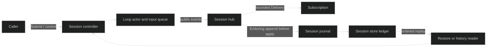

# Session runtime

A session is the lifetime boundary around one execution identity. The public
`session.Session` view submits content, selects loops, receives events, answers
gates, and interrupts work. `session.SessionController` adds trusted mutations
and teardown. Package `rig` is the only public constructor; it wires the session
store, a single-writer lease, the journal, and the loop topology before the
controller becomes reachable.

## Session ownership

The runtime owns four pieces of state together:

| State | Owner | Durable or live | Consumer surface |
| --- | --- | --- | --- |
| Session and loop identity | session runtime | durable `SessionStarted`/`LoopStarted`, live registry | `SessionID`, `Loop`, `ActiveLoop` |
| Commands and turn execution | loop actors, admitted by the session | command intent records plus live actor state | `Submit`, `SubmitToLoop`, loop controller |
| Enduring event history | journal and hub durable tap | durable journal, live `event.Delivery` | `SubscribeEvents`, replay through `sessionstore` |
| Teardown and ownership | session runtime and injected lease hooks | lifecycle events and lease fences | `Shutdown`, restore/new lifecycle |

The runtime never exposes a loop's command channel. A caller gets an immutable
`loop.Handle` or the trusted `loop.Controller` returned by
`SessionController.LoopController`; the actor remains the sole owner of queue
admission and committed loop state.

## Live and durable views

The live hub is not a replay source. It fans out public events to bounded
subscriptions and carries the assigned journal sequence only on live delivery.
The durable journal is the source for restore and history. This split matters:
an Ephemeral token delta can be useful to a renderer and still have no durable
record, while an Enduring event is appended before it changes hub state or is
delivered.



## Lifecycle at a glance

| Phase | Admission | Durable boundary |
| --- | --- | --- |
| New | one root loop is built; `SessionStarted` and root `LoopStarted` must commit | opening fence, then start events |
| Active | submits queue or start turns; gates and subscriptions are live | every Enduring event is appended before publication |
| Interrupted | current turns are cancelled; accepted user input waits behind the interrupt barrier | `TurnInterrupted` and idle edge are durable |
| Closing | `NewLoop`, active-loop changes, and new work are refused | shutdown sends every loop a command, then appends `SessionStopped` |
| Restored | old events are folded; open turns are crash-closed; loops are rebuilt idle | `RestoreStarted` precedes repair, `RestoreDone` is the commit point |

Start with [the controller contract](/docs/guides/harness/session-runtime/controller),
then [create and restore](/docs/guides/harness/session-runtime/create-and-restore).
For persistence details, see [session persistence](/docs/guides/harness/session-persistence).

## Source and proof

- [`pkg/session/session.go`](https://github.com/looprig/harness/blob/main/pkg/session/session.go)
- [`internal/sessionruntime/session.go`](https://github.com/looprig/harness/blob/main/internal/sessionruntime/session.go)
- [`pkg/hub/hub.go`](https://github.com/looprig/harness/blob/main/pkg/hub/hub.go)
- [`pkg/event/event.go`](https://github.com/looprig/harness/blob/main/pkg/event/event.go)
- [`pkg/rig/lifecycle_test.go`](https://github.com/looprig/harness/blob/main/pkg/rig/lifecycle_test.go)

```go
disk, err := fsstore.Open(fsstore.Options{Root: "./agent-data"})
if err != nil { return err }
sessions, err := sessionstore.Open(disk.Backend())
if err != nil { return err }
restored, err := runtime.RestoreSession(ctx, savedSessionID)
```

Start with [Create and restore](/docs/guides/harness/session-runtime/create-and-restore), then read [Session persistence](/docs/guides/harness/session-persistence) and the [`pkg/session` source](https://github.com/looprig/harness/tree/main/pkg/session).
