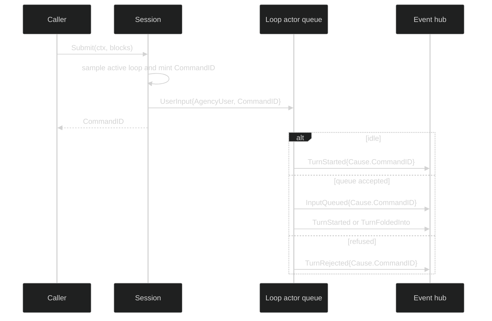

# Input queue

Submission hands a `command.UserInput` to one loop actor. The actor, not the
session, owns queue capacity, turn folding, and the decision to reject. The
session returns as soon as the command is handed to the actor; the event fan-in
reports what happened next.

## Submit contract

The exact public signatures are:

```go
func (s Session) Submit(context.Context, []content.Block) (uuid.UUID, error)
func (s Session) SubmitToLoop(context.Context, uuid.UUID, []content.Block) (uuid.UUID, error)
```

`Submit` samples `ActiveLoopID` once and stamps `identity.AgencyUser`.
`SubmitToLoop` addresses the UUID supplied by the caller and uses the same
human agency. Both return the command header's `CommandID`. They do not wait
for `TurnStarted`, a queue reply, or a terminal event.

## Admission and ordering

The managed queue exposes a shared capacity constant:

```go
const ManagedInputQueueCapacity = 64
```

An idle actor starts a turn. A running actor may accept input into its inbox;
the current turn remains ordered before the queued input. The actor later
folds, starts, or cancels that input. A full queue or shutting-down actor emits
an authoritative rejection. The command handoff and the outcome are separate
events:

| Actor state | Outcome | Class | Meaning |
| --- | --- | --- | --- |
| idle | `event.TurnStarted` | Enduring | input became the current turn |
| busy and queue has room | `event.InputQueued` | Ephemeral | accepted, waiting behind current work |
| queue full | `event.TurnRejected{Reason: event.RejectQueueFull}` | Enduring | not admitted |
| shutting down | `event.TurnRejected{Reason: event.RejectShuttingDown}` | Enduring | not admitted |
| transient actor failure | `event.TurnRejected{Reason: event.RejectInternal}` | Enduring | retry may be appropriate |

`InputQueued` is a live acknowledgement and is not a durable recovery point.
Pair it with the later `TurnStarted`, `TurnFoldedInto`, `InputCancelled`, or
`TurnRejected` event when rendering status.



## Correlate outcomes

Replies expose the command identity through `ReplyTo`:

```go
func waitForInput(ctx context.Context, s session.Session, blocks []content.Block) error {
	sub, err := s.SubscribeEvents(event.EventFilter{
		Ephemeral: event.LoopScope{All: true},
		Enduring:  event.LoopScope{All: true},
	})
	if err != nil {
		return err
	}
	defer sub.Close()

	id, err := s.Submit(ctx, blocks)
	if err != nil {
		return fmt.Errorf("handoff: %w", err)
	}
	for {
		select {
		case <-ctx.Done():
			return ctx.Err()
		case delivery, ok := <-sub.Events():
			if !ok {
				return sub.Err()
			}
			reply, ok := delivery.Event.(event.Reply)
			if !ok || reply.ReplyTo() != id {
				continue
			}
			switch reply.(type) {
			case event.TurnStarted, event.TurnFoldedInto, event.InputCancelled, event.TurnRejected:
				return nil
			}
		}
	}
}
```

If the consumer does not need the immediate queue acknowledgement, omit the
Ephemeral branch and wait only for the authoritative resolution.

## Cancellation and errors

The submit context bounds only the channel handoff. If it is cancelled before
the send, the method returns a zero UUID and `*session.SessionError` with
`SessionContextDone`. A missing target returns `SessionLoopNotFound`; an actor
that exits during the handoff returns `SessionLoopExited`. A durable fault
latched by the hub returns `SessionFaulted` before minting or sending a new
command. The command append is audit-only for ordinary user input: the runtime
logs an append failure and still attempts the handoff. Required machine
delegate intent uses a stricter path and refuses admission when its intent
append cannot commit.

Use `errors.As` rather than matching the text:

```go
var rejected *session.TurnRejectedError
if errors.As(err, &rejected) {
	// TurnRejected is normally observed as an event; this handles a drain path.
}
var se *session.SessionError
if errors.As(err, &se) && se.Kind == session.SessionContextDone {
	// No command was handed to the actor; the returned ID is zero.
}
```

## Source and proof

- [`Session` interface](https://github.com/looprig/harness/blob/main/pkg/session/session.go)
- [`Submit` and queue handoff](https://github.com/looprig/harness/blob/main/internal/sessionruntime/session.go)
- [`ManagedInputQueueCapacity`](https://github.com/looprig/harness/blob/main/pkg/loop/managed_queue.go)
- [`UserInput` command](https://github.com/looprig/harness/blob/main/pkg/command/provide_user_input.go)
- [`turn` event outcomes](https://github.com/looprig/harness/blob/main/pkg/event/turn.go)
- [`submit and queue tests`](https://github.com/looprig/harness/blob/main/internal/sessionruntime/submit_test.go)
