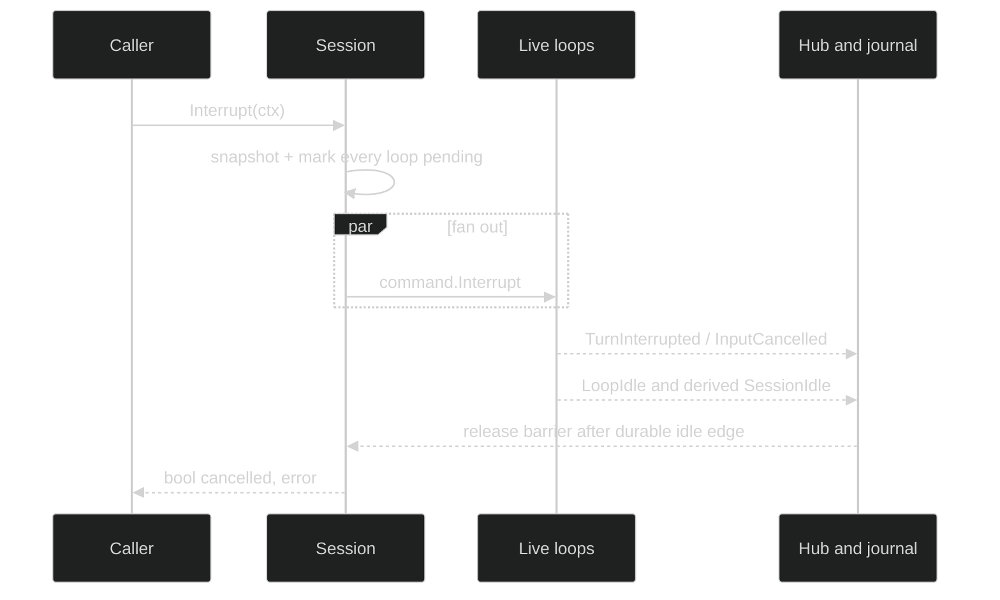

# Interrupt and drain

Interrupt is cancellation plus admission control. It must stop running work
without allowing a racing machine delegate to start fresh work in the
interrupted subtree. Draining is observation of the resulting durable terminal
events, not a sleep or a read from the actor internals.

## Session interrupt

The exact session-wide method is:

```go
Interrupt(context.Context) (bool, error)
```

The session snapshots every live loop and marks all of them interrupt-pending
under the registry lock before concurrently sending `command.Interrupt`.
`true` means at least one loop reported a running turn that it cancelled. A
fully idle interrupt returns `false` and emits no interrupt event. The context
only bounds fan-out; it cannot make a successful cancellation durable after
the call returns.

## Loop interrupt

The loop controller's exact scoped method is:

```go
Interrupt(context.Context) error
```

It selects one loop and its delegate descendants. Use it when a parent turn's
child must stop, and use `Session.Interrupt` for a human stop-all action.
Unknown IDs return `*session.SessionError{Kind: session.SessionLoopNotFound}`
from the session routing path.

## Barrier and queue

The interrupt barrier is ref-counted. A loop remains pending until every
overlapping interrupt scope releases its reference. Human input remains in the
actor inbox, but new machine-delegate admission waits while the target is
pending. This preserves accepted user input while preventing a cancelled
delegate from immediately opening another machine turn.



For workspace-backed sessions the release policy also waits for the required
checkpoint boundary. The policy is released only after its accepted/committed
or faulted outcome; this is why an idle-looking live event is not enough for a
caller that needs the snapshot guarantee.

## Drain by correlation

There is no public `WaitIdle` method in `session.SessionController`; the
public contract is event- and shutdown-based. A consumer that needs one input
to settle subscribes before submitting, matches `ReplyTo`, and waits for a
terminal reply. A consumer that needs the entire session stopped calls
`Shutdown`, which joins every loop.

```go
func interruptAndDrain(ctx context.Context, c session.SessionController) error {
	sub, err := c.SubscribeEvents(event.EventFilter{Enduring: event.LoopScope{All: true}})
	if err != nil {
		return err
	}
	defer sub.Close()

	if _, err := c.Interrupt(ctx); err != nil {
		return err
	}
	for {
		select {
		case <-ctx.Done():
			return ctx.Err()
		case d, ok := <-sub.Events():
			if !ok {
				return sub.Err()
			}
			switch d.Event.(type) {
			case event.TurnInterrupted, event.InputCancelled:
				return nil
			}
		}
	}
}
```

The internal agent drain uses the same principle: it subscribes before submit,
interrupts the exact child on context cancellation, and returns typed drain
errors when the terminal event is missing or the subscription is lost.

## Source and proof

- [`Session.Interrupt` and submit routing](https://github.com/looprig/harness/blob/main/internal/sessionruntime/session.go)
- [`interrupt barrier and fan-out`](https://github.com/looprig/harness/blob/main/internal/sessionruntime/interrupt.go)
- [`loop controller interrupt`](https://github.com/looprig/harness/blob/main/internal/sessionruntime/session.go)
- [`agent drain implementation`](https://github.com/looprig/harness/blob/main/internal/sessionruntime/drain.go)
- [`interrupt behavior tests`](https://github.com/looprig/harness/blob/main/internal/sessionruntime/interrupt_test.go)
